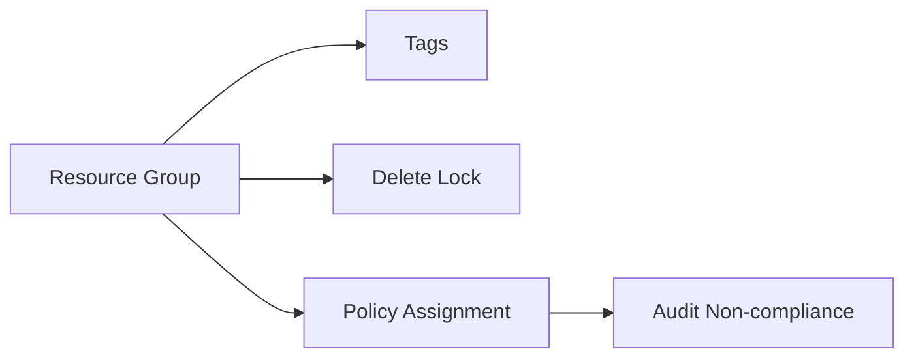

# Lab: Apply Tags + Resource Lock + Basic Policy Assignment

## Objective
Create a RG, apply tags, add a Delete lock, and assign a simple policy (Audit) at RG scope. Validate compliance state.

## What you will build


## Estimated time
30–45 minutes

## Cost + safety
- All resources are created in a **dedicated Resource Group** for this lab and can be deleted at the end.
- Default region: **australiaeast** (change if needed).

## Prerequisites
- Azure subscription with permission to create resources
- Azure CLI installed and authenticated (`az login`)
- (Optional) Azure Portal access

## Setup: Create environment file
```bash
cat > .env << 'EOF'
LOCATION="australiaeast"
PREFIX="az104"
LAB="m01-governance"
RG_NAME="${PREFIX}-${LAB}-rg"
EOF

source .env
echo "Environment loaded: RG_NAME=$RG_NAME, LOCATION=$LOCATION"
```

## Portal solution (high-level)
- Portal → Create a Resource Group.
- RG → **Tags** → add tags like `owner`, `env`.
- RG → **Locks** → Add **Delete** lock.
- RG → **Policies** → Assign a built-in policy (Audit) like 'Allowed locations' (set to australiaeast).
- Check compliance results under Policy → Compliance.

## Azure CLI solution (fully parameterised)
### 1) Create Resource Group
```bash
# Create the resource group in the specified location
az group create \
  --name "$RG_NAME" \
  --location "$LOCATION"
echo "RG_NAME=$RG_NAME"
```

### 2) Deploy resources
```bash
# Apply tags to the resource group for organization and cost tracking
az group update \
  --name "$RG_NAME" \
  --set tags.owner="student" tags.env="dev" tags.course="az104"
echo "Tagged RG: $RG_NAME"

# Define the lock name
LOCK_NAME="${RG_NAME}-delete-lock"
echo "LOCK_NAME=$LOCK_NAME"

# Create a CanNotDelete lock to prevent accidental deletion of the resource group
LOCK_ID="$(az lock create \
  --name "$LOCK_NAME" \
  --lock-type CanNotDelete \
  --resource-group "$RG_NAME" \
  --query id \
  -o tsv)"
echo "LOCK_ID=$LOCK_ID"

# Find the built-in 'Allowed locations' policy definition
POLICY_DEF_ID="$(az policy definition list \
  --query "[?displayName=='Allowed locations'].id | [0]" \
  -o tsv)"
echo "POLICY_DEF_ID=$POLICY_DEF_ID"

# Define the policy assignment name
POLICY_NAME="${RG_NAME}-allowed-locations"
echo "POLICY_NAME=$POLICY_NAME"

# Assign the policy to the resource group with allowed location parameter
POLICY_ASSIGNMENT_ID="$(az policy assignment create \
  --name "$POLICY_NAME" \
  --display-name "Allowed locations for $RG_NAME" \
  --policy "$POLICY_DEF_ID" \
  --params '{"listOfAllowedLocations":{"value":["australiaeast"]}}' \
  --resource-group "$RG_NAME" \
  --query id \
  -o tsv)"
echo "POLICY_ASSIGNMENT_ID=$POLICY_ASSIGNMENT_ID"
```


### 3) Validate
```bash
# Display the policy assignment details
az policy assignment show \
  --ids "$POLICY_ASSIGNMENT_ID" \
  -o table

# List policy compliance state for the resource group
az policy state list \
  --resource-group "$RG_NAME" \
  -o table
echo "Validated policy assignment and compliance state (may take a few minutes to populate)."
```


## ARM template solution (when needed)
Optional: policy assignments are commonly managed as code, but this lab keeps it CLI/Portal for simplicity.

## Cleanup (required)
```bash
# Delete the resource group and all its resources asynchronously
az group delete \
  --name "$RG_NAME" \
  --yes \
  --no-wait
echo "Deleted RG: $RG_NAME (async)"

# Remove the environment file
rm -f .env
echo "Cleaned up environment file"
```

## Notes
- Every CLI command that returns an ID/URL is captured into a **variable** and echoed.
- If a command returns JSON, use `--query ... -o tsv` for clean variable assignment.
