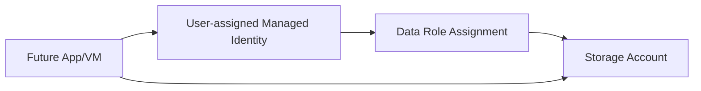

# Lab: User-Assigned Managed Identity Access to Blob Storage

## Objective
Create a user-assigned managed identity (UAMI), a storage account, and grant the identity **Storage Blob Data Contributor**. Validate role assignment outputs.

## What you will build


## Estimated time
30–45 minutes

## Cost + safety
- All resources are created in a **dedicated Resource Group** for this lab and can be deleted at the end.
- Default region: **australiaeast** (change if needed).

## Prerequisites
- Azure subscription with permission to create resources
- Azure CLI installed and authenticated (`az login`)
- (Optional) Azure Portal access

## Parameters (edit these first)
```bash
LOCATION="australiaeast"
PREFIX="az104"
LAB="m01-mi-storage"
RG_NAME="${PREFIX}-${LAB}-rg"
```
> **Tip:** Commands below are intentionally **commented out**. Copy to a shell script, review, then **uncomment** to run.

## Portal solution (high-level)
- Portal → **Managed Identities** → Create **User assigned** MI.
- Portal → **Storage accounts** → Create a storage account.
- Storage account → **Access control (IAM)** → Add role assignment.
- Role: **Storage Blob Data Contributor** → Assign access to the managed identity.
- Validate in Role assignments.

## Azure CLI solution (fully parameterised)
### 1) Create Resource Group
```bash
# Create the resource group in the specified location
az group create --name "$RG_NAME" --location "$LOCATION"
echo "RG_NAME=$RG_NAME"
```

### 2) Deploy resources
```bash
# Generate unique name for the managed identity
UAMI_NAME="${PREFIX}${LAB//-/}uami"
echo "UAMI_NAME=$UAMI_NAME"

# Create the user-assigned managed identity
UAMI_ID="$(az identity create \
  --name "$UAMI_NAME" \
  --resource-group "$RG_NAME" \
  --location "$LOCATION" \
  --query id -o tsv)"
echo "UAMI_ID=$UAMI_ID"

# Retrieve the principal ID (object ID) of the managed identity for RBAC
UAMI_PRINCIPAL_ID="$(az identity show --ids "$UAMI_ID" --query principalId -o tsv)"
echo "UAMI_PRINCIPAL_ID=$UAMI_PRINCIPAL_ID"

# Generate random suffix for globally unique storage account name
SUFFIX="$(openssl rand -hex 3)"
echo "SUFFIX=$SUFFIX"

# Create storage account name (lowercase, no special characters)
STG_NAME="$(echo "${PREFIX}${SUFFIX}stg" | tr -d '-' | tr '[:upper:]' '[:lower:]')"
echo "STG_NAME=$STG_NAME"

# Create the storage account with LRS redundancy
az storage account create \
  --name "$STG_NAME" \
  --resource-group "$RG_NAME" \
  --location "$LOCATION" \
  --sku Standard_LRS \
  --kind StorageV2

# Get the storage account's full Azure resource ID
STG_ID="$(az storage account show --name "$STG_NAME" --resource-group "$RG_NAME" --query id -o tsv)"
echo "STG_ID=$STG_ID"

# Define the data-plane RBAC role for blob access
DATA_ROLE="Storage Blob Data Contributor"
echo "DATA_ROLE=$DATA_ROLE"

# Assign the data-plane role to the managed identity at storage account scope
ROLE_ASSIGNMENT_ID="$(az role assignment create \
  --assignee-object-id "$UAMI_PRINCIPAL_ID" \
  --assignee-principal-type ServicePrincipal \
  --role "$DATA_ROLE" \
  --scope "$STG_ID" \
  --query id -o tsv)"
echo "ROLE_ASSIGNMENT_ID=$ROLE_ASSIGNMENT_ID"
```


### 3) Validate
```bash
# List role assignments at storage scope filtered by the role name
az role assignment list --scope "$STG_ID" --query "[?roleDefinitionName=='$DATA_ROLE']" -o table
echo "Validated data role on storage scope."
```


## ARM template solution (when needed)
Not required for this lab.

## Cleanup (required)
```bash
# Delete the resource group and all its resources asynchronously
az group delete --name "$RG_NAME" --yes --no-wait
echo "Deleted RG: $RG_NAME (async)"
```

## Notes
- Every CLI command that returns an ID/URL is captured into a **variable** and echoed.
- If a command returns JSON, use `--query ... -o tsv` for clean variable assignment.
