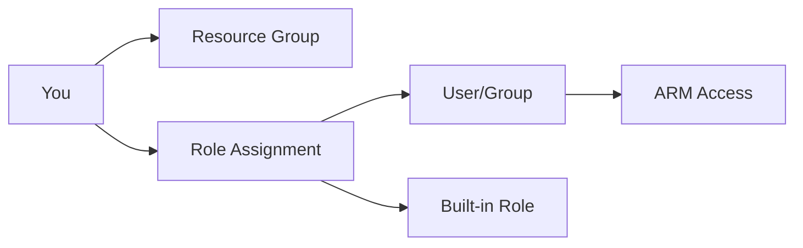

# Lab: RBAC Role Assignment at Resource Group Scope

## Objective
Create a resource group, create a user (optional), and assign a built-in RBAC role at RG scope. Validate the assignment.

## What you will build


## Estimated time
20–30 minutes

## Cost + safety
- All resources are created in a **dedicated Resource Group** for this lab and can be deleted at the end.
- Default region: **australiaeast** (change if needed).

## Prerequisites
- Azure subscription with permission to create resources
- Azure CLI installed and authenticated (`az login`)
- (Optional) Azure Portal access

## Setup: Create environment file
```bash
# Create .env file with lab parameters
cat > .env << 'EOF'
LOCATION="australiaeast"
PREFIX="az104"
LAB="m01-rbac"
RG_NAME="${PREFIX}-${LAB}-rg"
EOF

# Load environment variables
source .env
echo "Environment loaded: RG_NAME=$RG_NAME"
```

## Portal solution (high-level)
- Portal → **Resource groups** → Create RG.
- Portal → RG → **Access control (IAM)** → Add role assignment.
- Select Role (e.g., **Reader**), choose a user/group, Save.
- Validate under **Role assignments** tab.

## Azure CLI solution (fully parameterised)
### 1) Create Resource Group
```bash
# Create the resource group in the specified location
az group create \
  --name "$RG_NAME" \
  --location "$LOCATION"
echo "RG_NAME=$RG_NAME"
```

### 2) Deploy resources
```bash
# Get the signed-in user's UPN (email) for identification
SIGNED_IN_UPN="$(az account show \
  --query user.name \
  -o tsv)"
echo "SIGNED_IN_UPN=$SIGNED_IN_UPN"

# Retrieve the resource group's full Azure resource ID
RG_ID="$(az group show \
  --name "$RG_NAME" \
  --query id \
  -o tsv)"
echo "RG_ID=$RG_ID"

# Get the object ID of the currently signed-in user
ASSIGNEE_OBJECT_ID="$(az ad signed-in-user show \
  --query id \
  -o tsv)"
echo "ASSIGNEE_OBJECT_ID=$ASSIGNEE_OBJECT_ID"

# Define the RBAC role to assign
ROLE_NAME="Reader"
echo "ROLE_NAME=$ROLE_NAME"

# Create the role assignment at resource group scope
ROLE_ASSIGNMENT_ID="$(az role assignment create \
  --assignee-object-id "$ASSIGNEE_OBJECT_ID" \
  --assignee-principal-type User \
  --role "$ROLE_NAME" \
  --scope "$RG_ID" \
  --query id -o tsv)"
echo "ROLE_ASSIGNMENT_ID\
  --assignee "$ASSIGNEE_OBJECT_ID" \
  --scope "$RG_ID" \
 
```


### 3) Validate
```bash
# List all role assignments for the user at this resource group scope
az role assignment list --assignee "$ASSIGNEE_OBJECT_ID" --scope "$RG_ID" -o table
echo "Validated role assignment for objectId=$ASSIGNEE_OBJECT_ID at scope=$RG_ID"
```


## ARM template solution (when needed)
Not required for this lab (RBAC can be done via CLI/Portal).

## Cleanup (requ\
  --name "$RG_NAME" \
  --yes \
  --no-wait
echo "Deleted RG: $RG_NAME (async)"

# Remove the .env file
rm -f .env
echo "Cleaned up .env file
# Delete the resource group and all its resources asynchronously
az group delete --name "$RG_NAME" --yes --no-wait
echo "Deleted RG: $RG_NAME (async)"
```

## Notes
- Every CLI command that returns an ID/URL is captured into a **variable** and echoed.
- If a command returns JSON, use `--query ... -o tsv` for clean variable assignment.
