# Microsoft Entra ID Basics (AZ-104)

> **Microsoft Entra ID** (formerly Azure Active Directory) is Microsoft’s cloud-based **identity and access management (IAM)** service.  
> In Azure, Entra ID is the **source of truth for identities** and the **issuer of authentication tokens** that Azure services trust.

---

## Overview

Microsoft Entra ID is the identity layer behind:

- **Azure Portal / Azure CLI / Azure PowerShell** sign-in
- **Azure Resource Manager (ARM)** requests (create, update, delete resources)
- Access to **Microsoft 365** and thousands of SaaS applications
- Secure automation using **service principals** and **managed identities**

In AZ-104 terms: if you can’t reason about **tenant + token + RBAC scope**, you will struggle to troubleshoot access issues.

---

## What You Will Learn

- Entra ID **tenant architecture** and core components
- Identity objects: **users, groups, service principals, managed identities**
- **Authentication vs authorization** (and how Azure splits responsibilities)
- How Entra ID integrates with **ARM** and **Azure RBAC**
- The difference between **Entra ID roles** and **Azure RBAC roles**
- Common identity security controls: **MFA** and **Conditional Access**
- Monitoring and troubleshooting with **sign-in logs** and **audit logs**
- Real admin workflows and **exam-grade pitfalls**

---

## Mental Model: Who does what?

Azure identity is easier when you hold this model:

- **Entra ID answers:** *WHO are you?* and *issues a token*
- **Azure RBAC answers:** *WHAT can you do?* at a specific *scope*
- **ARM enforces:** the decision for **Azure resource management** operations

---

## High-Level Architecture

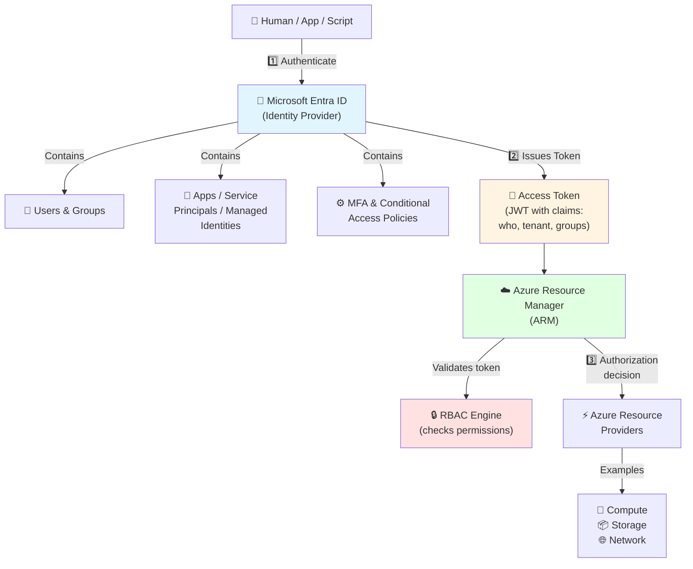

**Key takeaway:** Entra ID does **not** grant permissions to Azure resources by itself. It provides identity and tokens. **RBAC** grants permissions.

**Detailed flow explanation:**
1. **Authentication (Step 1)**: User/app provides credentials to Entra ID (password, certificate, managed identity)
2. **Token Issuance (Step 2)**: Entra ID validates credentials and issues a JWT (JSON Web Token) containing claims (user ID, tenant ID, group memberships)
3. **Authorization (Step 3)**: ARM validates the token, checks RBAC permissions at the requested scope, then allows/denies the operation

---

## Authentication Flow (What actually happens)

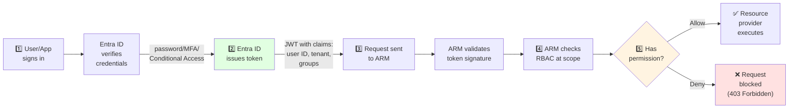

### Why tokens matter (AZ-104 troubleshooting)

Tokens are **time-bound** (often ~1 hour). If you change group membership or role assignments, the user might still have an old token:

- **Group membership change** may not reflect until token refresh
- **Role assignment change** may take time to propagate
- Symptoms: “I was just added, but still denied”

Admin fix: sign out/in, refresh token, or wait for propagation.

---

## Core Concepts

### 1) Entra ID Tenant

**Definition:** An Entra ID tenant is a dedicated identity directory for an organization and a security boundary.

**What lives in the tenant:**
- Users (members and guests)
- Groups
- App registrations
- Service principals
- Conditional Access policies
- Directory roles
- Logs (audit + sign-ins)

**Tenant identifiers:**
- Tenant (Directory) ID (GUID)
- Primary domain: `contoso.onmicrosoft.com`
- Custom domains: `contoso.com` (optional)

#### Tenant and Subscription Relationship (AZ-104 critical)

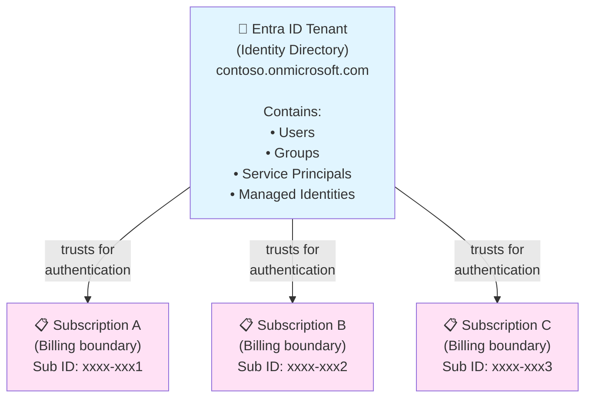

**Critical concepts:**
- A subscription trusts **one** tenant at a time (for authentication)
- A tenant can be associated with **many** subscriptions (one-to-many relationship)
- **Identities are created at tenant level**, not subscription level
- Changing subscription's trusted tenant (directory transfer) requires admin privileges and can break existing RBAC assignments

---

### 2) Identity Types

Azure administrators usually manage four identity categories.

#### Users (human identities)

User types you’ll encounter:

- **Member users**: internal identities (employees/students)
- **Guest users (B2B)**: external collaborators invited into your tenant
- **Cloud-only**: created directly in Entra ID
- **Synced (hybrid)**: synchronized from on-premises AD

User origin patterns:

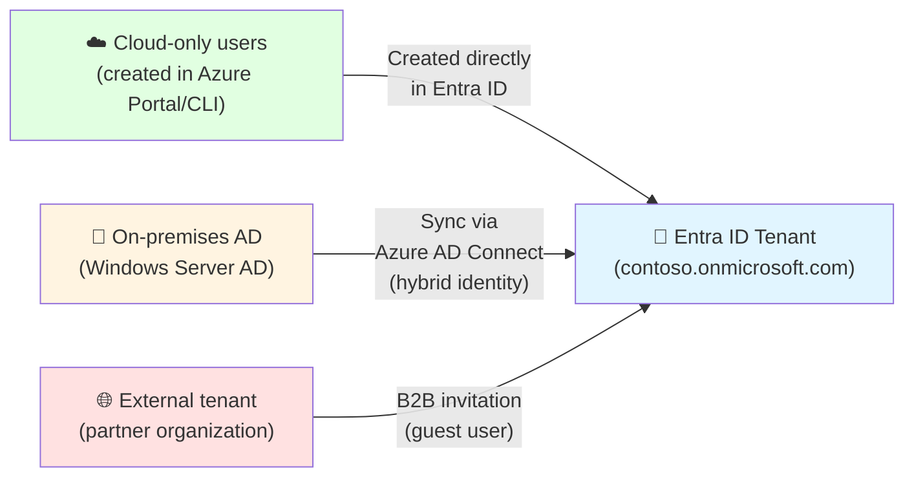

Important attributes:
- **UPN** (e.g., `john@contoso.com`) – sign-in name
- **Object ID** – immutable identifier used in RBAC assignments and APIs

---

#### Groups (access at scale)

Groups are the admin’s best friend for least-privilege access.

Why groups matter:
- You assign RBAC **once** to a group
- Add/remove users from the group without editing RBAC repeatedly

Group-based access pattern:

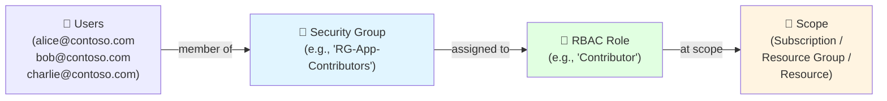

**Why this pattern works:**
- Add user to group → immediate access (once token refreshes)
- Remove user from group → immediate revocation
- No need to modify RBAC assignments repeatedly
- Easier auditing (one group assignment vs hundreds of individual assignments)

Types:
- **Security groups**: used for access control (RBAC, apps)
- **Microsoft 365 groups**: collaboration (Teams/SharePoint), can be used for some access patterns

Membership:
- **Assigned**: manual membership
- **Dynamic**: rules-based membership (premium features in many cases)

---

#### Applications and Service Principals (app identities)

Think of this as **design-time vs runtime**:

- **App registration (Application object)** = definition of an app (client ID, permissions, redirect URIs)
- **Service principal** = the identity instance of that app in a tenant (used to sign in and get tokens)

Application identity flow:

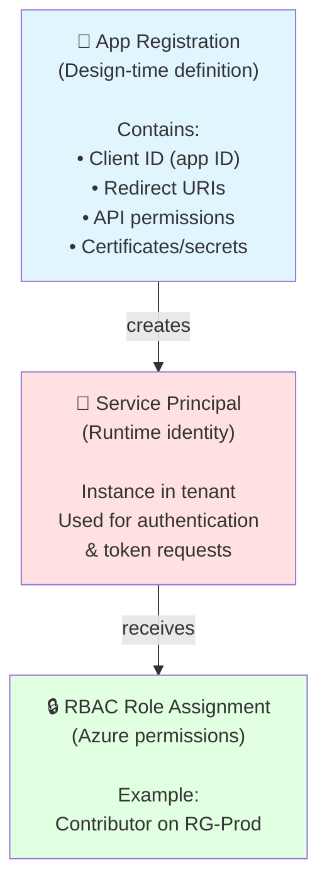

**Key distinction:**
- **App Registration** = blueprint (exists in one tenant, can be multi-tenant)
- **Service Principal** = instance (exists in each tenant where app is used)
- **Example**: Microsoft Graph API has ONE app registration, but a service principal in every tenant that uses it

**Use cases:** automation scripts, CI/CD, external apps accessing Azure.

---

#### Managed Identities (Azure-managed app identities)

Managed identities are service principals **created and managed by Azure**.

Two types:

- **System-assigned MI**: tied to one Azure resource (deleted with it)
- **User-assigned MI**: standalone resource, reusable across many resources

Managed identity lifecycle:

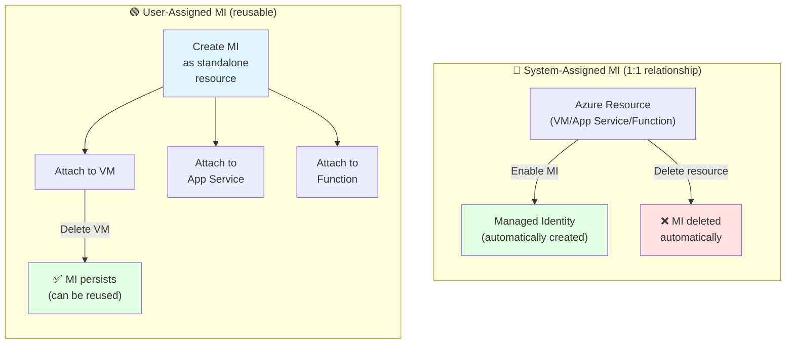

**When to use each:**
- **System-assigned**: Simple scenarios, single resource (VM accessing Storage)
- **User-assigned**: Multiple resources need same identity (3 VMs accessing same Key Vault with one MI)

**Why MIs are preferred:** no secrets, automatic rotation, reduced leakage risk.

---

## Authentication vs Authorization (Do not mix them)

### Authentication (AuthN) — WHO are you?

Handled by **Entra ID**.

Examples:
- Password + MFA
- Passwordless sign-in
- Conditional Access evaluation

Output:
- **Token** (proof of identity)

### Authorization (AuthZ) — WHAT can you do?

Handled by **Azure RBAC** (for Azure resources).

Output:
- **Allow / Deny** at a specific scope

Authentication and Authorization flow:

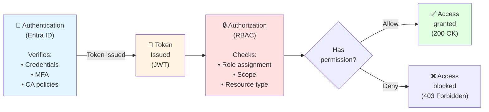

**Error code mapping:**
- **401 Unauthorized**: Authentication failed (invalid/missing token)
- **403 Forbidden**: Authentication succeeded, but authorization failed (no RBAC permissions)

---

## Entra ID Roles vs Azure RBAC Roles (Two different systems)

### Entra ID roles (Directory roles)

These control **directory management**, such as:
- create users
- reset passwords
- manage groups
- configure Conditional Access (depending on role)
- manage app registrations

Examples:
- Global Administrator
- User Administrator
- Application Administrator
- Security Administrator

**Scope:** the Entra ID tenant/directory.

### Azure RBAC roles

These control **Azure resources**, such as:
- create VMs
- edit VNets
- manage storage
- deploy resources

Examples:
- Owner
- Contributor
- Reader
- User Access Administrator

**Scope:** management group / subscription / resource group / resource.

#### Exam trap

Global Administrator **does not automatically** equal Subscription Owner.

To manage Azure resources, you must have **Azure RBAC** permissions.

---

## Conditional Access (Policy-driven security for sign-in)

Conditional Access evaluates signals and enforces controls.

Signals might include:
- user/group membership
- device compliance
- location/IP range
- sign-in risk
- application being accessed

Controls might include:
- require MFA
- require compliant device
- block access
- limit session duration

Conditional Access evaluation:

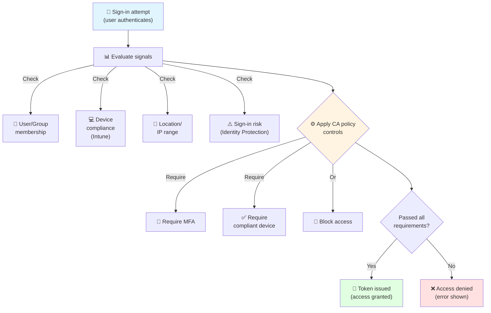

**Example CA policy:**
- **IF** user is in "Admins" group
- **AND** signing in from outside corporate network
- **THEN** require MFA + compliant device
- **ELSE** block access

**Admin mindset:** CA changes *how* authentication is allowed, not what resource permissions exist.

---

## Multi-Factor Authentication (MFA)

MFA is commonly enforced via:
- per-user MFA (legacy)
- Conditional Access (recommended)

MFA improves resistance to credential theft.

MFA method security ranking:

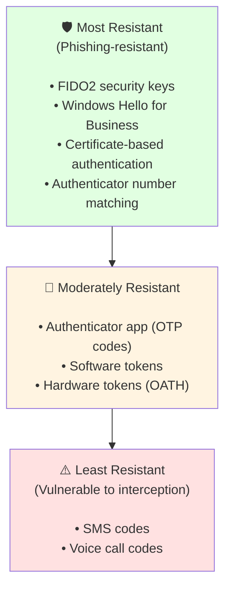

**Microsoft recommendation:**
- **Avoid**: SMS/voice (vulnerable to SIM swapping, interception)
- **Good**: Authenticator app with push notifications
- **Best**: FIDO2 keys or Windows Hello (hardware-backed, phishing-resistant)

---

## Monitoring and Auditing (How admins troubleshoot identity issues)

### Sign-in logs (authentication events)

Use sign-in logs to answer:
- Did the user sign in?
- Was MFA required?
- Was Conditional Access applied?
- Where did sign-in originate?
- Why did it fail (error code)?

### Audit logs (directory changes)

Use audit logs to answer:
- Who changed group membership?
- Who created a service principal?
- Who assigned a directory role?
- Who modified a Conditional Access policy?

Log types and sources:

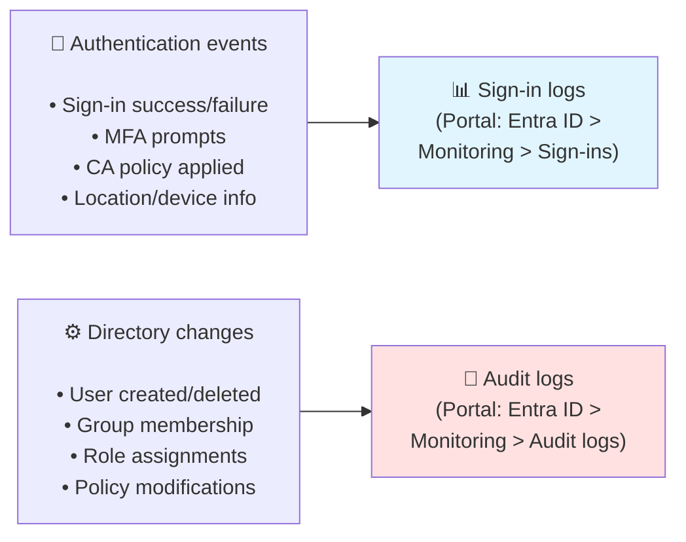

**Retention:**
- **Free tier**: 7 days
- **Premium P1/P2**: 30 days
- **Export to Log Analytics**: Long-term retention (90+ days, queryable with KQL)

### Common troubleshooting approach (AZ-104 practical)

1. Confirm user can authenticate (sign-in logs)
2. Confirm RBAC assignment exists at the correct scope
3. Confirm group membership is correct
4. Refresh token / allow propagation
5. Re-test action

---

## Common Scenarios (Admin view)

### Scenario 1: New employee onboarding (resource access)

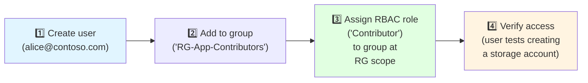

**Commands:**
```bash
# 1. Create user
az ad user create --display-name "Alice Smith" --user-principal-name alice@contoso.com --password "Temp@Pass123!"

# 2. Add to group
az ad group member add --group "RG-App-Contributors" --member-id $(az ad user show --id alice@contoso.com --query id -o tsv)

# 3. Assign RBAC role (group already has Contributor at RG scope)
# az role assignment create --assignee-object-id <group-object-id> --role "Contributor" --scope "/subscriptions/<sub-id>/resourceGroups/RG-App"

# 4. User tests access
# az login --username alice@contoso.com
# az storage account create --name teststoragealice --resource-group RG-App --location australiaeast --sku Standard_LRS
```

### Scenario 2: App needs access to Storage without secrets

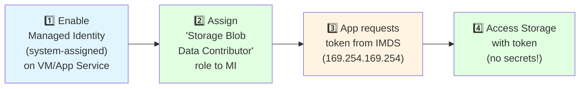

**Commands:**
```bash
# 1. Enable system-assigned MI on VM
az vm identity assign --name myVM --resource-group myRG

# 2. Get MI principal ID
MI_PRINCIPAL_ID=$(az vm show --name myVM --resource-group myRG --query identity.principalId -o tsv)

# 3. Assign Storage Blob Data Contributor role
az role assignment create \
  --assignee "$MI_PRINCIPAL_ID" \
  --role "Storage Blob Data Contributor" \
  --scope "/subscriptions/<sub-id>/resourceGroups/myRG/providers/Microsoft.Storage/storageAccounts/mystorageacct"

# 4. From within the VM, app code requests token:
# curl 'http://169.254.169.254/metadata/identity/oauth2/token?api-version=2018-02-01&resource=https://storage.azure.com/' -H Metadata:true
```

### Scenario 3: External partner access (B2B guest)

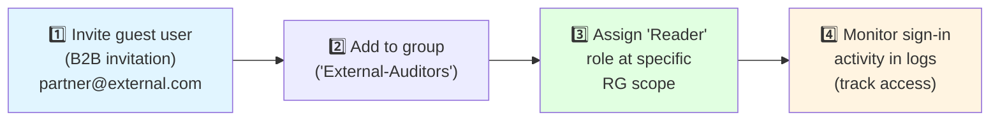

**Commands:**
```bash
# 1. Invite guest user
az ad user create --user-principal-name partner_external.com#EXT#@contoso.onmicrosoft.com \
  --display-name "Partner User" --mail partner@external.com

# Alternatively, use Portal: Portal > Entra ID > Users > New guest user

# 2. Add to group
az ad group member add --group "External-Auditors" \
  --member-id $(az ad user show --id partner_external.com#EXT#@contoso.onmicrosoft.com --query id -o tsv)

# 3. Assign Reader role to group at RG scope
az role assignment create --assignee-object-id <group-object-id> \
  --role "Reader" --scope "/subscriptions/<sub-id>/resourceGroups/Audit-RG"

# 4. Monitor sign-ins (Portal: Entra ID > Monitoring > Sign-in logs, filter by user)
```

---

## Best Practices (AZ-104 aligned)

- ✅ Use **groups** for RBAC assignments (not individuals)
- ✅ Apply **least privilege** and scope roles as low as possible (RG > subscription)
- ✅ Use **managed identities** for Azure workloads instead of secrets
- ✅ Require **MFA** for admins and privileged roles
- ✅ Use **Conditional Access** to enforce security policies
- ✅ Separate admin accounts from daily user accounts
- ✅ Monitor sign-in/audit logs and export to Log Analytics where required

---

## CLI Examples (commented)

> Note: Entra ID / directory operations may depend on tenant permissions.  
> Commands are intentionally **commented** so learners can copy/paste intentionally.

### List users
```bash
# List all users in the tenant
az ad user list --output table

# Show specific user details (UPN, object ID, display name)
az ad user show --id user@contoso.com

# Filter users by display name
az ad user list --filter "startswith(displayName,'Alice')" --output table
```

**What this shows:**
- User Principal Name (UPN) - sign-in name
- Object ID - immutable identifier used in RBAC
- Display Name - friendly name shown in portal
- User Type - Member or Guest

### List groups and members
```bash
# List all groups in tenant
az ad group list --output table

# Show specific group details
az ad group show --group "Marketing"

# List members of a group
az ad group member list --group "Marketing" --output table

# Check if user is member of specific group
az ad group member check --group "Marketing" --member-id <user-object-id>
```

**Use cases:**
- Verify group membership for troubleshooting access issues
- Audit group assignments before changing RBAC
- Identify nested groups (groups within groups)

### Service principals
```bash
# List all service principals (can be large, use --all flag)
az ad sp list --all --output table

# Show specific service principal by app ID or object ID
az ad sp show --id <app-id-or-object-id>

# Find service principal by display name
az ad sp list --filter "displayName eq 'MyApp'" --output table

# List service principals owned by current user
az ad sp list --show-mine --output table
```

**What this reveals:**
- App ID (Client ID) - used in authentication
- Object ID - used in RBAC assignments
- Display Name - human-readable app name
- Service Principal Names - additional identifiers

### Check current identity and RBAC assignments
```bash
# Show currently signed-in user
az ad signed-in-user show

# Get object ID of signed-in user (useful for scripting)
ASSIGNEE_ID=$(az ad signed-in-user show --query id -o tsv)
echo "Signed-in user objectId: $ASSIGNEE_ID"

# List all RBAC role assignments for current user
az role assignment list --assignee "$ASSIGNEE_ID" --output table

# List role assignments at specific scope
az role assignment list --assignee "$ASSIGNEE_ID" \
  --scope "/subscriptions/<sub-id>/resourceGroups/myRG" --output table

# Show inherited assignments (from parent scopes)
az role assignment list --assignee "$ASSIGNEE_ID" --all --output table
```

**Troubleshooting workflow:**
1. Confirm user is authenticated: `az ad signed-in-user show`
2. Get user's object ID: `az ad signed-in-user show --query id -o tsv`
3. Check RBAC assignments: `az role assignment list --assignee <object-id>`
4. Check group memberships: `az ad user get-member-groups --id <object-id>`
5. Verify scope hierarchy (assignments inherit from parent scopes)

---

## Common Pitfalls & Exam Traps

- ❌ **Confusing directory roles with Azure RBAC roles**  
  Entra roles manage the directory; RBAC manages Azure resources.

- ❌ **Assigning roles at the wrong scope**  
  A role at RG scope does not grant subscription-wide access.

- ❌ **Expecting immediate access after changes**  
  Propagation + token caching can delay access.

- ❌ **Mixing authentication failures with authorization failures**  
  - AuthN failure: cannot sign in (Entra ID issue)  
  - AuthZ failure: signed in but forbidden (RBAC issue)

- ❌ **Using service principal secrets unnecessarily**  
  Prefer managed identities for Azure workloads.

---

## Key Takeaways for AZ-104

1. **Entra ID answers WHO** and issues tokens  
2. **Azure RBAC answers WHAT** and at which scope  
3. **ARM enforces** access decisions for resource management  
4. **Managed identities** remove secrets and reduce risk  
5. **Groups** are the scalable access pattern  
6. Logs are essential for troubleshooting and compliance

---

