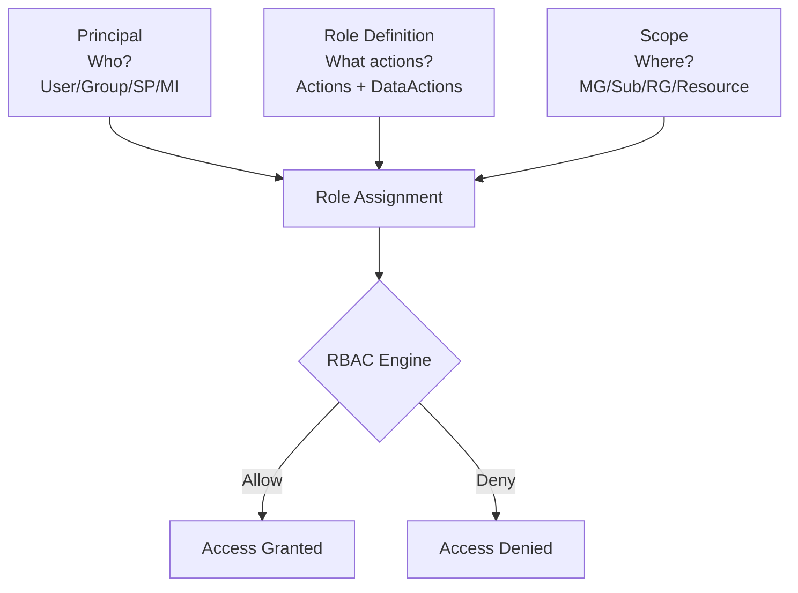
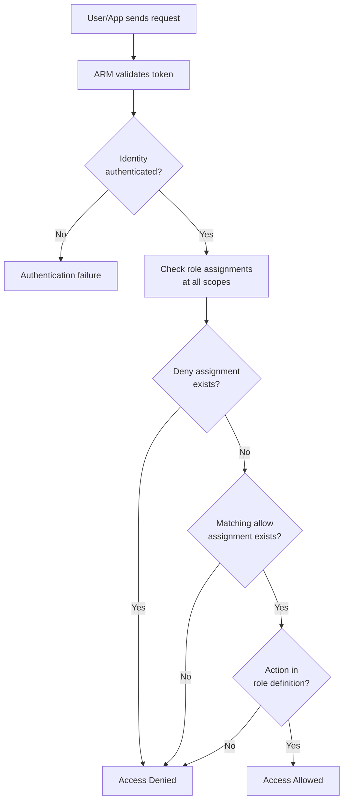
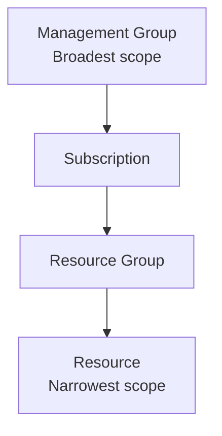
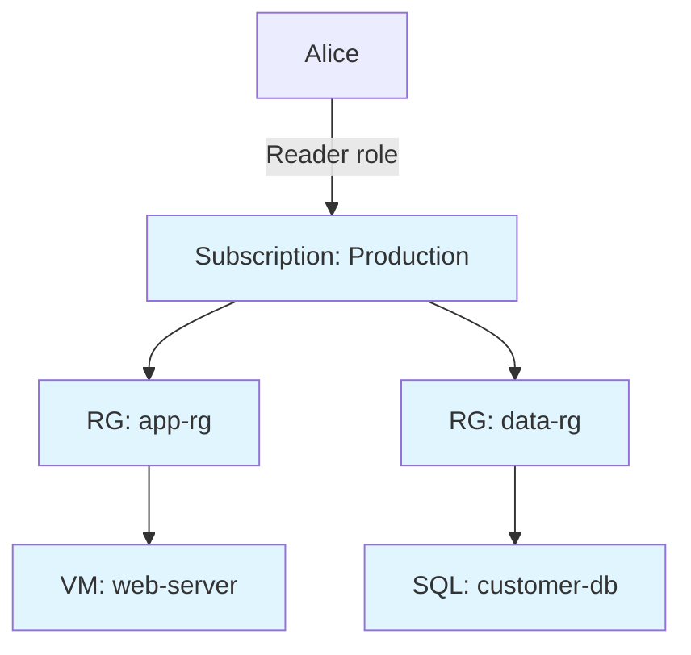
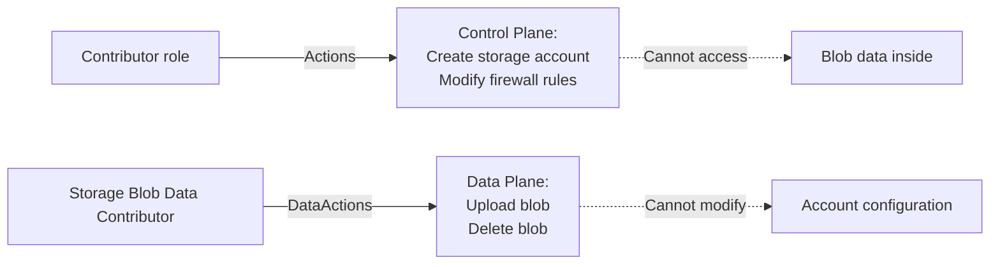
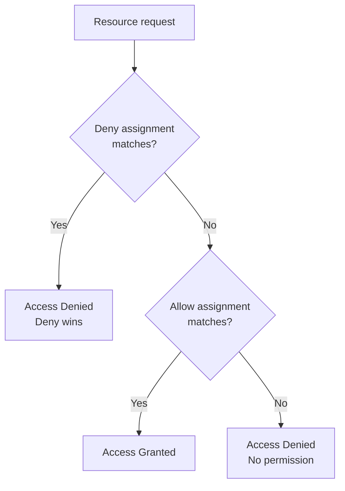
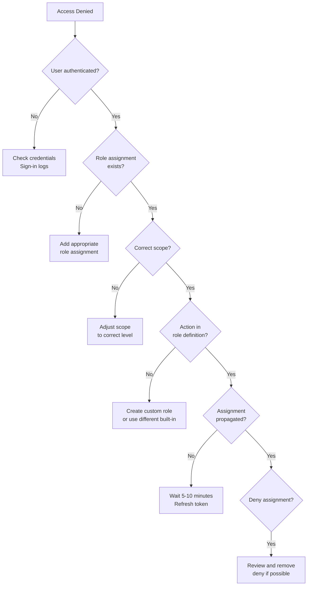
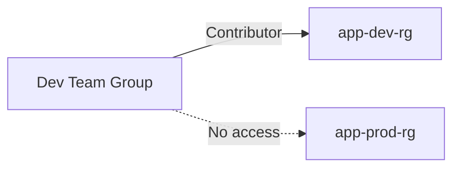

# Role-Based Access Control (RBAC) Fundamentals

> **Azure RBAC** is the authorization system that controls **who can do what** on **Azure resources**.  
> It operates **after authentication** and answers: *Does this identity have permission to perform this action at this scope?*

---

## Overview

Azure RBAC is the security boundary for all Azure resource management operations:

- **Control plane** (ARM operations): create VM, delete storage account, modify VNet
- **Data plane** (resource-specific data access): read blob, write to SQL, access Key Vault secret
- Works at **scope hierarchy**: management group → subscription → resource group → resource
- Assignments are **additive** (union of all permissions) with **deny assignments** as exceptions

In AZ-104 terms: if you can't reason about **principal + role + scope**, you cannot troubleshoot access issues in Azure.

---

## What You Will Learn

- RBAC **components**: principal, role definition, scope, role assignment
- **Scope hierarchy** and permission inheritance
- **Built-in roles** and when to use each (Owner, Contributor, Reader, User Access Administrator)
- **Custom roles** creation and JSON structure
- **Data actions** vs **Actions** (control plane vs data plane)
- **Deny assignments** and how they override allow
- **Classic administrator roles** (legacy)
- Troubleshooting access denied scenarios
- Real admin workflows and exam-grade pitfalls

---

## Mental Model: RBAC Components

Azure RBAC has four core components that work together:



**Formula:** *Principal* + *Role* + *Scope* = *Role Assignment*

---

## RBAC Evaluation Flow



**Key points:**
1. **Deny assignments** override all allow assignments
2. **No assignment** = no access (deny by default)
3. Permissions are evaluated **across all scopes** (inheritance)

---

## Scope Hierarchy and Inheritance

### Scope Levels



**Inheritance rule:** Permissions granted at a parent scope apply to all child scopes.

### Inheritance Example



**Result:** Alice can **read** (but not modify) everything in the subscription, including both resource groups and all their resources.

### Least Privilege Pattern

✅ **Good:** Assign Contributor at RG level for team working on specific app  
❌ **Bad:** Assign Contributor at Subscription level when only RG access needed

---

## Built-in Roles (Core Four)

### Role Comparison Table

| Role | Scope | Permissions | Use Case |
|------|-------|-------------|----------|
| **Owner** | All | Full control (CRUD) + Assign roles | Resource/RG owners, delegated admins |
| **Contributor** | All | Full control (CRUD) - Cannot assign roles | Developers, operators |
| **Reader** | All | Read-only (List, Get) | Auditors, viewers, monitoring |
| **User Access Administrator** | All | No resource access + Assign roles | Security teams managing access |

### Owner

**Permissions:**
- All `Actions: *` (create, read, update, delete)
- Can assign roles to others (`Microsoft.Authorization/roleAssignments/*`)

**When to use:**
- Delegated resource group ownership
- Need to grant access to others

**CLI check:**
```bash
# List Owner assignments at resource group scope
# az role assignment list \
#   --scope "/subscriptions/<sub-id>/resourceGroups/<rg-name>" \
#   --role "Owner" \
#   -o table
```

---

### Contributor

**Permissions:**
- All `Actions: *` (CRUD on resources)
- **Cannot** assign roles (missing `Microsoft.Authorization/roleAssignments/write`)

**When to use:**
- Development teams deploying infrastructure
- Automation scripts creating resources
- Most operational tasks

**Exam trap:** Contributor **cannot** grant access to others or view RBAC assignments.

---

### Reader

**Permissions:**
- `Actions: */read` (list and view resources)
- Cannot create, modify, or delete

**When to use:**
- Auditors reviewing configurations
- Monitoring tools reading resource state
- Cost management personnel

---

### User Access Administrator

**Permissions:**
- `Microsoft.Authorization/*` (manage role assignments only)
- **Cannot** create, modify, or delete resources

**When to use:**
- Security teams managing permissions
- Least-privilege access management
- Separation of duties (access control ≠ resource management)

---

## Data Actions vs Actions

### Control Plane vs Data Plane

| Plane | RBAC Property | Examples | Permission Required |
|-------|---------------|----------|---------------------|
| **Control plane** | `Actions` | Create storage account, delete VM, modify VNet | Contributor |
| **Data plane** | `DataActions` | Read blob, write to SQL, get Key Vault secret | Storage Blob Data Reader |

### Example: Storage Account



**Common roles with data actions:**
- `Storage Blob Data Contributor` (read/write blobs)
- `Storage Queue Data Contributor` (read/write queue messages)
- `Key Vault Secrets User` (read secrets)

**Exam trap:** Having `Contributor` on a storage account does **not** grant access to read/write blob data. You need `Storage Blob Data Reader/Contributor`.

---

## Custom Roles

### When to Create Custom Roles

✅ Built-in role is too broad (violates least privilege)  
✅ Need specific combination of permissions across services  
✅ Business-specific requirements not covered by built-in roles

❌ Don't create custom roles just to remove one or two actions from built-in  
❌ Avoid creating custom roles for short-term needs

### Role Definition JSON Structure

```json
{
  "Name": "Virtual Machine Operator Custom",
  "IsCustom": true,
  "Description": "Can start, stop, and restart VMs but not create or delete them",
  "Actions": [
    "Microsoft.Compute/virtualMachines/read",
    "Microsoft.Compute/virtualMachines/start/action",
    "Microsoft.Compute/virtualMachines/restart/action",
    "Microsoft.Compute/virtualMachines/powerOff/action",
    "Microsoft.Compute/virtualMachines/deallocate/action",
    "Microsoft.Network/networkInterfaces/read",
    "Microsoft.Resources/subscriptions/resourceGroups/read"
  ],
  "NotActions": [],
  "DataActions": [],
  "NotDataActions": [],
  "AssignableScopes": [
    "/subscriptions/00000000-0000-0000-0000-000000000000",
    "/subscriptions/11111111-1111-1111-1111-111111111111"
  ]
}
```

### Key Properties Explained

| Property | Description | Example |
|----------|-------------|---------|
| `Name` | Unique role name | "Virtual Machine Operator Custom" |
| `IsCustom` | Always `true` for custom roles | `true` |
| `Actions` | Control-plane permissions (allow) | `Microsoft.Compute/virtualMachines/start/action` |
| `NotActions` | Subtract from Actions | `Microsoft.Compute/*/delete` |
| `DataActions` | Data-plane permissions (allow) | `Microsoft.Storage/storageAccounts/blobServices/containers/blobs/read` |
| `NotDataActions` | Subtract from DataActions | N/A |
| `AssignableScopes` | Where role can be assigned | `/subscriptions/<sub-id>` or `/subscriptions/<sub-id>/resourceGroups/<rg>` |

### Permission Logic

**Effective Actions** = `Actions` - `NotActions`  
**Effective DataActions** = `DataActions` - `NotDataActions`

**Example:**  
```json
"Actions": ["Microsoft.Compute/*"],
"NotActions": ["Microsoft.Compute/*/delete"]
```
Result: All Compute actions **except** delete operations.

### Creating a Custom Role via CLI

```bash
# Create role definition JSON file
# cat > vm-operator-role.json << 'EOF'
# {
#   "Name": "VM Operator Custom",
#   "Description": "Start/stop VMs only",
#   "Actions": [
#     "Microsoft.Compute/virtualMachines/read",
#     "Microsoft.Compute/virtualMachines/start/action",
#     "Microsoft.Compute/virtualMachines/powerOff/action"
#   ],
#   "AssignableScopes": ["/subscriptions/<subscription-id>"]
# }
# EOF

# Create the custom role
# az role definition create --role-definition vm-operator-role.json

# List custom roles
# az role definition list --custom-role-only true -o table
```

---

## Deny Assignments

### What are Deny Assignments?

Deny assignments **block users from performing specific actions**, even if a role assignment grants them access.

**Key characteristics:**
- **Deny overrides allow** (always)
- Cannot be created directly by users (system-managed)
- Created automatically by certain Azure services (e.g., Blueprints, Managed Apps)
- Rare in typical environments

### Deny Assignment Evaluation



### CLI: Check Deny Assignments

```bash
# List deny assignments at subscription scope
# az role assignment list --include-inherited --include-deny -o table

# Check deny assignments for a specific resource
# az role assignment list \
#   --scope /subscriptions/<sub-id>/resourceGroups/<rg>/providers/Microsoft.Compute/virtualMachines/<vm> \
#   --include-deny \
#   -o table
```

---

## Classic Administrator Roles (Legacy)

| Role | Scope | Modern Equivalent | Status |
|------|-------|-------------------|--------|
| **Account Administrator** | Subscription | Owner + billing admin | Deprecated |
| **Service Administrator** | Subscription | Owner | Deprecated |
| **Co-Administrator** | Subscription | Owner | Deprecated |

**Current guidance:**
- ❌ Do **not** use classic roles for new assignments
- ✅ Use Azure RBAC roles instead (Owner, Contributor, etc.)
- ⚠️ Existing classic assignments still work but should be migrated

---

## Troubleshooting Access Denied

### Common Troubleshooting Flow



### Validation Checklist

1. **Confirm authentication** - User can sign in?
2. **Check role assignments** - Does assignment exist for the principal?
3. **Verify scope** - Is assignment at the right scope level?
4. **Review role definition** - Does role include required action?
5. **Check propagation** - Did assignment propagate (can take 5-10 min)?
6. **Look for deny assignments** - Any deny blocking access?
7. **Review Activity Log** - What error code is returned?

### CLI: Troubleshooting Commands

```bash
# Check current user's identity
# az ad signed-in-user show

# List all role assignments for current user
# PRINCIPAL_ID=$(az ad signed-in-user show --query id -o tsv)
# az role assignment list --assignee "$PRINCIPAL_ID" --all -o table

# Check effective permissions at a scope
# az role assignment list \
#   --scope "/subscriptions/<sub-id>/resourceGroups/<rg>" \
#   --assignee "$PRINCIPAL_ID" \
#   --include-inherited \
#   -o table

# View Activity Log for authorization failures
# az monitor activity-log list \
#   --offset 1h \
#   --query "[?contains(authorization.action, 'Microsoft.Authorization')]" \
#   -o table
```

---

## Real-World Admin Scenarios

### Scenario 1: Developer Team Needs RG Access

**Requirement:** Dev team needs full access to `app-dev-rg` but not production.



**Implementation:**
```bash
# Get the group object ID
# GROUP_ID=$(az ad group show --group "Dev-Team" --query id -o tsv)

# Assign Contributor at RG scope only
# az role assignment create \
#   --assignee-object-id "$GROUP_ID" \
#   --assignee-principal-type Group \
#   --role "Contributor" \
#   --scope "/subscriptions/<sub-id>/resourceGroups/app-dev-rg"
```

---

### Scenario 2: Monitoring Tool Needs Read Access

**Requirement:** Monitoring service needs read-only access to subscription.

```bash
# Create service principal for monitoring tool
# SP_ID=$(az ad sp create-for-rbac --name "monitoring-sp" --query appId -o tsv)

# Assign Reader at subscription scope
# az role assignment create \
#   --assignee "$SP_ID" \
#   --role "Reader" \
#   --scope "/subscriptions/<subscription-id>"
```

---

### Scenario 3: Data Access Without Resource Management

**Requirement:** User needs to read/write blob data but not modify storage account.

```bash
# Assign data-plane role only (not Contributor)
# az role assignment create \
#   --assignee user@contoso.com \
#   --role "Storage Blob Data Contributor" \
#   --scope "/subscriptions/<sub-id>/resourceGroups/<rg>/providers/Microsoft.Storage/storageAccounts/<storage>"
```

**Result:** User can upload/download blobs but **cannot** change firewall rules, delete account, etc.

---

## Best Practices (AZ-104 Aligned)

✅ **Use groups** for role assignments (not individual users)  
✅ **Apply least privilege** - smallest scope, minimal permissions  
✅ **Prefer Contributor** over Owner when role assignment capability not needed  
✅ **Use data-plane roles** for resource data access (blobs, queues, secrets)  
✅ **Document custom roles** with clear descriptions and justification  
✅ **Regular access reviews** - remove unused assignments  
✅ **Test in dev/test** before production role changes  
✅ **Monitor Activity Log** for authorization failures

---

## Common Pitfalls & Exam Traps

❌ **Assigning Owner when Contributor is sufficient**  
Owner grants role assignment capability that creates security risk.

❌ **Using subscription scope when RG scope is enough**  
Violates least privilege; increases blast radius.

❌ **Mixing control-plane and data-plane roles**  
Contributor ≠ data access. Need separate data-plane roles.

❌ **Expecting immediate effect after assignment**  
Propagation takes 5-10 minutes; token caching delays effect.

❌ **Forgetting NotActions**  
`Actions: ["*"], NotActions: []` grants everything.

❌ **Not checking deny assignments**  
Deny overrides allow; always check for deny when troubleshooting.

❌ **Using classic administrator roles**  
Deprecated; use modern RBAC instead.

❌ **Assigning at resource level for multiple resources**  
Use RG scope to avoid assignment sprawl.

---

## Key Takeaways for AZ-104

1. **RBAC = Principal + Role + Scope** (assignment formula)
2. **Deny overrides allow** (always check deny assignments)
3. **Inheritance flows down** scope hierarchy (parent → child)
4. **Contributor ≠ data access** (need data-plane roles)
5. **Owner grants role assignment** capability (security consideration)
6. **Least privilege** = smallest scope + minimal permissions
7. **Propagation delay** = 5-10 minutes for new assignments
8. **Custom roles** require `AssignableScopes` and clear documentation

---

## CLI Reference (Commented Examples)

### Role Assignment Operations

```bash
# Create role assignment
# az role assignment create \
#   --assignee <user-or-sp-id> \
#   --role "Contributor" \
#   --scope <scope-path>

# List all role assignments at scope
# az role assignment list --scope <scope-path> -o table

# Delete role assignment
# az role assignment delete \
#   --assignee <user-or-sp-id> \
#   --role "Contributor" \
#   --scope <scope-path>
```

### Role Definition Operations

```bash
# List all role definitions
# az role definition list -o table

# Get specific role definition
# az role definition list --name "Contributor" -o json

# Create custom role
# az role definition create --role-definition <json-file>

# Update custom role
# az role definition update --role-definition <json-file>

# Delete custom role
# az role definition delete --name <role-name>
```

### Troubleshooting Commands

```bash
# Check current user's role assignments
# PRINCIPAL_ID=$(az ad signed-in-user show --query id -o tsv)
# az role assignment list --assignee "$PRINCIPAL_ID" --all -o table

# List denied assignments
# az role assignment list --include-deny -o table

# View Activity Log for authorization events
# az monitor activity-log list \
#   --offset 1h \
#   --query "[?contains(category, 'Authorization')]" \
#   -o table
```

---
