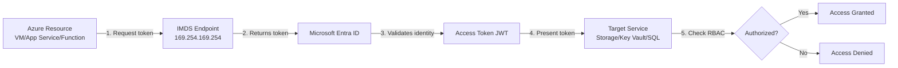
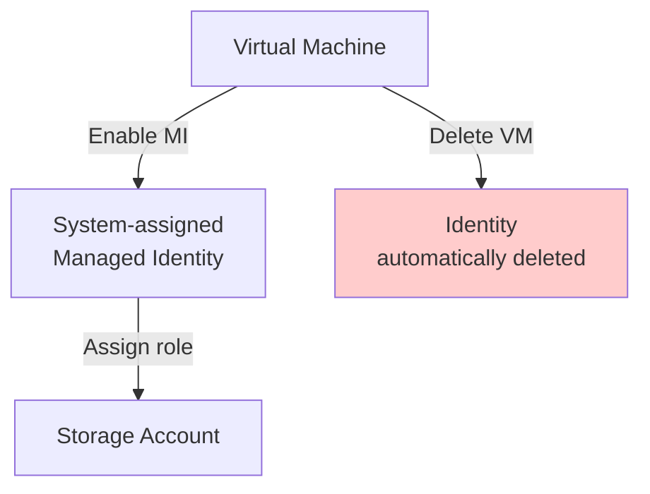
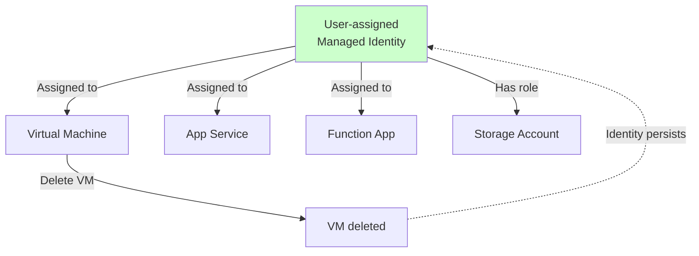
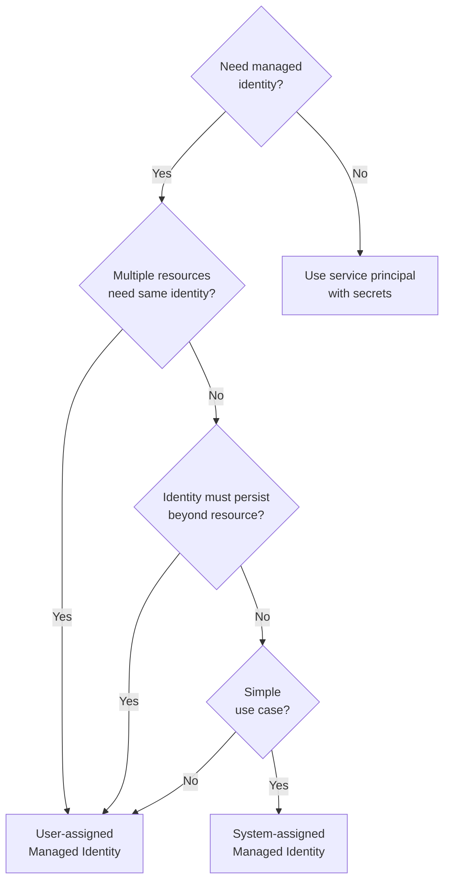
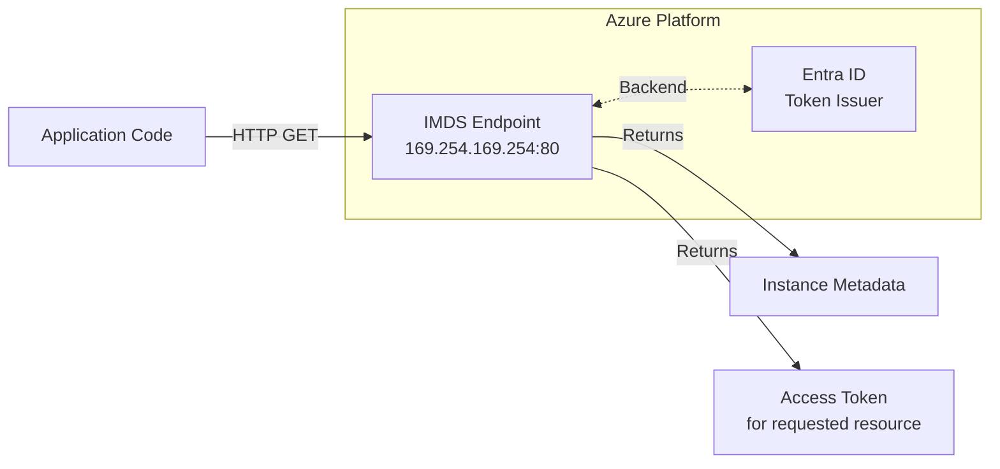
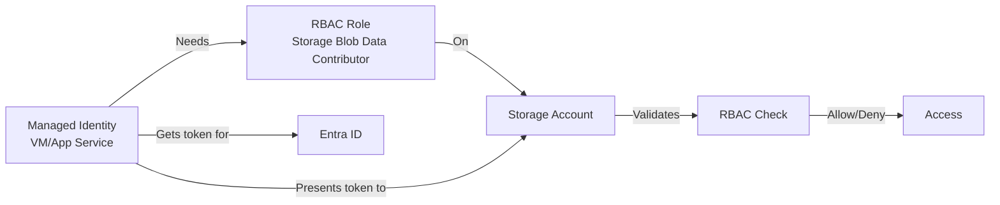
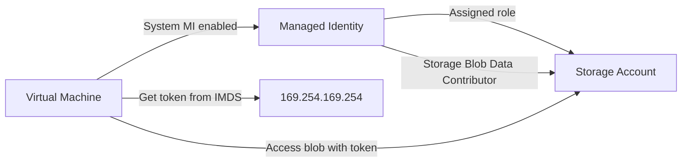
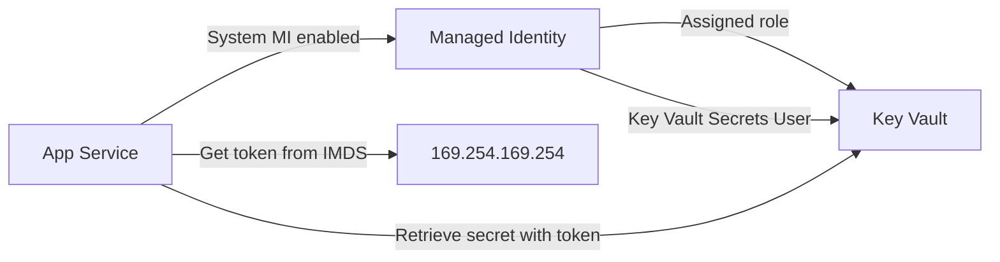
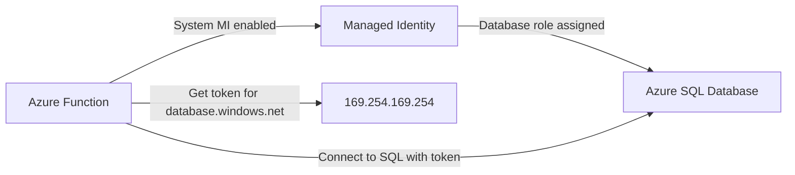
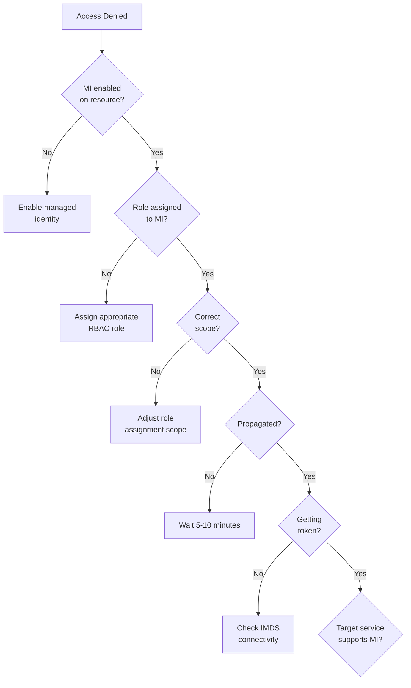

# Managed Identities (System vs User-assigned)

> **Managed Identities** eliminate the need to store credentials in code or configuration.  
> Azure automatically manages the identity lifecycle and token acquisition, providing a **secure, credential-free** way for Azure resources to access other Azure services.

---

## Overview

Managed Identities solve the **credential management problem** for Azure-to-Azure authentication:

- **No secrets in code** - Azure manages credentials automatically
- **Automatic rotation** - No manual certificate/key management
- **Seamless integration** - Works with Azure AD authentication-enabled services
- **Zero-trust architecture** - Identity-based access, not network-based

In AZ-104 terms: Managed identities are the **preferred authentication method** for any Azure resource accessing another Azure service.

---

## What You Will Learn

- What managed identities are and why they matter
- **System-assigned** vs **User-assigned** - when to use each
- How the **IMDS endpoint** (169.254.169.254) provides tokens
- Enabling managed identities across Azure services (VM, App Service, Functions, etc.)
- **Token acquisition** workflow and code examples
- Role assignments for managed identities
- Common integration patterns (Storage, Key Vault, SQL)
- Troubleshooting and best practices
- Real admin workflows and exam-grade pitfalls

---

## Mental Model: Managed Identity Flow



**Key insight:** Application **never handles credentials** - Azure manages token acquisition transparently.

---

## Types of Managed Identities

### System-Assigned Managed Identity

**Lifecycle:** Tied directly to a single Azure resource



**Characteristics:**
- ✅ One-to-one relationship (1 identity per resource)
- ✅ Automatically deleted when parent resource is deleted
- ✅ Simpler for single-resource scenarios
- ❌ Cannot be shared across resources
- ❌ Deleted if resource is deleted (cannot preserve identity)

**When to use:**
- Single resource needs access to other services
- Identity lifecycle matches resource lifecycle
- No need to share identity across multiple resources

---

### User-Assigned Managed Identity

**Lifecycle:** Independent Azure resource that can be shared



**Characteristics:**
- ✅ Can be assigned to multiple resources
- ✅ Independent lifecycle (survives resource deletion)
- ✅ Reusable across environments
- ✅ Supports advanced scenarios (failover, DR)
- ❌ Requires manual creation and deletion
- ❌ More complex to manage

**When to use:**
- Multiple resources need same permissions
- Identity should persist beyond resource lifecycle
- Disaster recovery scenarios requiring identity preservation
- Terraform/IaC where identity is managed separately

---

## Decision Tree: System vs User-Assigned



**Quick guide:**
- **System-assigned:** Default choice for simple scenarios
- **User-assigned:** When sharing identity or preserving identity across resource lifecycles

---

## The IMDS Endpoint (Instance Metadata Service)

### What is IMDS?

**IMDS (Instance Metadata Service)** is a REST API available at `http://169.254.169.254` from Azure resources.

**Characteristics:**
- ✅ Non-routable IP (only accessible from within Azure resource)
- ✅ Provides metadata about the resource instance
- ✅ **Token endpoint** for managed identities
- ✅ No authentication required from within the resource

### IMDS Architecture



### Token Acquisition Example

**HTTP Request to IMDS:**
```bash
curl 'http://169.254.169.254/metadata/identity/oauth2/token?api-version=2018-02-01&resource=https://storage.azure.com/' \
  -H Metadata:true
```

**Response:**
```json
{
  "access_token": "eyJ0eXAi...",
  "client_id": "00000000-0000-0000-0000-000000000000",
  "expires_in": "3599",
  "expires_on": "1234567890",
  "ext_expires_in": "3599",
  "not_before": "1234567890",
  "resource": "https://storage.azure.com/",
  "token_type": "Bearer"
}
```

**Key parameters:**
- `resource` - Target service (e.g., `https://storage.azure.com/`, `https://vault.azure.net/`)
- `Metadata: true` - Required header
- `api-version` - IMDS API version

---

## Enabling Managed Identities

### Virtual Machine (System-assigned)

**Portal:**
1. VM → **Identity** → System assigned → **On** → Save

**CLI:**
```bash
# Enable system-assigned MI on existing VM
# az vm identity assign --name <vm-name> --resource-group <rg-name>

# Create VM with system-assigned MI enabled
# az vm create \
#   --name myVM \
#   --resource-group myRG \
#   --image UbuntuLTS \
#   --assign-identity \
#   --role Contributor \
#   --scope /subscriptions/<sub-id>/resourceGroups/<rg>
```

**Get principal ID:**
```bash
# Get the managed identity's principal ID (for role assignments)
# PRINCIPAL_ID=$(az vm identity show \
#   --name <vm-name> \
#   --resource-group <rg-name> \
#   --query principalId -o tsv)
# echo $PRINCIPAL_ID
```

---

### App Service / Function App (System-assigned)

**Portal:**
1. App Service → **Identity** → System assigned → **On** → Save

**CLI:**
```bash
# Enable system-assigned MI on App Service
# az webapp identity assign \
#   --name <app-name> \
#   --resource-group <rg-name>

# Get principal ID
# PRINCIPAL_ID=$(az webapp identity show \
#   --name <app-name> \
#   --resource-group <rg-name> \
#   --query principalId -o tsv)
```

---

### User-Assigned Managed Identity

**Create user-assigned MI:**
```bash
# Create user-assigned managed identity
# az identity create \
#   --name myUserMI \
#   --resource-group myRG \
#   --location eastus

# Get identity details
# IDENTITY_ID=$(az identity show \
#   --name myUserMI \
#   --resource-group myRG \
#   --query id -o tsv)
# PRINCIPAL_ID=$(az identity show \
#   --name myUserMI \
#   --resource-group myRG \
#   --query principalId -o tsv)
```

**Assign to VM:**
```bash
# Assign user-assigned MI to VM
# az vm identity assign \
#   --name <vm-name> \
#   --resource-group <rg-name> \
#   --identities "$IDENTITY_ID"
```

**Assign to App Service:**
```bash
# Assign user-assigned MI to App Service
# az webapp identity assign \
#   --name <app-name> \
#   --resource-group <rg-name> \
#   --identities "$IDENTITY_ID"
```

---

## Token Acquisition in Code

### Bash (from VM)

```bash
#!/bin/bash
# Get token for Azure Storage
TOKEN=$(curl -H Metadata:true \
  "http://169.254.169.254/metadata/identity/oauth2/token?api-version=2018-02-01&resource=https://storage.azure.com/" \
  | jq -r '.access_token')

# Use token to access Storage
curl -H "Authorization: Bearer $TOKEN" \
  -H "x-ms-version: 2019-12-12" \
  "https://<storage-account>.blob.core.windows.net/<container>?restype=container&comp=list"
```

### Python

```python
import requests
import json

# IMDS endpoint for managed identity token
imds_url = "http://169.254.169.254/metadata/identity/oauth2/token"
params = {
    "api-version": "2018-02-01",
    "resource": "https://storage.azure.com/"  # Target resource
}
headers = {"Metadata": "true"}

# Get token
response = requests.get(imds_url, params=params, headers=headers)
token = response.json()["access_token"]

# Use token to access Azure Storage
storage_url = "https://<storage-account>.blob.core.windows.net/<container>?restype=container&comp=list"
storage_headers = {
    "Authorization": f"Bearer {token}",
    "x-ms-version": "2019-12-12"
}
storage_response = requests.get(storage_url, headers=storage_headers)
print(storage_response.text)
```

### PowerShell

```powershell
# Get token for Key Vault
$response = Invoke-RestMethod -Uri 'http://169.254.169.254/metadata/identity/oauth2/token?api-version=2018-02-01&resource=https://vault.azure.net' `
  -Headers @{Metadata="true"}
$token = $response.access_token

# Use token to access Key Vault secret
$vaultName = "myKeyVault"
$secretName = "mySecret"
$secretUrl = "https://$vaultName.vault.azure.net/secrets/$secretName?api-version=7.2"
$secret = Invoke-RestMethod -Uri $secretUrl -Headers @{Authorization="Bearer $token"}
Write-Host $secret.value
```

---

## Role Assignments for Managed Identities

### Pattern: MI → Role → Target Service



### Common Role Assignments

**Storage Account:**
```bash
# Grant managed identity access to blob storage
# az role assignment create \
#   --assignee <principal-id> \
#   --role "Storage Blob Data Contributor" \
#   --scope /subscriptions/<sub-id>/resourceGroups/<rg>/providers/Microsoft.Storage/storageAccounts/<storage>
```

**Key Vault:**
```bash
# Grant managed identity access to Key Vault secrets
# az role assignment create \
#   --assignee <principal-id> \
#   --role "Key Vault Secrets User" \
#   --scope /subscriptions/<sub-id>/resourceGroups/<rg>/providers/Microsoft.KeyVault/vaults/<vault>
```

**Azure SQL Database:**
```sql
-- Connect to database as Azure AD admin
-- Create user for managed identity
CREATE USER [myVM] FROM EXTERNAL PROVIDER;
ALTER ROLE db_datareader ADD MEMBER [myVM];
ALTER ROLE db_datawriter ADD MEMBER [myVM];
```

---

## Common Integration Patterns

### Pattern 1: VM → Storage Account

**Scenario:** VM needs to read/write blob data



**Implementation:**
```bash
# 1. Enable system MI on VM
# az vm identity assign --name myVM --resource-group myRG

# 2. Get principal ID
# PRINCIPAL_ID=$(az vm identity show --name myVM --resource-group myRG --query principalId -o tsv)

# 3. Assign Storage Blob Data Contributor role
# az role assignment create \
#   --assignee "$PRINCIPAL_ID" \
#   --role "Storage Blob Data Contributor" \
#   --scope /subscriptions/<sub-id>/resourceGroups/<rg>/providers/Microsoft.Storage/storageAccounts/<storage>

# 4. From VM, get token and access storage (see code examples above)
```

---

### Pattern 2: App Service → Key Vault

**Scenario:** App Service needs to retrieve secrets from Key Vault



**Implementation:**
```bash
# 1. Enable system MI on App Service
# az webapp identity assign --name myApp --resource-group myRG

# 2. Get principal ID
# PRINCIPAL_ID=$(az webapp identity show --name myApp --resource-group myRG --query principalId -o tsv)

# 3. Assign Key Vault Secrets User role
# az role assignment create \
#   --assignee "$PRINCIPAL_ID" \
#   --role "Key Vault Secrets User" \
#   --scope /subscriptions/<sub-id>/resourceGroups/<rg>/providers/Microsoft.KeyVault/vaults/<vault>

# 4. In app code, use Azure SDK to access Key Vault with managed identity
```

---

### Pattern 3: Function → SQL Database

**Scenario:** Azure Function needs to query SQL Database



**Implementation:**
```bash
# 1. Enable system MI on Function
# az functionapp identity assign --name myFunction --resource-group myRG

# 2. In SQL, create user for managed identity (see SQL example above)
```

**Connection string:**
```csharp
// C# example
var connectionString = "Server=tcp:myserver.database.windows.net;Database=mydb;";
var connection = new SqlConnection(connectionString);
connection.AccessToken = GetAccessToken("https://database.windows.net/");
```

---

## Cross-Subscription and Cross-Tenant Access

### Cross-Subscription Access

✅ **Supported** - Managed identity can access resources in different subscriptions within the **same tenant**

```bash
# Assign MI to storage account in different subscription
# az role assignment create \
#   --assignee <principal-id> \
#   --role "Storage Blob Data Contributor" \
#   --scope /subscriptions/<other-sub-id>/resourceGroups/<rg>/providers/Microsoft.Storage/storageAccounts/<storage>
```

### Cross-Tenant Access

❌ **Not supported** - Managed identities cannot authenticate across Entra ID tenants

**Alternative:** Use service principals with federated credentials (advanced topic).

---

## Troubleshooting Managed Identities

### Common Issues Checklist



### Validation Commands

```bash
# Check if system MI is enabled on VM
# az vm identity show --name <vm-name> --resource-group <rg-name>

# List role assignments for managed identity
# az role assignment list --assignee <principal-id> --all -o table

# Test IMDS endpoint from within VM/App Service
# curl -H Metadata:true "http://169.254.169.254/metadata/instance?api-version=2021-02-01" | jq

# Get token for specific resource
# curl -H Metadata:true \
#   "http://169.254.169.254/metadata/identity/oauth2/token?api-version=2018-02-01&resource=https://storage.azure.com/" \
#   | jq
```

### Common Error Messages

| Error | Cause | Solution |
|-------|-------|----------|
| `AADSTS70001: Application not found` | MI not enabled | Enable managed identity on resource |
| `403 Forbidden` | No role assignment | Assign appropriate role to MI principal |
| `The managed identity has not been assigned this role` | Wrong scope or missing role | Check role assignment scope |
| `Could not connect to IMDS` | Network issue or not running on Azure | Verify running on Azure resource |
| `MSI not available` | MI not enabled or runtime not initialized | Enable MI and restart resource |

---

## Best Practices (AZ-104 Aligned)

✅ **Prefer managed identities** over service principals with secrets  
✅ **Use system-assigned MI** as default (simpler)  
✅ **Use user-assigned MI** for shared identity or DR scenarios  
✅ **Assign data-plane roles** (Storage Blob Data Contributor, not Contributor)  
✅ **Scope roles narrowly** (storage account level, not subscription)  
✅ **Test token acquisition** before deploying to production  
✅ **Monitor sign-in logs** for managed identity usage  
✅ **Document MI dependencies** in infrastructure-as-code  
✅ **Use latest IMDS API version** (2021-02-01 or newer)

---

## Common Pitfalls & Exam Traps

❌ **Enabling MI but forgetting role assignment**  
MI provides identity, not permissions. Must assign RBAC role.

❌ **Assigning Contributor instead of data-plane role**  
Contributor grants control-plane access, not blob/queue/secret access.

❌ **Using system MI when user MI is appropriate**  
System MI is deleted with resource; use user MI for shared scenarios.

❌ **Assuming MI works across tenants**  
MI is tenant-scoped; use service principals for cross-tenant.

❌ **Not waiting for propagation**  
Role assignments take 5-10 minutes to propagate.

❌ **Hardcoding IMDS endpoint in application**  
Use Azure SDK libraries that handle IMDS automatically.

❌ **Forgetting to test from within Azure resource**  
IMDS is only accessible from Azure resources, not local development.

❌ **Using wrong resource URI in token request**  
Each service has specific resource URI (https://storage.azure.com/, https://vault.azure.net/, etc.)

---

## Key Takeaways for AZ-104

1. **Managed identities = credential-free authentication** for Azure resources
2. **System-assigned** = 1:1 with resource (default choice)
3. **User-assigned** = reusable across resources (advanced scenarios)
4. **IMDS endpoint** (169.254.169.254) provides tokens automatically
5. **Role assignment required** - MI provides identity, not permissions
6. **Data-plane roles** for resource data access (not Contributor)
7. **Cross-subscription supported**, cross-tenant not supported
8. **No secrets in code** - Azure SDK handles token acquisition
9. **Propagation delay** = 5-10 minutes for role assignments
10. **Best for Azure-to-Azure** authentication (VMs, App Services, Functions)

---

## CLI Reference (Commented Examples)

### Enable Managed Identities

```bash
# Enable system-assigned MI on VM
# az vm identity assign --name <vm-name> --resource-group <rg-name>

# Enable system-assigned MI on App Service
# az webapp identity assign --name <app-name> --resource-group <rg-name>

# Create user-assigned MI
# az identity create --name <identity-name> --resource-group <rg-name>

# Assign user-assigned MI to VM
# az vm identity assign --name <vm-name> --resource-group <rg-name> --identities <identity-id>
```

### Get Identity Information

```bash
# Get principal ID from system-assigned MI
# az vm identity show --name <vm-name> --resource-group <rg-name> --query principalId -o tsv

# Get user-assigned MI details
# az identity show --name <identity-name> --resource-group <rg-name>
```

### Assign Roles to Managed Identity

```bash
# Assign Storage Blob Data Contributor
# az role assignment create \
#   --assignee <principal-id> \
#   --role "Storage Blob Data Contributor" \
#   --scope <storage-account-resource-id>

# Assign Key Vault Secrets User
# az role assignment create \
#   --assignee <principal-id> \
#   --role "Key Vault Secrets User" \
#   --scope <key-vault-resource-id>
```

### Test Token Acquisition

```bash
# Get token for Azure Storage (from within Azure resource)
# curl -H Metadata:true \
#   "http://169.254.169.254/metadata/identity/oauth2/token?api-version=2018-02-01&resource=https://storage.azure.com/" \
#   | jq

# Get token for Key Vault
# curl -H Metadata:true \
#   "http://169.254.169.254/metadata/identity/oauth2/token?api-version=2018-02-01&resource=https://vault.azure.net/" \
#   | jq
```

---
