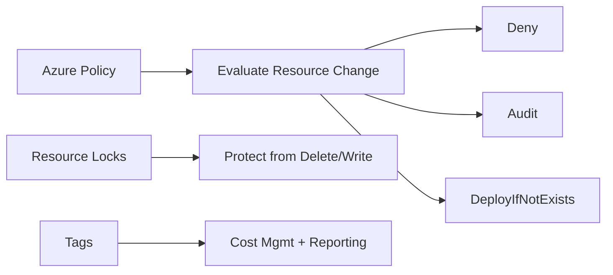

# Governance: Policy, Locks, and Tags

## What you will learn
- How policies enforce guardrails
- How locks protect critical resources
- How tagging supports cost + operations

## Concept flow architecture


## Key concepts (AZ-104 focus)
- Policy controls *what can be deployed* and can audit or deny non-compliance.
- Locks prevent accidental deletion/modification (Delete lock / ReadOnly).
- Tags are metadata for cost allocation, ownership, and automation.

## Admin mindset
- Use policy for standardisation and risk control.
- Use locks only where justified; they can block automation and cleanups.
- Establish a minimal tag set early: owner, costCenter, environment.

## Common pitfalls / exam traps
- Confusing locks with RBAC (locks are not permissions).
- Applying a lock on a RG and later forgetting why deletes fail.
- Assuming tags enforce behaviour (they don’t; policy does).

## Quick CLI signals (read-only examples)
> These are **signals** you look for as an administrator. They are not a full lab.
```bash
# az <service> <command> ... 
```
