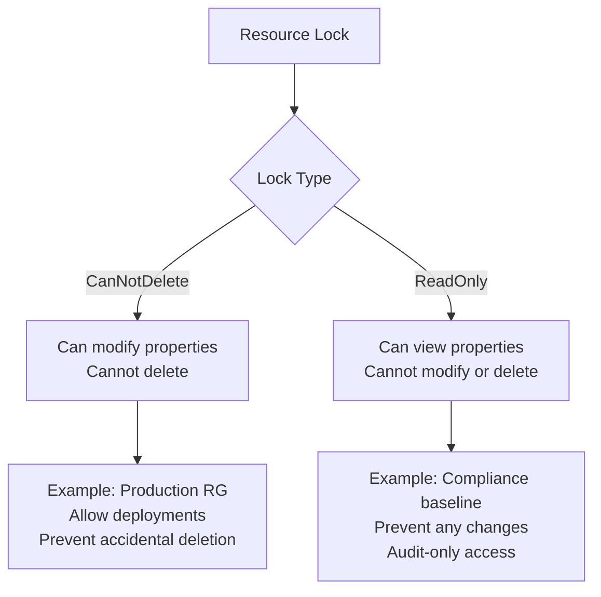
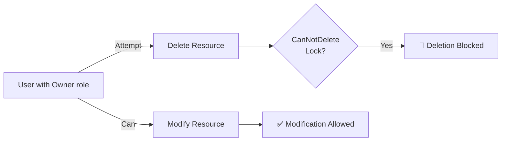
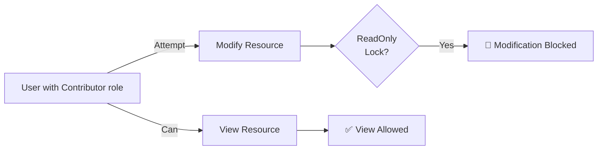
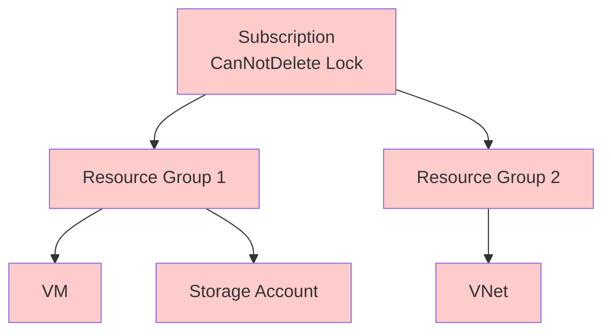
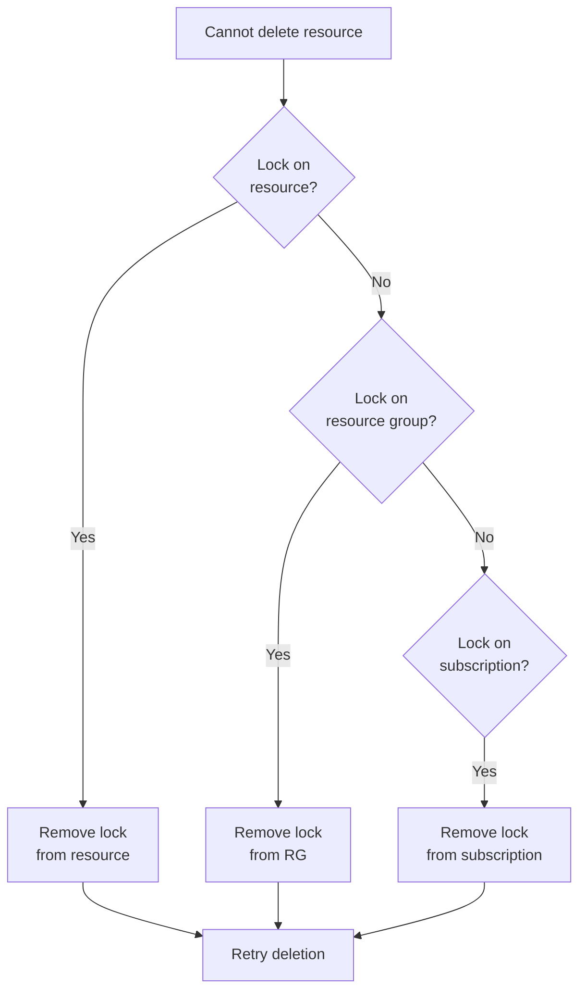
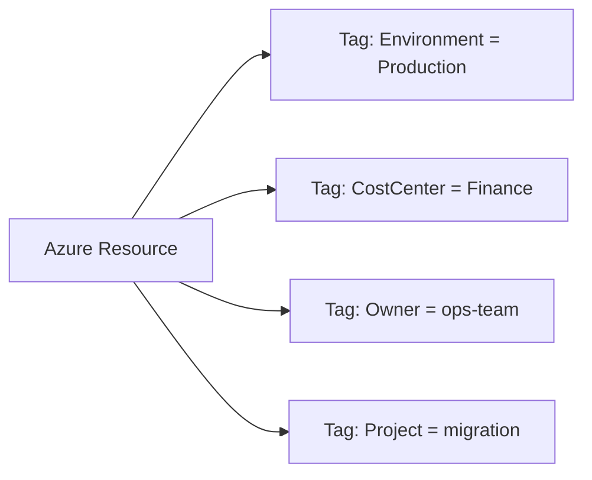
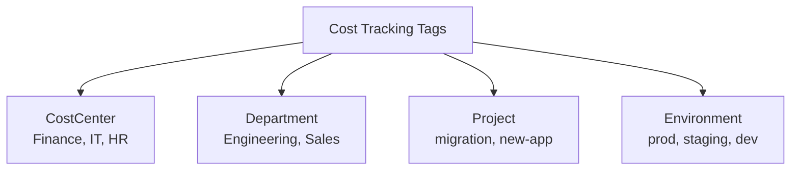
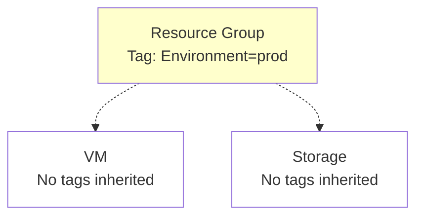
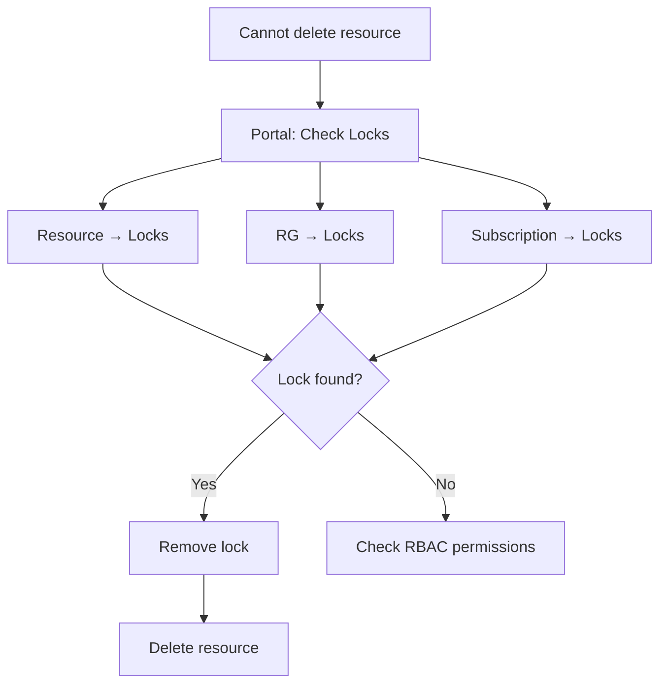

# Resource Management (Locks & Tags)

> **Resource locks** protect critical resources from accidental deletion or modification.  
> **Resource tags** provide metadata for organization, cost tracking, automation, and compliance reporting.

---

## Overview

Locks and tags are essential **resource management tools** for Azure administrators:

**Locks:**
- **Prevent** accidental deletion or modifications
- Override RBAC permissions (even Owner cannot delete locked resource)
- Apply at subscription, resource group, or resource level

**Tags:**
- **Organize** resources with metadata (key-value pairs)
- **Track costs** by department, project, environment
- **Automate** operations based on tag values
- **Report** on resource ownership and compliance

In AZ-104 terms: locks protect resources, tags organize them - both are **critical for production environments**.

---

## What You Will Learn

- **Lock types**: CanNotDelete vs ReadOnly
- Lock **inheritance** and scope hierarchy
- When to use locks (and when not to)
- **Tag strategies** for cost allocation and governance
- Tag **inheritance** and limitations
- **Tag policies** for enforcement
- Real-world scenarios
- Troubleshooting locked resources
- Best practices and exam-grade pitfalls

---

## Resource Locks

### Lock Types



| Lock Type | Read | Create/Update | Delete | Use Case |
|-----------|------|---------------|--------|----------|
| **CanNotDelete** | ✅ Yes | ✅ Yes | ❌ No | Production resources, critical data |
| **ReadOnly** | ✅ Yes | ❌ No | ❌ No | Compliance baselines, archived resources |

---

### Lock Behavior 

**CanNotDelete Lock:**


**ReadOnly Lock:**


**Key insight:** Locks override RBAC permissions. Even **Owner** role cannot delete a CanNotDelete-locked resource without first removing the lock.

---

### Lock Inheritance



**Inheritance rule:** Locks applied at **parent scope** protect all **child resources**.

**Example:**
- Lock on **Subscription** → All RGs and resources protected
- Lock on **Resource Group** → All resources in that RG protected
- Lock on **Resource** → Only that resource protected

**To delete:** Must remove lock from **parent** before deleting any child resource.

---

### Creating Locks

**Portal:**
1. Navigate to resource, RG, or subscription
2. **Locks** → **+ Add**
3. Select lock type (CanNotDelete or ReadOnly)
4. Provide lock name and optional notes
5. **OK**

**CLI:**
```bash
# Create CanNotDelete lock on resource group
# az lock create \
#   --name "prod-rg-lock" \
#   --lock-type CanNotDelete \
#   --resource-group "app-prod-rg" \
#   --notes "Prevent accidental deletion of production resources"

# Create ReadOnly lock on specific resource
# az lock create \
#   --name "baseline-vm-lock" \
#   --lock-type ReadOnly \
#   --resource-group "compliance-rg" \
#   --resource-name "baseline-vm" \
#   --resource-type "Microsoft.Compute/virtualMachines" \
#   --notes "Compliance baseline - do not modify"

# Create lock at subscription level
# az lock create \
#   --name "sub-delete-lock" \
#   --lock-type CanNotDelete \
#   --notes "Protect all production resources"
```

---

### Listing and Removing Locks

**List locks:**
```bash
# List all locks at resource group level
# az lock list --resource-group "app-prod-rg" -o table

# List locks at subscription level
# az lock list -o table

# List locks on specific resource
# az lock list \
#   --resource-group "app-prod-rg" \
#   --resource-name "prod-vm" \
#   --resource-type "Microsoft.Compute/virtualMachines"
```

**Remove locks:**
```bash
# Delete lock by name and resource group
# az lock delete \
#   --name "prod-rg-lock" \
#   --resource-group "app-prod-rg"

# Delete lock by lock ID
# LOCK_ID=$(az lock show --name "prod-rg-lock" --resource-group "app-prod-rg" --query id -o tsv)
# az lock delete --ids "$LOCK_ID"
```

---

### Lock Conflict Scenarios

#### Scenario 1: Cannot Delete Storage Account

**Symptoms:**
```
Error: Cannot delete resource 'prodStorage' because it has a lock.
```

**Resolution flow:**


**Solution:**
```bash
# Find all locks affecting the resource
# az lock list --resource-group "app-prod-rg" -o table

# Remove the lock
# az lock delete --name "<lock-name>" --resource-group "app-prod-rg"

# Now delete the resource
# az storage account delete --name "prodStorage" --resource-group "app-prod-rg"
```

---

#### Scenario 2: ReadOnly Lock Blocks Deployment

**Symptoms:**
```
Error: Resource modification blocked by ReadOnly lock.
```

**Root cause:** ReadOnly lock on RG prevents creating/modifying resources inside it.

**Solution:**
```bash
# Temporarily remove ReadOnly lock
# az lock delete --name "compliance-lock" --resource-group "baseline-rg"

# Deploy resources
# az deployment group create --resource-group "baseline-rg" --template-file template.json

# Re-apply lock after deployment
# az lock create --name "compliance-lock" --lock-type ReadOnly --resource-group "baseline-rg"
```

---

## Resource Tags

### What are Tags?

**Tags** are key-value pairs that provide metadata about Azure resources.



**Structure:**
- **Tag name** (key): Up to 512 characters
- **Tag value**: Up to 256 characters
- **Limit**: 50 tags per resource

---

### Tag Strategies

#### Strategy 1: Cost Allocation



**Example:**
```bash
# Tag resource for cost tracking
# az resource tag \
#   --tags CostCenter=Finance Department=Engineering Project=migration Environment=prod \
#   --ids /subscriptions/<sub-id>/resourceGroups/app-rg/providers/Microsoft.Compute/virtualMachines/app-vm
```

**Result:** Azure Cost Management can break down costs by CostCenter, Department, Project, or Environment.

---

#### Strategy 2: Operational Tags

| Tag Name | Purpose | Example Values |
|----------|---------|----------------|
| `Owner` | Responsible team/person | ops-team, john@contoso.com |
| `SLA` | Service level | critical, standard, low |
| `MaintenanceWindow` | Allowed downtime | saturday-2am, never |
| `BackupPolicy` | Backup requirement | daily, weekly, none |
| `DataClassification` | Sensitivity level | confidential, internal, public |

---

#### Strategy 3: Automation Tags

```bash
# Tag VM for auto-shutdown
# az vm update \
#   --resource-group app-rg \
#   --name dev-vm \
#   --set tags.AutoShutdown=true tags.ShutdownTime=19:00
```

**Automation script:**
```bash
# Shutdown all VMs tagged with AutoShutdown=true at specified time
# VMs=$(az vm list --query "[?tags.AutoShutdown=='true'].id" -o tsv)
# for VM in $VMs; do
#   az vm deallocate --ids "$VM" --no-wait
# done
```

---

### Tag Inheritance

**Warning:** Tags do **NOT** inherit from parent scopes by default.



**Solution:** Use Azure Policy to enforce tag inheritance.

**Policy example: Inherit tag from resource group**
```json
{
  "if": {
    "field": "tags['Environment']",
    "exists": false
  },
  "then": {
    "effect": "modify",
    "details": {
      "roleDefinitionIds": [
        "/providers/Microsoft.Authorization/roleDefinitions/b24988ac-6180-42a0-ab88-20f7382dd24c"
      ],
      "operations": [
        {
          "operation": "addOrReplace",
          "field": "tags['Environment']",
          "value": "[resourceGroup().tags['Environment']]"
        }
      ]
    }
  }
}
```

---

### Tag Management via CLI

**Add/Update tags:**
```bash
# Add tags to resource group
# az group update \
#   --name "app-prod-rg" \
#   --tags Environment=Production CostCenter=Finance Owner=ops-team

# Add tags to specific resource
# az vm update \
#   --resource-group "app-prod-rg" \
#   --name "web-vm" \
#   --set tags.Role=WebServer tags.Tier=Frontend

# Add tag using resource ID
# az tag create \
#   --resource-id "/subscriptions/<sub-id>/resourceGroups/app-rg/providers/Microsoft.Compute/virtualMachines/app-vm" \
#   --tags Project=migration
```

**List resources by tag:**
```bash
# Find all resources with Environment=Production tag
# az resource list --tag Environment=Production -o table

# Find all VMs with specific tag
# az vm list --query "[?tags.Role=='WebServer']" -o table
```

**Remove tags:**
```bash
# Remove specific tag from resource
# az vm update \
#   --resource-group "app-rg" \
#   --name "test-vm" \
#   --remove tags.Temporary

# Remove all tags from resource
# az vm update --resource-group "app-rg" --name "test-vm" --set tags={}
```

---

### Tag Policies (Enforcement)

#### Policy 1: Require Specific Tags

**Requirement:** All resources must have `CostCenter` tag.

```bash
# Assign built-in policy "Require a tag on resources"
# az policy assignment create \
#   --name "require-costcenter" \
#   --policy "/providers/Microsoft.Authorization/policyDefinitions/871b6d14-10aa-478d-b590-94f262ecfa99" \
#   --params '{"tagName":{"value":"CostCenter"}}' \
#   --scope /subscriptions/<sub-id>
```

**Effect:** Resources created without `CostCenter` tag are **denied**.

---

#### Policy 2: Append Default Tag

**Requirement:** Auto-apply `Environment=dev` to resources in dev-rg.

```bash
# Custom policy to append default tag
# cat > append-env-tag-policy.json << 'EOF'
# {
#   "if": {
#     "allOf": [
#       {
#         "field": "type",
#         "notEquals": "Microsoft.Resources/subscriptions/resourceGroups"
#       },
#       {
#         "field": "tags['Environment']",
#         "exists": false
#       }
#     ]
#   },
#   "then": {
#     "effect": "append",
#     "details": [
#       {
#         "field": "tags['Environment']",
#         "value": "dev"
#       }
#     ]
#   }
# }
# EOF

# az policy definition create --name "append-env-tag" --rules append-env-tag-policy.json
# az policy assignment create --name "auto-env-tag" --policy "append-env-tag" --scope /subscriptions/<sub-id>/resourceGroups/dev-rg
```

---

## Real-World Scenarios

### Scenario 1: Production Resource Protection

**Requirement:** Protect production RG from accidental deletion but allow updates.

```bash
# Apply CanNotDelete lock to production resource group
# az lock create \
#   --name "prod-protection" \
#   --lock-type CanNotDelete \
#   --resource-group "app-prod-rg" \
#   --notes "Protect production environment from accidental deletion"

# Tag all resources in production
# az group update --name "app-prod-rg" --tags Environment=Production SLA=Critical Owner=ops-team
```

**Result:**
- ✅ Admins can deploy/update resources
- ❌ Nobody can delete the resource group or its resources
- ✅ Tags identify production resources for cost tracking

---

### Scenario 2: Cost Allocation by Department

**Requirement:** Track costs for Finance, Engineering, and Sales departments.

```bash
# Tag resource groups by department
# az group update --name "finance-rg" --tags Department=Finance CostCenter=F100
# az group update --name "engineering-rg" --tags Department=Engineering CostCenter=E200
# az group update --name "sales-rg" --tags Department=Sales CostCenter=S300

# Enforce department tag on all resources (policy)
# az policy assignment create \
#   --name "require-department-tag" \
#   --policy "<require-tag-policy-id>" \
#   --params '{"tagName":{"value":"Department"}}' \
#   --scope /subscriptions/<sub-id>
```

**Result:** Azure Cost Management can show costs broken down by Department tag.

---

### Scenario 3: Automation - Auto-Start/Stop VMs

**Requirement:** Dev VMs should auto-shutdown at 7 PM and start at 8 AM.

```bash
# Tag dev VMs with schedule
# az vm update --resource-group "dev-rg" --name "dev-vm1" \
#   --set tags.AutoStart=08:00 tags.AutoStop=19:00

# Automation script (run via Azure Automation or scheduled task)
# STOP_VMS=$(az vm list --query "[?tags.AutoStop=='19:00' && powerState=='running'].id" -o tsv)
# for VM in $STOP_VMS; do
#   CURRENT_HOUR=$(date +%H:%M)
#   if [ "$CURRENT_HOUR" == "19:00" ]; then
#     az vm deallocate --ids "$VM" --no-wait
#   fi
# done
```

---

## Troubleshooting

### Cannot Delete Resource (Lock)



**CLI troubleshooting:**
```bash
# List all locks affecting a resource
# az lock list --resource-group "app-rg" -o table

# Check locks at all scopes
# az lock list -o table  # Subscription level
# az lock list --resource-group "app-rg" -o table  # RG level
```

---

### Tags Not Appearing in Cost Reports

**Possible causes:**
1. **Tags not applied** - Verify tags exist on resources
2. **Tag not synced** - Cost data can lag 24-48 hours
3. **Tag not enabled in Cost Management** - Enable tag in cost analysis filters

**Verification:**
```bash
# Check tags on resource
# az resource show --ids <resource-id> --query tags

# List all resources and their tags
# az resource list --query "[].{Name:name, Tags:tags}" -o json
```

---

## Best Practices (AZ-104 Aligned)

### Locks

✅ **Use CanNotDelete** for production RGs and critical resources  
✅ **Document lock purpose** in notes field  
✅ **Apply at RG level** (not individual resources) for easier management  
✅ **Use sparingly** - excessive locks hinder automation  
✅ **Test deployment** before applying ReadOnly locks  
✅ **Notify teams** when applying locks to shared resources

### Tags

✅ **Define tag schema** before deployment (standardize names)  
✅ **Use policies** to enforce required tags  
✅ **Tag resource groups** and use policies to inherit to resources  
✅ **Keep tag names consistent** (CostCenter, not Cost_Center or costcenter)  
✅ **Limit tag count** - use 5-10 meaningful tags, not 50  
✅ **Document tag meanings** in wiki or runbook  
✅ **Review tags quarterly** - remove obsolete tags

---

## Common Pitfalls & Exam Traps

### Locks

❌ **Confusing locks with RBAC**  
Locks are **not permissions**. They block operations **even for Owners**.

❌ **Forgetting inherited locks**  
Lock on subscription blocks deletion of all RGs and resources below.

❌ **ReadOnly lock blocking all changes**  
ReadOnly prevents even benign updates; use CanNotDelete for most cases.

❌ **Not documenting lock purpose**  
6 months later, nobody knows why the lock exists.

❌ **Locking automation accounts**  
Locks can break CI/CD pipelines and automation.

### Tags

❌ **Expecting automatic inheritance**  
Tags do NOT inherit by default; use policies to enforce.

❌ **Inconsistent tag names**  
`Environment`, `environment`, `Env` are all different tags.

❌ **Too many tags**  
50-tag limit is per resource; 10-15 meaningful tags are usually sufficient.

❌ **Not enforcing tags**  
Without policy enforcement, tag standards are optional.

❌ **Using tags instead of RBAC**  
Tags are metadata, not access control.

---

## Key Takeaways for AZ-104

### Locks

1. **CanNotDelete** = allow modifications, block deletion
2. **ReadOnly** = block all modifications and deletion
3. **Locks override RBAC** (even Owner cannot bypass lock)
4. **Inheritance applies** - parent lock protects all children
5. **Remove lock before deletion** - mandatory step

### Tags

6. **Tags = metadata** (not permissions, not inheritance by default)
7. **50 tags max** per resource
8. **Use policies** to enforce required tags and inheritance
9. **Cost allocation** requires consistent tagging strategy
10. **Automation** can use tags to identify resources for operations

---

## CLI Reference (Commented Examples)

### Locks

```bash
# Create CanNotDelete lock on resource group
# az lock create --name "prod-lock" --lock-type CanNotDelete --resource-group "app-prod-rg"

# Create ReadOnly lock on subscription
# az lock create --name "baseline-lock" --lock-type ReadOnly

# List all locks
# az lock list -o table

# Delete lock
# az lock delete --name "prod-lock" --resource-group "app-prod-rg"
```

### Tags

```bash
# Add tags to resource group
# az group update --name "app-rg" --tags Environment=prod CostCenter=IT

# Add tags to resource
# az vm update --resource-group "app-rg" --name "vm1" --set tags.Role=WebServer

# List resources by tag
# az resource list --tag Environment=prod -o table

# Remove tag
# az vm update --resource-group "app-rg" --name "vm1" --remove tags.Temporary
```

---
