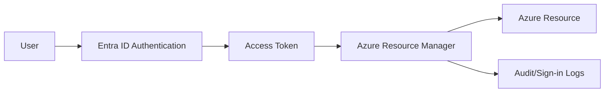

# Entra ID Basics for Azure Administrators

## What you will learn
- How Entra ID fits Azure resource access
- Users, groups, and service principals at a high level
- Which logs matter for AZ-104 operations

## Concept flow architecture


## Key concepts (AZ-104 focus)
- Entra ID is the identity provider for Azure control-plane access.
- Most Azure resource permissions are enforced through ARM + RBAC.
- Service principals are identities for apps/automation; managed identities are Azure-managed principals.

## Admin mindset
- Check *who* is calling ARM (user vs app vs managed identity).
- Use sign-in logs to diagnose authentication and conditional access issues.
- Use audit logs to track directory changes (user/group/role changes).

## Common pitfalls / exam traps
- Confusing Entra ID roles with Azure RBAC roles (different planes).
- Assuming group membership changes apply instantly (replication delay).
- Granting broad roles at subscription scope when RG scope is sufficient.

## Quick CLI signals (read-only examples)
> These are **signals** you look for as an administrator. They are not a full lab.
```bash
# az <service> <command> ... 
```
