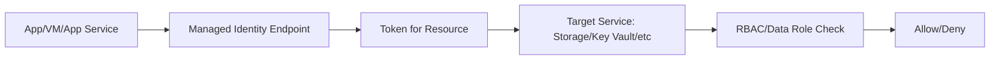

# Managed Identities (System vs User-assigned)

## What you will learn
- What managed identities are
- When to use system vs user-assigned
- How apps use MI to access resources

## Concept flow architecture


## Key concepts (AZ-104 focus)
- Managed identities remove the need to store secrets for Azure-to-Azure authentication.
- System-assigned identity is tied to one resource lifecycle; user-assigned can be reused across resources.
- You still must grant RBAC/data roles to the managed identity for the target service.

## Admin mindset
- Prefer managed identity for automation inside Azure (apps, VMs, functions).
- Use user-assigned MI when multiple resources need the same identity or you want lifecycle independence.
- Audit access by checking role assignments and sign-ins for the identity.

## Common pitfalls / exam traps
- Creating MI but forgetting to assign a role to the target resource.
- Using management-plane role where a data-plane role is required.
- Assuming MI works across tenants/subscriptions without proper scoping.

## Quick CLI signals (read-only examples)
> These are **signals** you look for as an administrator. They are not a full lab.
```bash
# az <service> <command> ... 
```
