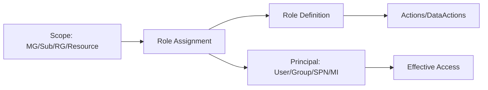

# RBAC Fundamentals (Scopes, Roles, Assignments)

## What you will learn
- How RBAC evaluates permissions
- How scope inheritance works
- How to troubleshoot access denied

## Concept flow architecture


## Key concepts (AZ-104 focus)
- RBAC is an authorization system for Azure resources (control-plane and data-plane via data roles).
- Scopes form a hierarchy: Management Group → Subscription → Resource Group → Resource.
- Effective permissions = union of assignments across scopes, minus explicit denies from policies (where applicable).

## Admin mindset
- Start with the smallest scope that satisfies the requirement (least privilege).
- When troubleshooting, confirm: correct scope, correct principal, correct role definition, assignment propagation.
- Use Activity Log for failed authorization events on resources.

## Common pitfalls / exam traps
- Using Owner when Contributor is enough.
- Assigning at wrong scope (resource vs RG).
- Mixing 'Storage Blob Data Contributor' (data-plane) with 'Contributor' (management-plane).

## Quick CLI signals (read-only examples)
> These are **signals** you look for as an administrator. They are not a full lab.
```bash
# az <service> <command> ... 
```
