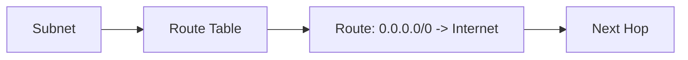

# Lab: UDR Routing Simulation (Simple Route Table)

## Objective
Create a route table, add a route, associate it to a subnet, and validate effective association. This lab keeps the next hop simple.

## What you will build


## Estimated time
25–35 minutes

## Cost + safety
- All resources are created in a **dedicated Resource Group** for this lab and can be deleted at the end.
- Default region: **australiaeast** (change if needed).

## Prerequisites
- Azure subscription with permission to create resources
- Azure CLI installed and authenticated (`az login`)
- (Optional) Azure Portal access

## Setup: Create environment file
```bash
cat > .env << 'EOF'
LOCATION="australiaeast"
PREFIX="az104"
LAB="m02-udr"
RG_NAME="${PREFIX}-${LAB}-rg"
EOF

source .env
echo "Environment loaded: RG_NAME=$RG_NAME, LOCATION=$LOCATION"
```

## Portal solution (high-level)
- Portal → Create VNet + subnet.
- Portal → Route tables → Create.
- Add a route (e.g., `0.0.0.0/0` next hop Internet) for demo.
- Associate route table to subnet.

## Azure CLI solution (fully parameterised)
### 1) Create Resource Group
```bash
# Create the resource group in the specified location
az group create \
  --name "$RG_NAME" \
  --location "$LOCATION"
echo "RG_NAME=$RG_NAME"
```

### 2) Deploy resources
```bash
# Define VNet, subnet, and route table names
VNET_NAME="${PREFIX}-${LAB}-vnet"
SUBNET_NAME="workload"
RT_NAME="${PREFIX}-${LAB}-rt"
echo "VNET_NAME=$VNET_NAME"
echo "RT_NAME=$RT_NAME"

# Create VNet with a workload subnet
az network vnet create \
  --resource-group "$RG_NAME" \
  --name "$VNET_NAME" \
  --address-prefixes "10.40.0.0/16" \
  --subnet-name "$SUBNET_NAME" \
  --subnet-prefixes "10.40.1.0/24"

# Create a route table (UDR) for custom routing
RT_ID="$(az network route-table create \
  --resource-group "$RG_NAME" \
  --name "$RT_NAME" \
  --location "$LOCATION" \
  --query id \
  -o tsv)"
echo "RT_ID=$RT_ID"

# Add a default route to send all traffic to Internet (demonstration)
ROUTE_ID="$(az network route-table route create \
  --resource-group "$RG_NAME" \
  --route-table-name "$RT_NAME" \
  --name "default-to-internet" \
  --address-prefix "0.0.0.0/0" \
  --next-hop-type Internet \
  --query id \
  -o tsv)"
echo "ROUTE_ID=$ROUTE_ID"

# Associate the route table with the workload subnet
az network vnet subnet update \
  --resource-group "$RG_NAME" \
  --vnet-name "$VNET_NAME" \
  --name "$SUBNET_NAME" \
  --route-table "$RT_ID"
echo "Associated route table to subnet: $SUBNET_NAME"
```


### 3) Validate
```bash
# Display route table details
az network route-table show \
  --resource-group "$RG_NAME" \
  --name "$RT_NAME" \
  -o table

# Display subnet details including associated route table
az network vnet subnet show \
  --resource-group "$RG_NAME" \
  --vnet-name "$VNET_NAME" \
  --name "$SUBNET_NAME" \
  -o table
echo "Validated route table and subnet association."
```


## ARM template solution (when needed)
Not required for this lab.

## Cleanup (required)
```bash
# Delete the resource group and all its resources asynchronously
az group delete \
  --name "$RG_NAME" \
  --yes \
  --no-wait
echo "Deleted RG: $RG_NAME (async)"

# Remove the environment file
rm -f .env
echo "Cleaned up environment file"
```

## Notes
- Every CLI command that returns an ID/URL is captured into a **variable** and echoed.
- If a command returns JSON, use `--query ... -o tsv` for clean variable assignment.
