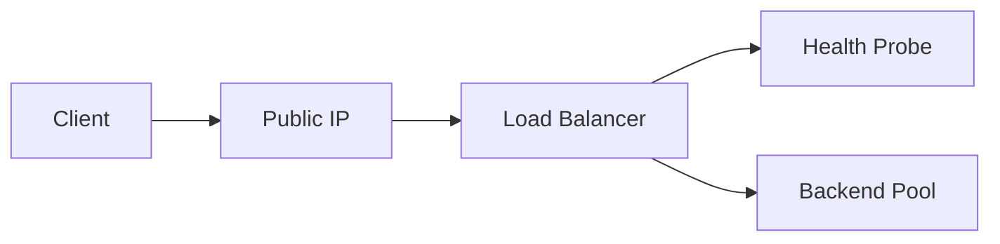

# Lab: Basic Azure Load Balancer (Conceptual + Minimal)

## Objective
Create a public IP and a basic Load Balancer frontend + health probe. Backend pool is created; attaching VMs is optional to keep cost low.

## What you will build


## Estimated time
30–45 minutes

## Cost + safety
- All resources are created in a **dedicated Resource Group** for this lab and can be deleted at the end.
- Default region: **australiaeast** (change if needed).

## Prerequisites
- Azure subscription with permission to create resources
- Azure CLI installed and authenticated (`az login`)
- (Optional) Azure Portal access

## Setup: Create environment file
```bash
cat > .env << 'EOF'
LOCATION="australiaeast"
PREFIX="az104"
LAB="m02-lb"
RG_NAME="${PREFIX}-${LAB}-rg"
EOF

source .env
echo "Environment loaded: RG_NAME=$RG_NAME, LOCATION=$LOCATION"
```

## Portal solution (high-level)
- Portal → Public IP addresses → Create.
- Portal → Load balancers → Create (Public).
- Add frontend IP configuration using the Public IP.
- Add health probe (TCP 80).
- Add backend pool (VMs optional).

## Azure CLI solution (fully parameterised)
### 1) Create Resource Group
```bash
# Create the resource group in the specified location
az group create \
  --name "$RG_NAME" \
  --location "$LOCATION"
echo "RG_NAME=$RG_NAME"
```

### 2) Deploy resources
```bash
# Define names for public IP, load balancer, and its components
PIP_NAME="${PREFIX}-${LAB}-pip"
LB_NAME="${PREFIX}-${LAB}-lb"
FRONTEND_NAME="fe"
BACKEND_POOL="be-pool"
PROBE_NAME="tcp80"
echo "LB_NAME=$LB_NAME"

# Create a Standard public IP address for the load balancer frontend
PIP_ID="$(az network public-ip create \
  --resource-group "$RG_NAME" \
  --name "$PIP_NAME" \
  --sku Standard \
  --allocation-method static \
  --query publicIp.id \
  -o tsv)"
echo "PIP_ID=$PIP_ID"

# Retrieve the public IP address value for reference
PIP_ADDR="$(az network public-ip show \
  --resource-group "$RG_NAME" \
  --name "$PIP_NAME" \
  --query ipAddress \
  -o tsv)"
echo "PIP_ADDR=$PIP_ADDR"

# Create the load balancer with frontend and backend pool
LB_ID="$(az network lb create \
  --resource-group "$RG_NAME" \
  --name "$LB_NAME" \
  --sku Standard \
  --frontend-ip-name "$FRONTEND_NAME" \
  --backend-pool-name "$BACKEND_POOL" \
  --public-ip-address "$PIP_NAME" \
  --query loadBalancer.id \
  -o tsv)"
echo "LB_ID=$LB_ID"

# Create a health probe to monitor backend health on TCP port 80
PROBE_ID="$(az network lb probe create \
  --resource-group "$RG_NAME" \
  --lb-name "$LB_NAME" \
  --name "$PROBE_NAME" \
  --protocol tcp \
  --port 80 \
  --query id \
  -o tsv)"
echo "PROBE_ID=$PROBE_ID"
```


### 3) Validate
```bash
# Display load balancer configuration details
az network lb show \
  --resource-group "$RG_NAME" \
  --name "$LB_NAME" \
  -o jsonc
echo "Validate: frontend IP, backend pool, and probe exist."
```


## ARM template solution (when needed)
Not required for this lab.

## Cleanup (required)
```bash
# Delete the resource group and all its resources asynchronously
az group delete \
  --name "$RG_NAME" \
  --yes \
  --no-wait
echo "Deleted RG: $RG_NAME (async)"

# Remove the environment file
rm -f .env
echo "Cleaned up environment file"
```

## Notes
- Every CLI command that returns an ID/URL is captured into a **variable** and echoed.
- If a command returns JSON, use `--query ... -o tsv` for clean variable assignment.
