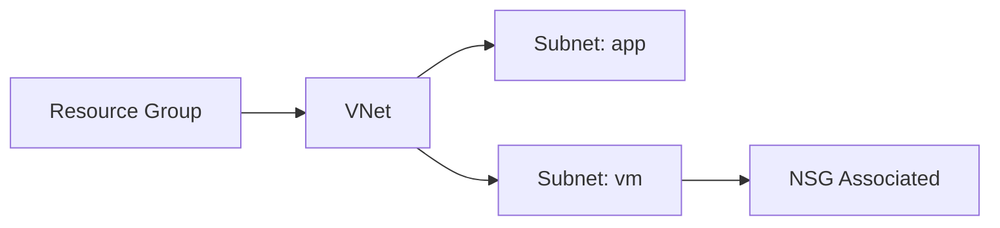

# Lab: Create VNet + Subnets + NSG (Basic)

## Objective
Deploy a VNet with multiple subnets, attach an NSG with simple inbound rules, and validate configuration.

## What you will build


## Estimated time
30–45 minutes

## Cost + safety
- All resources are created in a **dedicated Resource Group** for this lab and can be deleted at the end.
- Default region: **australiaeast** (change if needed).

## Prerequisites
- Azure subscription with permission to create resources
- Azure CLI installed and authenticated (`az login`)
- (Optional) Azure Portal access

## Parameters (edit these first)
```bash
LOCATION="australiaeast"
PREFIX="az104"
LAB="m02-vnet"
RG_NAME="${PREFIX}-${LAB}-rg"
```
> **Tip:** Commands below are intentionally **commented out**. Copy to a shell script, review, then **uncomment** to run.

## Portal solution (high-level)
- Portal → Virtual networks → Create (address space + subnets).
- Portal → Network security groups → Create NSG.
- NSG → Inbound rules → add SSH (22) temporarily (or RDP if Windows).
- Associate NSG to the VM subnet.

## Azure CLI solution (fully parameterised)
### 1) Create Resource Group
```bash
# Create the resource group in the specified location
az group create --name "$RG_NAME" --location "$LOCATION"
echo "RG_NAME=$RG_NAME"
```

### 2) Deploy resources
```bash
# Define resource names using consistent naming pattern
VNET_NAME="${PREFIX}-${LAB}-vnet"
NSG_NAME="${PREFIX}-${LAB}-nsg"
SUBNET_APP="app"
SUBNET_VM="vm"
echo "VNET_NAME=$VNET_NAME"
echo "NSG_NAME=$NSG_NAME"

# Create VNet with first subnet (app) in a single command
VNET_ID="$(az network vnet create \
  --resource-group "$RG_NAME" \
  --name "$VNET_NAME" \
  --address-prefixes "10.20.0.0/16" \
  --subnet-name "$SUBNET_APP" \
  --subnet-prefixes "10.20.1.0/24" \
  --query newVNet.id -o tsv)"
echo "VNET_ID=$VNET_ID"

# Create the second subnet (vm) in the existing VNet
az network vnet subnet create \
  --resource-group "$RG_NAME" \
  --vnet-name "$VNET_NAME" \
  --name "$SUBNET_VM" \
  --address-prefixes "10.20.2.0/24"

# Retrieve the VM subnet's resource ID for NSG association
SUBNET_VM_ID="$(az network vnet subnet show \
  --resource-group "$RG_NAME" \
  --vnet-name "$VNET_NAME" \
  --name "$SUBNET_VM" \
  --query id -o tsv)"
echo "SUBNET_VM_ID=$SUBNET_VM_ID"

# Create the Network Security Group
NSG_ID="$(az network nsg create \
  --resource-group "$RG_NAME" \
  --name "$NSG_NAME" \
  --query NewNSG.id -o tsv)"
echo "NSG_ID=$NSG_ID"

# Add an inbound rule to allow SSH traffic (for demonstration purposes)
az network nsg rule create \
  --resource-group "$RG_NAME" \
  --nsg-name "$NSG_NAME" \
  --name "Allow-SSH" \
  --priority 1000 \
  --access Allow \
  --protocol Tcp \
  --direction Inbound \
  --source-address-prefixes "*" \
  --source-port-ranges "*" \
  --destination-address-prefixes "*" \
  --destination-port-ranges 22

# Associate the NSG with the VM subnet
az network vnet subnet update \
  --resource-group "$RG_NAME" \
  --vnet-name "$VNET_NAME" \
  --name "$SUBNET_VM" \
  --network-security-group "$NSG_ID"
echo "Associated NSG to subnet: $SUBNET_VM"
```


### 3) Validate
```bash
# Display the VNet details in table format
az network vnet show --resource-group "$RG_NAME" --name "$VNET_NAME" -o table

# List all NSG rules to verify the SSH rule was created
az network nsg rule list --resource-group "$RG_NAME" --nsg-name "$NSG_NAME" -o table
echo "Validated VNet, subnets, and NSG rules."
```


## ARM template solution (when needed)
Not required for this lab.

## Cleanup (required)
```bash
# Delete the resource group and all its resources asynchronously
az group delete --name "$RG_NAME" --yes --no-wait
echo "Deleted RG: $RG_NAME (async)"
```

## Notes
- Every CLI command that returns an ID/URL is captured into a **variable** and echoed.
- If a command returns JSON, use `--query ... -o tsv` for clean variable assignment.
