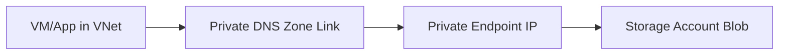

# Lab: Private Endpoint to Storage + Private DNS (Minimal)

## Objective
Create a VNet, storage account, private endpoint to blob, and private DNS zone link. Validate storage name resolves to private IP (conceptual).

## What you will build


## Estimated time
45–60 minutes

## Cost + safety
- All resources are created in a **dedicated Resource Group** for this lab and can be deleted at the end.
- Default region: **australiaeast** (change if needed).

## Prerequisites
- Azure subscription with permission to create resources
- Azure CLI installed and authenticated (`az login`)
- (Optional) Azure Portal access

## Parameters (edit these first)
```bash
LOCATION="australiaeast"
PREFIX="az104"
LAB="m02-pe-dns"
RG_NAME="${PREFIX}-${LAB}-rg"
```
> **Tip:** Commands below are intentionally **commented out**. Copy to a shell script, review, then **uncomment** to run.

## Portal solution (high-level)
- Portal → Create VNet + subnet for private endpoint.
- Portal → Create Storage account.
- Storage → Networking → Private endpoint connections → Add.
- Create/choose Private DNS zone `privatelink.blob.core.windows.net` and link to VNet.
- Validate private endpoint connection state.

## Azure CLI solution (fully parameterised)
### 1) Create Resource Group
```bash
# Create the resource group in the specified location
az group create --name "$RG_NAME" --location "$LOCATION"
echo "RG_NAME=$RG_NAME"
```

### 2) Deploy resources
```bash
# Define VNet and subnet names for private endpoint
VNET_NAME="${PREFIX}-${LAB}-vnet"
PE_SUBNET="private-endpoints"
echo "VNET_NAME=$VNET_NAME"

# Create VNet with a dedicated subnet for private endpoints
az network vnet create \
  --resource-group "$RG_NAME" \
  --name "$VNET_NAME" \
  --address-prefixes "10.50.0.0/16" \
  --subnet-name "$PE_SUBNET" \
  --subnet-prefixes "10.50.3.0/24"

# Retrieve the subnet ID for private endpoint deployment
SUBNET_ID="$(az network vnet subnet show --resource-group "$RG_NAME" --vnet-name "$VNET_NAME" --name "$PE_SUBNET" --query id -o tsv)"
echo "SUBNET_ID=$SUBNET_ID"

# Generate random suffix for globally unique storage account name
SUFFIX="$(openssl rand -hex 3)"

# Create storage account name (lowercase, no special characters)
STG_NAME="$(echo "${PREFIX}${SUFFIX}pe" | tr -d '-' | tr '[:upper:]' '[:lower:]')"
echo "STG_NAME=$STG_NAME"

# Create the storage account with LRS redundancy
az storage account create \
  --name "$STG_NAME" \
  --resource-group "$RG_NAME" \
  --location "$LOCATION" \
  --sku Standard_LRS \
  --kind StorageV2

# Get the storage account's full Azure resource ID
STG_ID="$(az storage account show --name "$STG_NAME" --resource-group "$RG_NAME" --query id -o tsv)"
echo "STG_ID=$STG_ID"

# Define the private DNS zone name for blob storage
PDNS_ZONE="privatelink.blob.core.windows.net"
echo "PDNS_ZONE=$PDNS_ZONE"

# Create the private DNS zone for blob private endpoint resolution
PDNS_ZONE_ID="$(az network private-dns zone create \
  --resource-group "$RG_NAME" \
  --name "$PDNS_ZONE" \
  --query id -o tsv)"
echo "PDNS_ZONE_ID=$PDNS_ZONE_ID"

# Create a virtual network link to the private DNS zone
VNET_LINK_ID="$(az network private-dns link vnet create \
  --resource-group "$RG_NAME" \
  --zone-name "$PDNS_ZONE" \
  --name "${PREFIX}-${LAB}-link" \
  --virtual-network "$VNET_NAME" \
  --registration-enabled false \
  --query id -o tsv)"
echo "VNET_LINK_ID=$VNET_LINK_ID"

# Define the private endpoint name
PE_NAME="${PREFIX}-${LAB}-pe"
echo "PE_NAME=$PE_NAME"

# Create the private endpoint for the storage account blob service
PE_ID="$(az network private-endpoint create \
  --resource-group "$RG_NAME" \
  --name "$PE_NAME" \
  --vnet-name "$VNET_NAME" \
  --subnet "$PE_SUBNET" \
  --private-connection-resource-id "$STG_ID" \
  --group-id blob \
  --connection-name "${PE_NAME}-conn" \
  --query id -o tsv)"
echo "PE_ID=$PE_ID"

# Create DNS zone group to link private endpoint with private DNS zone
DNS_ZONE_GROUP_ID="$(az network private-endpoint dns-zone-group create \
  --resource-group "$RG_NAME" \
  --endpoint-name "$PE_NAME" \
  --name "default" \
  --private-dns-zone "$PDNS_ZONE_ID" \
  --zone-name "$PDNS_ZONE" \
  --query id -o tsv)"
echo "DNS_ZONE_GROUP_ID=$DNS_ZONE_GROUP_ID"
```


### 3) Validate
```bash
# Display private endpoint details in JSON format
az network private-endpoint show --resource-group "$RG_NAME" --name "$PE_NAME" -o jsonc

# List DNS A records in the private DNS zone to verify storage account registration
az network private-dns record-set a list --resource-group "$RG_NAME" --zone-name "$PDNS_ZONE" -o table
echo "Validate: record set exists for the storage account in privatelink zone."
```


## ARM template solution (when needed)
Not required for this lab.

## Cleanup (required)
```bash
# Delete the resource group and all its resources asynchronously
az group delete --name "$RG_NAME" --yes --no-wait
echo "Deleted RG: $RG_NAME (async)"
```

## Notes
- Every CLI command that returns an ID/URL is captured into a **variable** and echoed.
- If a command returns JSON, use `--query ... -o tsv` for clean variable assignment.
