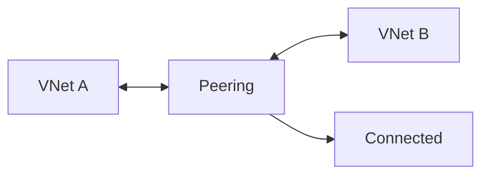

# Lab: VNet Peering + Connectivity Check (Basic)

## Objective
Create two VNets, peer them in both directions, and validate peering state. (Optional VM test is kept minimal.)

## What you will build


## Estimated time
30–45 minutes

## Cost + safety
- All resources are created in a **dedicated Resource Group** for this lab and can be deleted at the end.
- Default region: **australiaeast** (change if needed).

## Prerequisites
- Azure subscription with permission to create resources
- Azure CLI installed and authenticated (`az login`)
- (Optional) Azure Portal access

## Setup: Create environment file
```bash
cat > .env << 'EOF'
LOCATION="australiaeast"
PREFIX="az104"
LAB="m02-peering"
RG_NAME="${PREFIX}-${LAB}-rg"
EOF

source .env
echo "Environment loaded: RG_NAME=$RG_NAME, LOCATION=$LOCATION"
```

## Portal solution (high-level)
- Portal → Create VNet A and VNet B with non-overlapping CIDRs.
- Open VNet A → Peerings → Add peering to VNet B.
- Open VNet B → Peerings → Add peering to VNet A.
- Validate both show **Connected**.

## Azure CLI solution (fully parameterised)
### 1) Create Resource Group
```bash
# Create the resource group in the specified location
az group create \
  --name "$RG_NAME" \
  --location "$LOCATION"
echo "RG_NAME=$RG_NAME"
```

### 2) Deploy resources
```bash
# Define VNet names for the two networks to be peered
VNET_A="${PREFIX}-${LAB}-vnet-a"
VNET_B="${PREFIX}-${LAB}-vnet-b"
echo "VNET_A=$VNET_A"
echo "VNET_B=$VNET_B"

# Create VNet A with non-overlapping address space
az network vnet create \
  --resource-group "$RG_NAME" \
  --name "$VNET_A" \
  --address-prefixes "10.30.0.0/16" \
  --subnet-name "default" \
  --subnet-prefixes "10.30.1.0/24"

# Create VNet B with non-overlapping address space
az network vnet create \
  --resource-group "$RG_NAME" \
  --name "$VNET_B" \
  --address-prefixes "10.31.0.0/16" \
  --subnet-name "default" \
  --subnet-prefixes "10.31.1.0/24"

# Retrieve the resource ID for VNet A (required for peering)
VNET_A_ID="$(az network vnet show \
  --resource-group "$RG_NAME" \
  --name "$VNET_A" \
  --query id \
  -o tsv)"

# Retrieve the resource ID for VNet B (required for peering)
VNET_B_ID="$(az network vnet show \
  --resource-group "$RG_NAME" \
  --name "$VNET_B" \
  --query id \
  -o tsv)"
echo "VNET_A_ID=$VNET_A_ID"
echo "VNET_B_ID=$VNET_B_ID"

# Create peering from VNet A to VNet B
PEER_A_TO_B_ID="$(az network vnet peering create \
  --resource-group "$RG_NAME" \
  --vnet-name "$VNET_A" \
  --name "peer-a-to-b" \
  --remote-vnet "$VNET_B_ID" \
  --allow-vnet-access \
  --query id -o tsv)"
echo "PEER_A_TO_B_ID=$PEER_A_TO_B_ID"

# Create peering from VNet B to VNet A (bidirectional peering required)
PEER_B_TO_A_ID="$(az network vnet peering create \
  --resource-group "$RG_NAME" \
  --vnet-name "$VNET_B" \
  --name "peer-b-to-a" \
  --remote-vnet "$VNET_A_ID" \
  --allow-vnet-access \
  --query id -o tsv)"
echo "PEER_B_TO_A_ID=$PEER_B_TO_A_ID"
```


### 3) Validate
```bash
# List peering connections for VNet A and verify status is "Connected"
az network vnet peering list \
  --resource-group "$RG_NAME" \
  --vnet-name "$VNET_A" \
  -o table

# List peering connections for VNet B and verify status is "Connected"
az network vnet peering list \
  --resource-group "$RG_NAME" \
  --vnet-name "$VNET_B" \
  -o table
echo "Validated peering state for both VNets."
```


## ARM template solution (when needed)
Not required for this lab.

## Cleanup (required)
```bash
# Delete the resource group and all its resources asynchronously
az group delete \
  --name "$RG_NAME" \
  --yes \
  --no-wait
echo "Deleted RG: $RG_NAME (async)"

# Remove the environment file
rm -f .env
echo "Cleaned up environment file"
```

## Notes
- Every CLI command that returns an ID/URL is captured into a **variable** and echoed.
- If a command returns JSON, use `--query ... -o tsv` for clean variable assignment.
