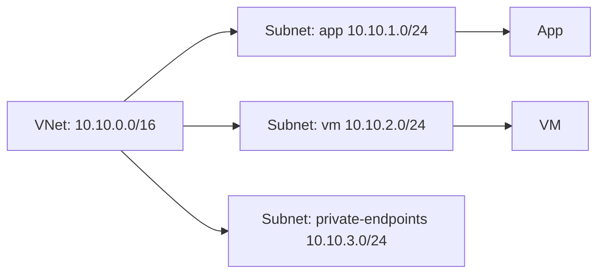

# VNets and Subnets (IP Planning and Isolation)

## What you will learn
- How VNets segment address space
- How subnets isolate workloads
- How to plan CIDR ranges

## Concept flow architecture


## Key concepts (AZ-104 focus)
- VNet is a private IP boundary; subnets carve out address ranges for workload groups.
- Subnet choice impacts NSG association, route tables, and private endpoint placement.
- AZ-104 expects you to create VNets/subnets and understand address overlap constraints.

## Admin mindset
- Reserve space for growth; avoid overly small subnets for future scale.
- Use dedicated subnet for private endpoints to simplify routing and policy.
- Document CIDR plans to prevent overlap with on-prem or other VNets.

## Common pitfalls / exam traps
- Overlapping address spaces break peering and VPN designs.
- Putting private endpoints in the same subnet as workloads can complicate routing.
- Assuming VNets automatically have DNS configured for private zones (they don’t).

## Quick CLI signals (read-only examples)
> These are **signals** you look for as an administrator. They are not a full lab.
```bash
# az <service> <command> ... 
```
