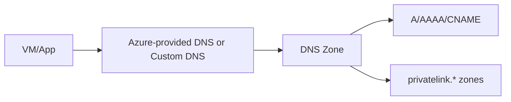

# Azure DNS: Public and Private Zones

## What you will learn
- When to use public vs private DNS
- How private DNS links to VNets
- Name resolution troubleshooting

## Concept flow architecture


## Key concepts (AZ-104 focus)
- Public DNS zones host internet-resolvable records.
- Private DNS zones resolve names inside VNets; must be linked to VNets.
- Private endpoints typically require private DNS zones (privatelink.*) for clean name resolution.

## Admin mindset
- Link private DNS zones to VNets used by clients.
- Use `nslookup`/`dig` to confirm resolution path.
- Understand split-horizon DNS patterns for hybrid environments.

## Common pitfalls / exam traps
- Creating private zone but not linking it to the VNet.
- Assuming private endpoint automatically sets up DNS for all VNets (it doesn’t).
- Mixing custom DNS servers without forwarding rules for private zones.

## Quick CLI signals (read-only examples)
> These are **signals** you look for as an administrator. They are not a full lab.
```bash
# az <service> <command> ... 
```
