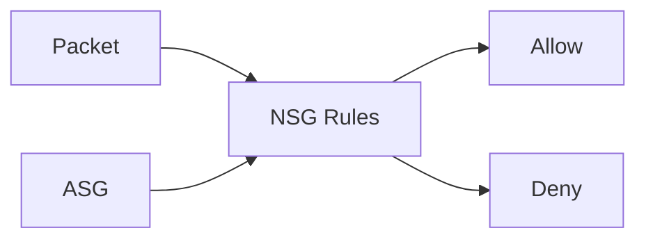

# NSGs and ASGs (Traffic Filtering)

## What you will learn
- How NSGs evaluate rules
- How to design inbound/outbound rules
- When ASGs help

## Concept flow architecture


## Key concepts (AZ-104 focus)
- NSGs are stateful filters applied to subnets or NICs.
- Rules evaluate by priority; first match wins.
- ASGs group NICs logically to simplify rules without IP pinning.

## Admin mindset
- Prefer subnet-level NSG for consistent policy; use NIC-level only for exceptions.
- Use service tags where possible to simplify (e.g., 'Internet', 'VirtualNetwork').
- Start with minimal inbound (SSH/RDP only temporarily).

## Common pitfalls / exam traps
- Forgetting to allow outbound required traffic (e.g., updates).
- Using broad inbound rules (0.0.0.0/0) longer than needed.
- Assuming NSG logs are on by default (need NSG flow logs via NSG flow logs / Traffic Analytics).

## Quick CLI signals (read-only examples)
> These are **signals** you look for as an administrator. They are not a full lab.
```bash
# az <service> <command> ... 
```
