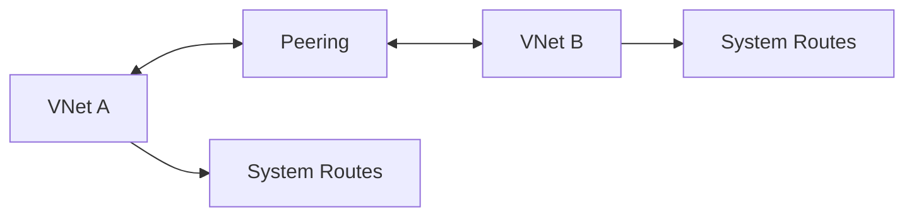

# VNet Peering (Connectivity Between VNets)

## What you will learn
- How peering works
- Transitivity and limitations
- Common admin checks

## Concept flow architecture


## Key concepts (AZ-104 focus)
- VNet peering connects VNets privately over Azure backbone.
- Peering is not transitive by default across multiple VNets (routing design matters).
- You must configure peering from both sides.

## Admin mindset
- Confirm address spaces don’t overlap before peering.
- Check peering settings: 'Allow forwarded traffic', 'Use remote gateways' only when required.
- Validate with VM-to-VM connectivity tests and route inspection.

## Common pitfalls / exam traps
- Only creating peering on one side.
- Overlapping CIDRs prevent peering.
- Expecting peering to resolve private DNS without private DNS zone links.

## Quick CLI signals (read-only examples)
> These are **signals** you look for as an administrator. They are not a full lab.
```bash
# az <service> <command> ... 
```
