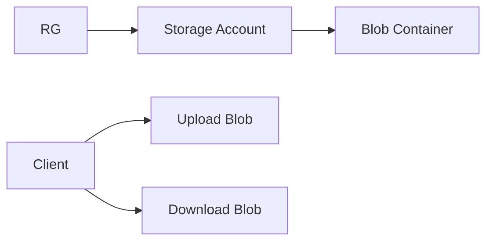

# Lab: Storage Account + Blob Container (Upload/Download)

## Objective
Create a storage account and blob container, upload a file, list blobs, and download it back. Capture endpoints in variables.

## What you will build


## Estimated time
30–40 minutes

## Cost + safety
- All resources are created in a **dedicated Resource Group** for this lab and can be deleted at the end.
- Default region: **australiaeast** (change if needed).

## Prerequisites
- Azure subscription with permission to create resources
- Azure CLI installed and authenticated (`az login`)
- (Optional) Azure Portal access

## Setup: Create environment file
```bash
cat > .env << 'EOF'
LOCATION="australiaeast"
PREFIX="az104"
LAB="m03-blob"
RG_NAME="${PREFIX}-${LAB}-rg"
EOF

source .env
echo "Environment loaded: RG_NAME=$RG_NAME, LOCATION=$LOCATION"
```

## Portal solution (high-level)
- Portal → Storage accounts → Create.
- Storage → Containers → Create a container.
- Upload a file in the container.
- Download it and verify content.

## Azure CLI solution (fully parameterised)
### 1) Create Resource Group
```bash
# Create the resource group in the specified location
az group create \
  --name "$RG_NAME" \
  --location "$LOCATION"
echo "RG_NAME=$RG_NAME"
```

### 2) Deploy resources
```bash
# Generate random suffix for globally unique storage account name
SUFFIX="$(openssl rand -hex 3)"

# Create storage account name (lowercase, no special characters)
STG_NAME="$(echo "${PREFIX}${SUFFIX}blob" | tr -d '-' | tr '[:upper:]' '[:lower:]')"

# Define container name
CONTAINER_NAME="data"
echo "STG_NAME=$STG_NAME"
echo "CONTAINER_NAME=$CONTAINER_NAME"

# Create the storage account with LRS redundancy
az storage account create \
  --name "$STG_NAME" \
  --resource-group "$RG_NAME" \
  --location "$LOCATION" \
  --sku Standard_LRS \
  --kind StorageV2

# Retrieve the storage account key for authentication
STG_KEY="$(az storage account keys list \
  --account-name "$STG_NAME" \
  --resource-group "$RG_NAME" \
  --query "[0].value" \
  -o tsv)"
echo "STG_KEY=<hidden>"

# Get the blob service endpoint URL
BLOB_ENDPOINT="$(az storage account show \
  --name "$STG_NAME" \
  --resource-group "$RG_NAME" \
  --query primaryEndpoints.blob \
  -o tsv)"
echo "BLOB_ENDPOINT=$BLOB_ENDPOINT"

# Create a blob container within the storage account
az storage container create \
  --name "$CONTAINER_NAME" \
  --account-name "$STG_NAME" \
  --account-key "$STG_KEY"
echo "Created container: $CONTAINER_NAME"

# Create a local test file to upload
FILE_NAME="hello.txt"
echo "Hello AZ-104" > "$FILE_NAME"
echo "Created local file: $FILE_NAME"

# Upload the file as a blob to the container
az storage blob upload \
  --container-name "$CONTAINER_NAME" \
  --account-name "$STG_NAME" \
  --account-key "$STG_KEY" \
  --name "$FILE_NAME" \
  --file "$FILE_NAME"
echo "Uploaded blob: $FILE_NAME"

# List all blobs in the container
az storage blob list \
  --container-name "$CONTAINER_NAME" \
  --account-name "$STG_NAME" \
  --account-key "$STG_KEY" \
  -o table

# Define download filename
DOWNLOADED="downloaded-$FILE_NAME"

# Download the blob to a local file
az storage blob download \
  --container-name "$CONTAINER_NAME" \
  --account-name "$STG_NAME" \
  --account-key "$STG_KEY" \
  --name "$FILE_NAME" \
  --file "$DOWNLOADED"
echo "Downloaded blob to: $DOWNLOADED"
```


### 3) Validate
```bash
# Display the content of the downloaded file to verify integrity
cat "downloaded-hello.txt"
echo "Validated download content."
```


## ARM template solution (when needed)
Not required for this lab.

## Cleanup (required)
```bash
# Delete the resource group and all its resources asynchronously
az group delete \
  --name "$RG_NAME" \
  --yes \
  --no-wait
echo "Deleted RG: $RG_NAME (async)"

# Remove the environment file
rm -f .env
echo "Cleaned up environment file"
```

## Notes
- Every CLI command that returns an ID/URL is captured into a **variable** and echoed.
- If a command returns JSON, use `--query ... -o tsv` for clean variable assignment.
