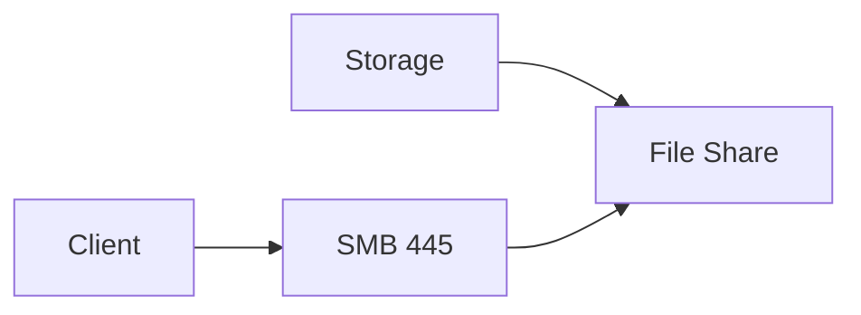

# Lab: Azure Files Share (Create + Quota)

## Objective
Create a storage account and an Azure Files share with quota. (Mounting is optional and depends on client network access to port 445.)

## What you will build


## Estimated time
25–40 minutes

## Cost + safety
- All resources are created in a **dedicated Resource Group** for this lab and can be deleted at the end.
- Default region: **australiaeast** (change if needed).

## Prerequisites
- Azure subscription with permission to create resources
- Azure CLI installed and authenticated (`az login`)
- (Optional) Azure Portal access

## Parameters (edit these first)
```bash
LOCATION="australiaeast"
PREFIX="az104"
LAB="m03-files"
RG_NAME="${PREFIX}-${LAB}-rg"
```
> **Tip:** Commands below are intentionally **commented out**. Copy to a shell script, review, then **uncomment** to run.

## Portal solution (high-level)
- Portal → Storage account → File shares → Create file share.
- Set a quota (e.g., 5 GB).
- Copy the connection string/mount path for later use.

## Azure CLI solution (fully parameterised)
### 1) Create Resource Group
```bash
# Create the resource group in the specified location
az group create --name "$RG_NAME" --location "$LOCATION"
echo "RG_NAME=$RG_NAME"
```

### 2) Deploy resources
```bash
# Generate random suffix for globally unique storage account name
SUFFIX="$(openssl rand -hex 3)"

# Create storage account name (lowercase, no special characters)
STG_NAME="$(echo "${PREFIX}${SUFFIX}files" | tr -d '-' | tr '[:upper:]' '[:lower:]')"

# Define file share name and quota
SHARE_NAME="share1"
QUOTA_GB=5
echo "STG_NAME=$STG_NAME"
echo "SHARE_NAME=$SHARE_NAME"
echo "QUOTA_GB=$QUOTA_GB"

# Create the storage account with LRS redundancy
az storage account create \
  --name "$STG_NAME" \
  --resource-group "$RG_NAME" \
  --location "$LOCATION" \
  --sku Standard_LRS \
  --kind StorageV2

# Retrieve the storage account key for authentication
STG_KEY="$(az storage account keys list \
  --account-name "$STG_NAME" \
  --resource-group "$RG_NAME" \
  --query "[0].value" -o tsv)"
echo "STG_KEY=<hidden>"

# Get the file service endpoint URL
FILE_ENDPOINT="$(az storage account show \
  --name "$STG_NAME" \
  --resource-group "$RG_NAME" \
  --query primaryEndpoints.file -o tsv)"
echo "FILE_ENDPOINT=$FILE_ENDPOINT"

# Create an Azure Files share with the specified quota
az storage share-rm create \
  --resource-group "$RG_NAME" \
  --storage-account "$STG_NAME" \
  --name "$SHARE_NAME" \
  --quota "$QUOTA_GB"
echo "Created file share: $SHARE_NAME"

# List all file shares in the storage account
az storage share-rm list --resource-group "$RG_NAME" --storage-account "$STG_NAME" -o table
```


### 3) Validate
```bash
# Display the file share details including quota
az storage share-rm show --resource-group "$RG_NAME" --storage-account "$STG_NAME" --name "$SHARE_NAME" -o table
echo "Validated file share and quota."
```


## ARM template solution (when needed)
Not required for this lab.

## Cleanup (required)
```bash
# Delete the resource group and all its resources asynchronously
az group delete --name "$RG_NAME" --yes --no-wait
echo "Deleted RG: $RG_NAME (async)"
```

## Notes
- Every CLI command that returns an ID/URL is captured into a **variable** and echoed.
- If a command returns JSON, use `--query ... -o tsv` for clean variable assignment.
