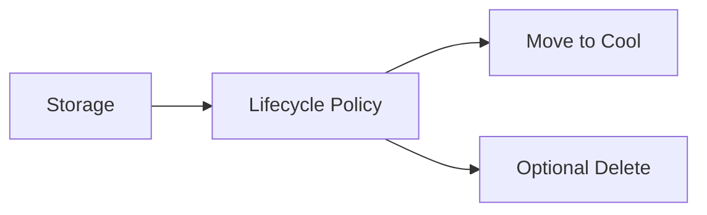

# Lab: Blob Lifecycle Management Policy (Hot → Cool)

## Objective
Create a storage account and apply a lifecycle policy to move blobs to Cool tier after N days. Validate policy exists.

## What you will build


## Estimated time
25–35 minutes

## Cost + safety
- All resources are created in a **dedicated Resource Group** for this lab and can be deleted at the end.
- Default region: **australiaeast** (change if needed).

## Prerequisites
- Azure subscription with permission to create resources
- Azure CLI installed and authenticated (`az login`)
- (Optional) Azure Portal access

## Parameters (edit these first)
```bash
LOCATION="australiaeast"
PREFIX="az104"
LAB="m03-lifecycle"
RG_NAME="${PREFIX}-${LAB}-rg"
```
> **Tip:** Commands below are intentionally **commented out**. Copy to a shell script, review, then **uncomment** to run.

## Portal solution (high-level)
- Portal → Storage account → Data management → Lifecycle management.
- Add a rule: move blobs to Cool after X days.
- Save and verify the rule is listed.

## Azure CLI solution (fully parameterised)
### 1) Create Resource Group
```bash
# Create the resource group in the specified location
az group create --name "$RG_NAME" --location "$LOCATION"
echo "RG_NAME=$RG_NAME"
```

### 2) Deploy resources
```bash
# Generate random suffix for globally unique storage account name
SUFFIX="$(openssl rand -hex 3)"

# Create storage account name (lowercase, no special characters)
STG_NAME="$(echo "${PREFIX}${SUFFIX}life" | tr -d '-' | tr '[:upper:]' '[:lower:]')"
echo "STG_NAME=$STG_NAME"

# Create the storage account with LRS redundancy
az storage account create \
  --name "$STG_NAME" \
  --resource-group "$RG_NAME" \
  --location "$LOCATION" \
  --sku Standard_LRS \
  --kind StorageV2

# Define the lifecycle policy JSON filename
POLICY_FILE="lifecycle.json"

# Create the lifecycle policy JSON file
cat > "$POLICY_FILE" << 'EOF'
{
  "rules": [
    {
      "enabled": true,
      "name": "move-to-cool",
      "type": "Lifecycle",
      "definition": {
        "filters": { "blobTypes": [ "blockBlob" ] },
        "actions": {
          "baseBlob": { "tierToCool": { "daysAfterModificationGreaterThan": 7 } }
        }
      }
    }
  ]
}
EOF
echo "Wrote lifecycle policy file: $POLICY_FILE"

# Apply the lifecycle management policy to the storage account
az storage account management-policy create \
  --account-name "$STG_NAME" \
  --resource-group "$RG_NAME" \
  --policy @"$POLICY_FILE"

# Retrieve the policy ID to verify creation
POLICY_ID="$(az storage account management-policy show \
  --account-name "$STG_NAME" \
  --resource-group "$RG_NAME" \
  --query id -o tsv)"
echo "POLICY_ID=$POLICY_ID"
```


### 3) Validate
```bash
# Display the lifecycle management policy in JSON format
az storage account management-policy show --account-name "$STG_NAME" --resource-group "$RG_NAME" -o jsonc
echo "Validated lifecycle policy exists."
```


## ARM template solution (when needed)
Not required for this lab.

## Cleanup (required)
```bash
# Delete the resource group and all its resources asynchronously
az group delete --name "$RG_NAME" --yes --no-wait
echo "Deleted RG: $RG_NAME (async)"
```

## Notes
- Every CLI command that returns an ID/URL is captured into a **variable** and echoed.
- If a command returns JSON, use `--query ... -o tsv` for clean variable assignment.
