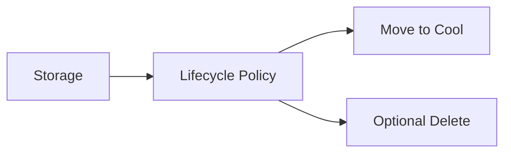

# Lab: Blob Lifecycle Management Policy (Hot → Cool)
> Variant: Portal lab track (CLI/ARM walkthrough omitted).

## Objective
Create a storage account and apply a lifecycle policy to move blobs to Cool tier after N days. Validate policy exists.

## What you will build


## Estimated time
25–35 minutes

## Cost + safety
- All resources are created in a **dedicated Resource Group** for this lab and can be deleted at the end.
- Default region: **australiaeast** (change if needed).

## Prerequisites
- Azure subscription with permission to create resources
- Azure CLI installed and authenticated (`az login`)
- (Optional) Azure Portal access

## Setup: Create environment file
```bash
cat > .env << 'EOF'
LOCATION="australiaeast"
PREFIX="az104"
LAB="m03-lifecycle"
RG_NAME="${PREFIX}-${LAB}-rg"
EOF

source .env
echo "Environment loaded: RG_NAME=$RG_NAME, LOCATION=$LOCATION"
```

## Portal solution (high-level)
- Portal → Storage account → Data management → Lifecycle management.
- Add a rule: move blobs to Cool after X days.
- Save and verify the rule is listed.


## Cleanup (required)
```bash
# Delete the resource group and all its resources asynchronously
az group delete \
  --name "$RG_NAME" \
  --yes \
  --no-wait
echo "Deleted RG: $RG_NAME (async)"

# Remove lifecycle policy file and environment file
rm -f lifecycle.json .env
echo "Cleaned up lifecycle.json and environment file"
```

## Notes
- Every CLI command that returns an ID/URL is captured into a **variable** and echoed.
- If a command returns JSON, use `--query ... -o tsv` for clean variable assignment.