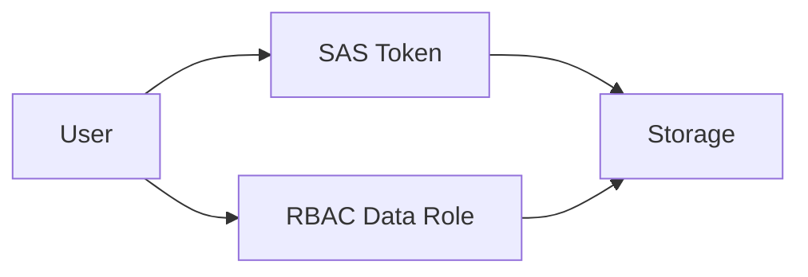

# Lab: SAS vs RBAC (Conceptual Access Control)
> Variant: Portal lab track (CLI/ARM walkthrough omitted).

## Objective
Generate a short-lived SAS token for a blob container and compare with RBAC approach. Validate SAS format and expiry.

## What you will build


## Estimated time
30–45 minutes

## Cost + safety
- All resources are created in a **dedicated Resource Group** for this lab and can be deleted at the end.
- Default region: **australiaeast** (change if needed).

## Prerequisites
- Azure subscription with permission to create resources
- Azure CLI installed and authenticated (`az login`)
- (Optional) Azure Portal access

## Setup: Create environment file
```bash
cat > .env << 'EOF'
LOCATION="australiaeast"
PREFIX="az104"
LAB="m03-sas-rbac"
RG_NAME="${PREFIX}-${LAB}-rg"
EOF

source .env
echo "Environment loaded: RG_NAME=$RG_NAME, LOCATION=$LOCATION"
```

## Portal solution (high-level)
- Portal → Storage account → Containers → Shared access signature → Generate SAS.
- Portal → Storage account → Access control (IAM) → assign 'Storage Blob Data Reader/Contributor' to a principal.
- Compare: SAS (time-bound URL) vs RBAC (identity-based).


## Cleanup (required)
```bash
# Delete the resource group and all its resources asynchronously
az group delete \
  --name "$RG_NAME" \
  --yes \
  --no-wait
echo "Deleted RG: $RG_NAME (async)"

# Remove the environment file
rm -f .env
echo "Cleaned up environment file"
```

## Notes
- Every CLI command that returns an ID/URL is captured into a **variable** and echoed.
- If a command returns JSON, use `--query ... -o tsv` for clean variable assignment.