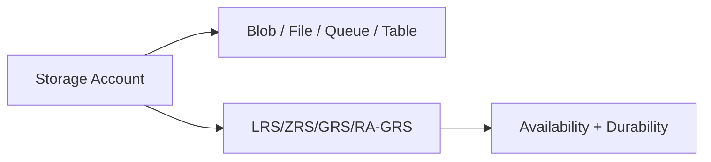

# Storage Accounts + Redundancy (LRS/ZRS/GRS)

## What you will learn
- How storage accounts are structured
- What redundancy options mean
- How to pick based on availability needs

## Concept flow architecture


## Key concepts (AZ-104 focus)
- Storage account is the top-level container for storage services.
- Redundancy affects durability and regional resilience; AZ-104 expects you to choose and configure it.
- Changing redundancy has constraints; plan before production.

## Admin mindset
- Use LRS for dev/test; consider ZRS/GRS for production depending on RPO/RTO needs.
- Confirm whether features like NFS or premium tiers are required (scope-limited in AZ-104).
- Use tags and naming for ownership and cleanup.

## Common pitfalls / exam traps
- Storage names must be globally unique and lowercase.
- Assuming GRS instantly replicates (there is replication lag).
- Confusing availability (SLA) with durability (data loss probability).

## Quick CLI signals (read-only examples)
> These are **signals** you look for as an administrator. They are not a full lab.
```bash
# az <service> <command> ... 
```
