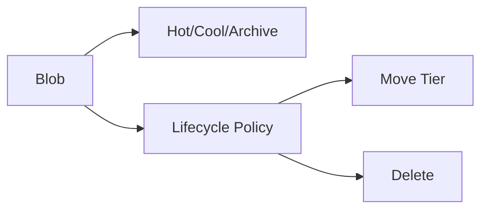

# Blob Storage + Lifecycle Management

## What you will learn
- Blob containers and tiers
- Lifecycle policies (hot/cool/archive)
- Data protection basics (soft delete/versioning)

## Concept flow architecture


## Key concepts (AZ-104 focus)
- Blob tiers optimise cost vs access frequency.
- Lifecycle policies automate tiering and deletion.
- Soft delete and versioning protect against accidental deletes/overwrites.

## Admin mindset
- Start lifecycle policies in audit/low-impact patterns; monitor cost impact.
- Keep retention aligned with business requirements and compliance.
- Use least-privilege: storage data roles for access.

## Common pitfalls / exam traps
- Putting frequently accessed data into Cool/Archive by mistake.
- Assuming Archive is instant retrieval (it’s not).
- Not enabling soft delete before users start writing critical data.

## Quick CLI signals (read-only examples)
> These are **signals** you look for as an administrator. They are not a full lab.
```bash
# az <service> <command> ... 
```
