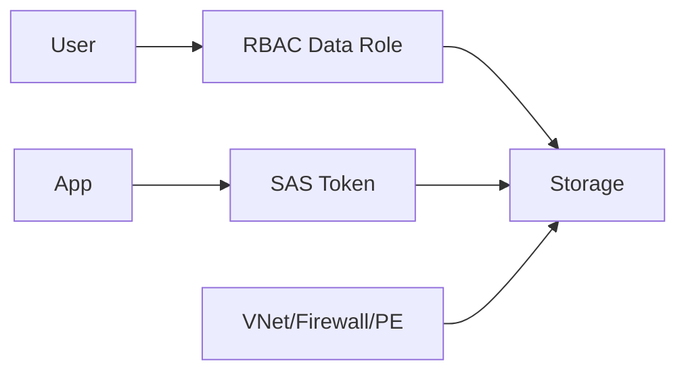

# Storage Security: SAS vs RBAC

## What you will learn
- When to use SAS
- When to use RBAC data roles
- How network restrictions complement identity

## Concept flow architecture


## Key concepts (AZ-104 focus)
- RBAC data roles provide identity-based access (preferred where possible).
- SAS provides time-bound delegated access (useful for limited sharing).
- Network controls (firewall, private endpoint) reduce exposure but do not replace auth.

## Admin mindset
- Prefer RBAC for internal users/apps; use SAS for external temporary access.
- Always scope SAS minimally (service, resource, permissions, time).
- Combine with network restrictions for defense-in-depth.

## Common pitfalls / exam traps
- Generating SAS with broad permissions and long expiry.
- Assigning Contributor and expecting data access (wrong plane).
- Allowing public network access by default in sensitive environments.

## Quick CLI signals (read-only examples)
> These are **signals** you look for as an administrator. They are not a full lab.
```bash
# az <service> <command> ... 
```
