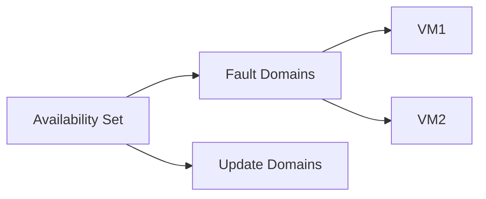

# Lab: VM Availability (Availability Set OR Zone)

## Objective
Deploy two VMs into an availability set (simple) and understand how fault/update domains apply. Zone deployment is mentioned as an alternative.

## What you will build


## Estimated time
45–60 minutes

## Cost + safety
- All resources are created in a **dedicated Resource Group** for this lab and can be deleted at the end.
- Default region: **australiaeast** (change if needed).

## Prerequisites
- Azure subscription with permission to create resources
- Azure CLI installed and authenticated (`az login`)
- (Optional) Azure Portal access

## Setup: Create environment file
```bash
cat > .env << 'EOF'
LOCATION="australiaeast"
PREFIX="az104"
LAB="m04-availability"
RG_NAME="${PREFIX}-${LAB}-rg"
EOF

source .env
echo "Environment loaded: RG_NAME=$RG_NAME, LOCATION=$LOCATION"
```

## Portal solution (high-level)
- Portal → Create an Availability Set (choose fault/update domain count).
- Create VM1 and VM2 and select the same Availability Set.
- Validate under Availability Set → VMs.
- Alternative: create VMs in different Availability Zones (if region/sku supports).

## Azure CLI solution (fully parameterised)
### 1) Create Resource Group
```bash
# Create the resource group in the specified location
az group create \
  --name "$RG_NAME" \
  --location "$LOCATION"
echo "RG_NAME=$RG_NAME"
```

### 2) Deploy resources
```bash
# Define availability set and VM names
AS_NAME="${PREFIX}-${LAB}-as"
VM1="${PREFIX}-${LAB}-vm1"
VM2="${PREFIX}-${LAB}-vm2"
ADMIN_USER="azureuser"
echo "AS_NAME=$AS_NAME"

# Create an availability set with fault and update domains
AS_ID="$(az vm availability-set create \
  --resource-group "$RG_NAME" \
  --name "$AS_NAME" \
  --platform-fault-domain-count 2 \
  --platform-update-domain-count 5 \
  --query id \
  -o tsv)"
echo "AS_ID=$AS_ID"

# Create the first VM in the availability set
VM1_ID="$(az vm create \
  --resource-group "$RG_NAME" \
  --name "$VM1" \
  --image UbuntuLTS \
  --size Standard_B1s \
  --admin-username "$ADMIN_USER" \
  --generate-ssh-keys \
  --availability-set "$AS_NAME" \
  --query id \
  -o tsv)"
echo "VM1_ID=$VM1_ID"

# Create the second VM in the same availability set
VM2_ID="$(az vm create \
  --resource-group "$RG_NAME" \
  --name "$VM2" \
  --image UbuntuLTS \
  --size Standard_B1s \
  --admin-username "$ADMIN_USER" \
  --generate-ssh-keys \
  --availability-set "$AS_NAME" \
  --query id \
  -o tsv)"
echo "VM2_ID=$VM2_ID"
```


### 3) Validate
```bash
# Display availability set details including VM members
az vm availability-set show \
  --resource-group "$RG_NAME" \
  --name "$AS_NAME" \
  -o jsonc
echo "Validated availability set and VM membership."
```


## ARM template solution (when needed)
Not required for this lab.

## Cleanup (required)
```bash
# Delete the resource group and all its resources asynchronously
az group delete \
  --name "$RG_NAME" \
  --yes \
  --no-wait
echo "Deleted RG: $RG_NAME (async)"

# Remove the environment file
rm -f .env
echo "Cleaned up environment file"
```

## Notes
- Every CLI command that returns an ID/URL is captured into a **variable** and echoed.
- If a command returns JSON, use `--query ... -o tsv` for clean variable assignment.
