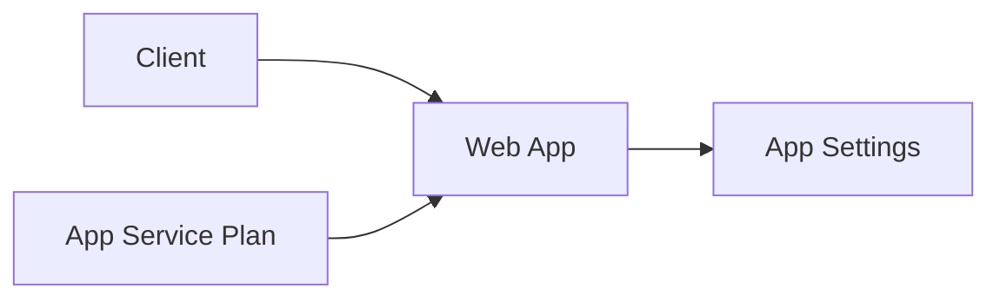

# Lab: Deploy App Service (Web App) + App Settings

## Objective
Create an App Service Plan + Web App and configure an app setting. Capture the web app URL.

## What you will build


## Estimated time
35–50 minutes

## Cost + safety
- All resources are created in a **dedicated Resource Group** for this lab and can be deleted at the end.
- Default region: **australiaeast** (change if needed).

## Prerequisites
- Azure subscription with permission to create resources
- Azure CLI installed and authenticated (`az login`)
- (Optional) Azure Portal access

## Setup: Create environment file
```bash
cat > .env << 'EOF'
LOCATION="australiaeast"
PREFIX="az104"
LAB="m04-appsvc"
RG_NAME="${PREFIX}-${LAB}-rg"
EOF

source .env
echo "Environment loaded: RG_NAME=$RG_NAME, LOCATION=$LOCATION"
```

## Portal solution (high-level)
- Portal → App Services → Create Web App.
- Create new App Service Plan (Basic or Free where available).
- After deployment: Web App → Configuration → add app setting.
- Browse the default page to validate URL.

## Azure CLI solution (fully parameterised)
### 1) Create Resource Group
```bash
# Create the resource group in the specified location
az group create \
  --name "$RG_NAME" \
  --location "$LOCATION"
echo "RG_NAME=$RG_NAME"
```

### 2) Deploy resources
```bash
# Define App Service Plan and Web App names
PLAN_NAME="${PREFIX}-${LAB}-plan"

# Create unique Web App name (globally unique requirement)
WEBAPP_NAME="$(echo "${PREFIX}${LAB//-/}$(openssl rand -hex 3)" | tr -d '-' | tr '[:upper:]' '[:lower:]')"

# Define the runtime stack for the web app
RUNTIME="NODE|18-lts"
echo "PLAN_NAME=$PLAN_NAME"
echo "WEBAPP_NAME=$WEBAPP_NAME"

# Create the App Service Plan with Basic SKU
az appservice plan create \
  --resource-group "$RG_NAME" \
  --name "$PLAN_NAME" \
  --location "$LOCATION" \
  --sku B1

# Create the Web App within the App Service Plan
WEBAPP_ID="$(az webapp create \
  --resource-group "$RG_NAME" \
  --plan "$PLAN_NAME" \
  --name "$WEBAPP_NAME" \
  --runtime "$RUNTIME" \
  --query id \
  -o tsv)"
echo "WEBAPP_ID=$WEBAPP_ID"

# Configure application settings for the web app
az webapp config appsettings set \
  --resource-group "$RG_NAME" \
  --name "$WEBAPP_NAME" \
  --settings DEMO_SETTING="az104"
echo "Set DEMO_SETTING=az104"

# Retrieve the web app's default hostname (URL)
WEBAPP_URL="$(az webapp show \
  --resource-group "$RG_NAME" \
  --name "$WEBAPP_NAME" \
  --query defaultHostName \
  -o tsv)"
echo "WEBAPP_URL=https://$WEBAPP_URL"
```


### 3) Validate
```bash
# List all application settings for the web app
az webapp config appsettings list \
  --resource-group "$RG_NAME" \
  --name "$WEBAPP_NAME" \
  -o table
echo "Validated web app and app settings."
```


## ARM template solution (when needed)
Optional: ARM/Bicep is commonly used for App Service, but this lab keeps it simple via CLI/Portal.

## Cleanup (required)
```bash
# Delete the resource group and all its resources asynchronously
az group delete \
  --name "$RG_NAME" \
  --yes \
  --no-wait
echo "Deleted RG: $RG_NAME (async)"

# Remove the environment file
rm -f .env
echo "Cleaned up environment file"
```

## Notes
- Every CLI command that returns an ID/URL is captured into a **variable** and echoed.
- If a command returns JSON, use `--query ... -o tsv` for clean variable assignment.
