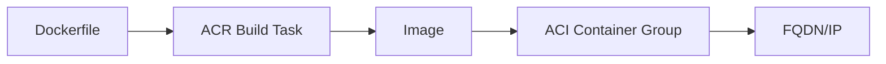

# Lab: ACR Build + ACI Run Container (Minimal)

## Objective
Create an ACR, build a tiny container image using ACR Tasks, and run it in ACI. Capture login server and container FQDN.

## What you will build


## Estimated time
45–60 minutes

## Cost + safety
- All resources are created in a **dedicated Resource Group** for this lab and can be deleted at the end.
- Default region: **australiaeast** (change if needed).

## Prerequisites
- Azure subscription with permission to create resources
- Azure CLI installed and authenticated (`az login`)
- (Optional) Azure Portal access

## Setup: Create environment file
```bash
cat > .env << 'EOF'
LOCATION="australiaeast"
PREFIX="az104"
LAB="m04-acr-aci"
RG_NAME="${PREFIX}-${LAB}-rg"
EOF

source .env
echo "Environment loaded: RG_NAME=$RG_NAME, LOCATION=$LOCATION"
```

## Portal solution (high-level)
- Portal → Container registries → Create ACR.
- Use Tasks or local docker to build/push an image.
- Portal → Container instances → Create using image from ACR.
- Validate container state is Running and view logs.

## Azure CLI solution (fully parameterised)
### 1) Create Resource Group
```bash
# Create the resource group in the specified location
az group create \
  --name "$RG_NAME" \
  --location "$LOCATION"
echo "RG_NAME=$RG_NAME"
```

### 2) Deploy resources
```bash
# Generate random suffix for globally unique ACR name
SUFFIX="$(openssl rand -hex 3)"

# Create ACR name (lowercase, no special characters)
ACR_NAME="$(echo "${PREFIX}${SUFFIX}acr" | tr -d '-' | tr '[:upper:]' '[:lower:]')"
echo "ACR_NAME=$ACR_NAME"

# Create the Azure Container Registry with Basic SKU
ACR_ID="$(az acr create \
  --resource-group "$RG_NAME" \
  --name "$ACR_NAME" \
  --sku Basic \
  --location "$LOCATION" \
  --query id \
  -o tsv)"
echo "ACR_ID=$ACR_ID"

# Retrieve the ACR login server URL
ACR_LOGIN_SERVER="$(az acr show \
  --name "$ACR_NAME" \
  --query loginServer \
  -o tsv)"
echo "ACR_LOGIN_SERVER=$ACR_LOGIN_SERVER"

# Enable admin user for simplified authentication (lab only)
az acr update \
  --name "$ACR_NAME" \
  --admin-enabled true

# Get ACR admin credentials
ACR_USER="$(az acr credential show \
  --name "$ACR_NAME" \
  --query username \
  -o tsv)"
ACR_PASS="$(az acr credential show \
  --name "$ACR_NAME" \
  --query passwords[0].value \
  -o tsv)"
echo "ACR_USER=$ACR_USER"
echo "ACR_PASS=<hidden>"

# Create a directory for the application
APP_DIR="app"
mkdir -p "$APP_DIR"

# Create a minimal Dockerfile for demonstration
cat > "$APP_DIR/Dockerfile" << 'EOF'
FROM mcr.microsoft.com/oss/nginx/nginx:1.25.3
RUN echo "AZ-104 ACI demo" > /usr/share/nginx/html/index.html
EOF
echo "Created Dockerfile in $APP_DIR"

# Define the image name and tag
IMAGE_NAME="nginx-demo:v1"
echo "IMAGE_NAME=$IMAGE_NAME"

# Build the container image using ACR Tasks (no local Docker required)
az acr build \
  --registry "$ACR_NAME" \
  --image "$IMAGE_NAME" \
  "$APP_DIR"
echo "Built image in ACR: $ACR_LOGIN_SERVER/$IMAGE_NAME"

# Define Azure Container Instance name
ACI_NAME="${PREFIX}-${LAB}-aci"
echo "ACI_NAME=$ACI_NAME"

# Create an ACI container group using the ACR image
ACI_ID="$(az container create \
  --resource-group "$RG_NAME" \
  --name "$ACI_NAME" \
  --image "${ACR_LOGIN_SERVER}/${IMAGE_NAME}" \
  --registry-login-server "$ACR_LOGIN_SERVER" \
  --registry-username "$ACR_USER" \
  --registry-password "$ACR_PASS" \
  --dns-name-label "${PREFIX}${SUFFIX}aci" \
  --ports 80 \
  --query id \
  -o tsv)"
echo "ACI_ID=$ACI_ID"

# Retrieve the container's fully qualified domain name
ACI_FQDN="$(az container show \
  --resource-group "$RG_NAME" \
  --name "$ACI_NAME" \
  --query ipAddress.fqdn \
  -o tsv)"
echo "ACI_FQDN=$ACI_FQDN"
```


### 3) Validate
```bash
# Display container instance details
az container show \
  --resource-group "$RG_NAME" \
  --name "$ACI_NAME" \
  -o jsonc

# View container logs
az container logs \
  --resource-group "$RG_NAME" \
  --name "$ACI_NAME"
echo "Validated ACI running and logs accessible."
```


## ARM template solution (when needed)
Not required for this lab.

## Cleanup (required)
```bash
# Delete the resource group and all its resources asynchronously
az group delete \
  --name "$RG_NAME" \
  --yes \
  --no-wait
echo "Deleted RG: $RG_NAME (async)"

# Remove the app directory and environment file
rm -rf app .env
echo "Cleaned up app directory and environment file"
```

## Notes
- Every CLI command that returns an ID/URL is captured into a **variable** and echoed.
- If a command returns JSON, use `--query ... -o tsv` for clean variable assignment.
