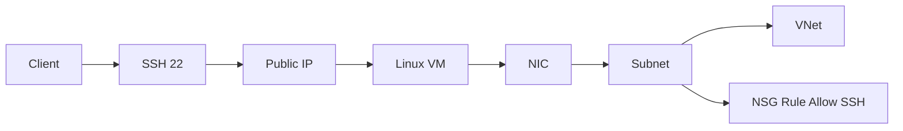

# Lab: Deploy a Linux VM (Simple)

## Objective
Create a VNet, subnet, NSG, and deploy a small Linux VM. Capture public IP and validate SSH connectivity (optional).

## What you will build


## Estimated time
45–60 minutes

## Cost + safety
- All resources are created in a **dedicated Resource Group** for this lab and can be deleted at the end.
- Default region: **australiaeast** (change if needed).

## Prerequisites
- Azure subscription with permission to create resources
- Azure CLI installed and authenticated (`az login`)
- (Optional) Azure Portal access

## Parameters (edit these first)
```bash
LOCATION="australiaeast"
PREFIX="az104"
LAB="m04-vm"
RG_NAME="${PREFIX}-${LAB}-rg"
```
> **Tip:** Commands below are intentionally **commented out**. Copy to a shell script, review, then **uncomment** to run.

## Portal solution (high-level)
- Portal → Virtual machines → Create.
- Choose Ubuntu LTS, size `B1s` if available.
- Create new VNet/subnet and NSG allowing SSH.
- Create public IP, set admin username + SSH key.
- Validate VM provisioning succeeded.

## Azure CLI solution (fully parameterised)
### 1) Create Resource Group
```bash
# Create the resource group in the specified location
az group create --name "$RG_NAME" --location "$LOCATION"
echo "RG_NAME=$RG_NAME"
```

### 2) Deploy resources
```bash
# Define names for networking and VM resources
VNET_NAME="${PREFIX}-${LAB}-vnet"
SUBNET_NAME="vm"
NSG_NAME="${PREFIX}-${LAB}-nsg"
VM_NAME="${PREFIX}-${LAB}-vm"
ADMIN_USER="azureuser"
echo "VM_NAME=$VM_NAME"

# Create VNet with a VM subnet
az network vnet create \
  --resource-group "$RG_NAME" \
  --name "$VNET_NAME" \
  --address-prefixes "10.60.0.0/16" \
  --subnet-name "$SUBNET_NAME" \
  --subnet-prefixes "10.60.2.0/24"

# Create Network Security Group
NSG_ID="$(az network nsg create --resource-group "$RG_NAME" --name "$NSG_NAME" --query NewNSG.id -o tsv)"
echo "NSG_ID=$NSG_ID"

# Add inbound rule to allow SSH traffic
az network nsg rule create \
  --resource-group "$RG_NAME" \
  --nsg-name "$NSG_NAME" \
  --name "Allow-SSH" \
  --priority 1000 \
  --access Allow \
  --protocol Tcp \
  --direction Inbound \
  --source-address-prefixes "*" \
  --destination-port-ranges 22

# Associate the NSG with the VM subnet
az network vnet subnet update \
  --resource-group "$RG_NAME" \
  --vnet-name "$VNET_NAME" \
  --name "$SUBNET_NAME" \
  --network-security-group "$NSG_ID"

# Create a Linux VM with Ubuntu LTS image and small size
VM_ID="$(az vm create \
  --resource-group "$RG_NAME" \
  --name "$VM_NAME" \
  --image UbuntuLTS \
  --size Standard_B1s \
  --admin-username "$ADMIN_USER" \
  --vnet-name "$VNET_NAME" \
  --subnet "$SUBNET_NAME" \
  --nsg "" \
  --generate-ssh-keys \
  --query id -o tsv)"
echo "VM_ID=$VM_ID"

# Retrieve the VM's public IP address for SSH access
VM_PUBLIC_IP="$(az vm show --resource-group "$RG_NAME" --name "$VM_NAME" -d --query publicIps -o tsv)"
echo "VM_PUBLIC_IP=$VM_PUBLIC_IP"

# Optional: Test SSH connectivity (uncomment to use)
# ssh ${ADMIN_USER}@${VM_PUBLIC_IP}
```


### 3) Validate
```bash
# Display VM details in table format
az vm show --resource-group "$RG_NAME" --name "$VM_NAME" -o table
echo "Validated VM deployment and captured public IP."
```


## ARM template solution (when needed)
Not required for this lab.

## Cleanup (required)
```bash
# Delete the resource group and all its resources asynchronously
az group delete --name "$RG_NAME" --yes --no-wait
echo "Deleted RG: $RG_NAME (async)"
```

## Notes
- Every CLI command that returns an ID/URL is captured into a **variable** and echoed.
- If a command returns JSON, use `--query ... -o tsv` for clean variable assignment.
