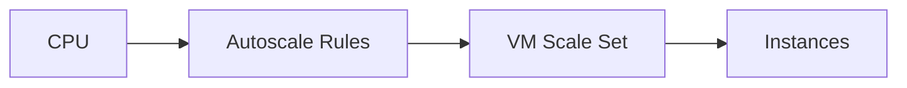

# Lab: VM Scale Set Autoscale (Basic)

## Objective
Create a VM scale set and add a simple autoscale rule. Validate autoscale profile exists.

## What you will build


## Estimated time
45–60 minutes

## Cost + safety
- All resources are created in a **dedicated Resource Group** for this lab and can be deleted at the end.
- Default region: **australiaeast** (change if needed).

## Prerequisites
- Azure subscription with permission to create resources
- Azure CLI installed and authenticated (`az login`)
- (Optional) Azure Portal access

## Parameters (edit these first)
```bash
LOCATION="australiaeast"
PREFIX="az104"
LAB="m04-vmss"
RG_NAME="${PREFIX}-${LAB}-rg"
```
> **Tip:** Commands below are intentionally **commented out**. Copy to a shell script, review, then **uncomment** to run.

## Portal solution (high-level)
- Portal → Virtual machine scale sets → Create (Ubuntu, small SKU).
- Enable autoscaling: scale out when CPU > 70%, scale in when CPU < 30%.
- Validate in Autoscale settings and monitor instance count.

## Azure CLI solution (fully parameterised)
### 1) Create Resource Group
```bash
# Create the resource group in the specified location
az group create --name "$RG_NAME" --location "$LOCATION"
echo "RG_NAME=$RG_NAME"
```

### 2) Deploy resources
```bash
# Define VM scale set and autoscale names
VMSS_NAME="${PREFIX}-${LAB}-vmss"
ADMIN_USER="azureuser"
echo "VMSS_NAME=$VMSS_NAME"

# Create the VM scale set with Ubuntu LTS and automatic upgrade policy
VMSS_ID="$(az vmss create \
  --resource-group "$RG_NAME" \
  --name "$VMSS_NAME" \
  --image UbuntuLTS \
  --instance-count 1 \
  --admin-username "$ADMIN_USER" \
  --generate-ssh-keys \
  --upgrade-policy-mode automatic \
  --vm-sku Standard_B1s \
  --query id -o tsv)"
echo "VMSS_ID=$VMSS_ID"

# Define autoscale setting name
AUTOSCALE_NAME="${VMSS_NAME}-autoscale"
echo "AUTOSCALE_NAME=$AUTOSCALE_NAME"

# Create autoscale setting with min/max instance count
AUTOSCALE_ID="$(az monitor autoscale create \
  --resource-group "$RG_NAME" \
  --resource "$VMSS_ID" \
  --name "$AUTOSCALE_NAME" \
  --min-count 1 \
  --max-count 3 \
  --count 1 \
  --query id -o tsv)"
echo "AUTOSCALE_ID=$AUTOSCALE_ID"

# Add scale out rule when CPU exceeds 70% for 5 minutes
az monitor autoscale rule create \
  --resource-group "$RG_NAME" \
  --autoscale-name "$AUTOSCALE_NAME" \
  --condition "Percentage CPU > 70 avg 5m" \
  --scale out 1

# Add scale in rule when CPU falls below 30% for 10 minutes
az monitor autoscale rule create \
  --resource-group "$RG_NAME" \
  --autoscale-name "$AUTOSCALE_NAME" \
  --condition "Percentage CPU < 30 avg 10m" \
  --scale in 1

echo "Configured autoscale rules for VMSS."
```


### 3) Validate
```bash
# Display autoscale configuration details
az monitor autoscale show --resource-group "$RG_NAME" --name "$AUTOSCALE_NAME" -o jsonc
echo "Validated autoscale configuration."
```


## ARM template solution (when needed)
Not required for this lab.

## Cleanup (required)
```bash
# Delete the resource group and all its resources asynchronously
az group delete --name "$RG_NAME" --yes --no-wait
echo "Deleted RG: $RG_NAME (async)"
```

## Notes
- Every CLI command that returns an ID/URL is captured into a **variable** and echoed.
- If a command returns JSON, use `--query ... -o tsv` for clean variable assignment.
