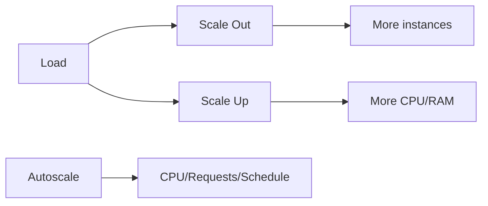

# Scaling: VM Scale Sets and App Service Scale

## What you will learn
- Horizontal vs vertical scale
- VMSS basics and autoscale signals
- App Service plan scaling

## Concept flow architecture


## Key concepts (AZ-104 focus)
- Horizontal scaling adds instances; vertical scaling increases size.
- VMSS is for scaling identical VMs with orchestration; autoscale uses rules.
- App Service scaling applies at the App Service Plan level.

## Admin mindset
- Choose scale signals carefully (CPU alone can be misleading).
- Set min/max instance limits to avoid runaway costs.
- Validate autoscale history and metrics after configuration.

## Common pitfalls / exam traps
- Setting max instances too high without budgets.
- Forgetting cooldown causing flapping.
- Confusing scaling web app vs scaling the plan.

## Quick CLI signals (read-only examples)
> These are **signals** you look for as an administrator. They are not a full lab.
```bash
# az <service> <command> ... 
```
