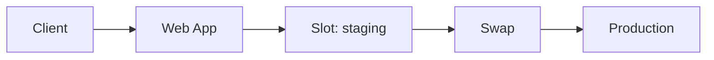

# App Service (Web Apps, Config, Slots)

## What you will learn
- How App Service runs code
- Configuration: app settings, connection strings
- Deployment slots and swap

## Concept flow architecture


## Key concepts (AZ-104 focus)
- App Service is managed PaaS for web apps/APIs.
- App settings are injected as environment variables; slots allow safe deployments.
- Scaling is at plan level; deployment slots reduce risk.

## Admin mindset
- Store secrets in Key Vault where possible (beyond minimal AZ-104 labs).
- Use health checks and deployment slots for safe updates.
- Monitor logs and metrics during deployments.

## Common pitfalls / exam traps
- Editing settings in wrong slot.
- Forgetting slot-specific settings during swap.
- Scaling up plan impacts cost immediately.

## Quick CLI signals (read-only examples)
> These are **signals** you look for as an administrator. They are not a full lab.
```bash
# az <service> <command> ... 
```
