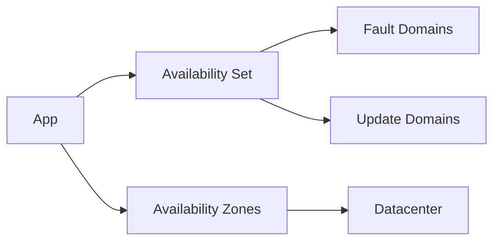

# Availability: Sets vs Zones

## What you will learn
- How availability sets reduce impact of platform maintenance
- How zones provide datacenter-level redundancy
- How to choose for workloads

## Concept flow architecture


## Key concepts (AZ-104 focus)
- Availability Set spreads VMs across fault/update domains within a datacenter.
- Availability Zones spread VMs across separate datacenters in a region.
- AZ-104 tests understanding and configuration basics.

## Admin mindset
- Use zones when you need higher resilience and the region supports it.
- Use availability sets when zones aren't available or for classic patterns.
- Design with load balancing if you expect instance failure.

## Common pitfalls / exam traps
- Mixing VM sizes/images that are not zone-available.
- Expecting availability set to protect from full zone failure.
- Creating single VM and assuming availability features apply automatically.

## Quick CLI signals (read-only examples)
> These are **signals** you look for as an administrator. They are not a full lab.
```bash
# az <service> <command> ... 
```
