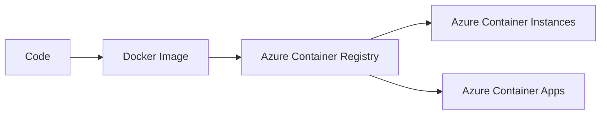

# Containers: ACR, ACI, and ACA Overview

## What you will learn
- What ACR/ACI/ACA are
- Basic container deployment flow
- AZ-104 scope boundaries (no AKS deep dive)

## Concept flow architecture


## Key concepts (AZ-104 focus)
- ACR stores images; ACI runs containers without managing servers.
- ACA adds managed scaling and app-level features (conceptual for AZ-104).
- Focus on authentication, image pull, and basic runtime configuration.

## Admin mindset
- Prefer ACR + ACI for simple exam-aligned scenarios.
- Validate image tags and registry login server.
- Use environment variables for simple config.

## Common pitfalls / exam traps
- Forgetting ACR admin user settings or role permissions when pulling.
- Using uppercase characters in registry names.
- Assuming ACI provides advanced routing features by default.

## Quick CLI signals (read-only examples)
> These are **signals** you look for as an administrator. They are not a full lab.
```bash
# az <service> <command> ... 
```
