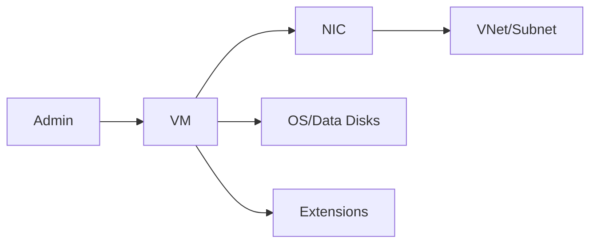

# Virtual Machines Essentials (Deploy, Configure, Manage)

## What you will learn
- VM components (compute, NIC, disk)
- VM sizing and images
- Admin operations: extensions, reset, redeploy

## Concept flow architecture


## Key concepts (AZ-104 focus)
- VMs include compute + networking + storage; deployment creates multiple resources.
- Sizes affect cost and performance; choose small sizes for labs.
- Extensions automate configuration (e.g., Custom Script, monitoring agents).

## Admin mindset
- Know where to check boot diagnostics and serial console for troubleshooting.
- Use NSGs for access control and avoid leaving SSH/RDP open permanently.
- Use tags to identify lab resources for cleanup.

## Common pitfalls / exam traps
- Forgetting to open the right port in NSG.
- Deploying in a subnet with restrictive routing/DNS causing package update failures.
- Assuming deleting a VM deletes disks/NICs (depends on settings).

## Quick CLI signals (read-only examples)
> These are **signals** you look for as an administrator. They are not a full lab.
```bash
# az <service> <command> ... 
```
