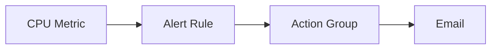

# Lab: Create an Alert + Action Group (Metric Alert)

## Objective
Create an action group (email) and a CPU metric alert for a VM. Capture action group ID and alert rule ID.

## What you will build


## Estimated time
35–50 minutes

## Cost + safety
- All resources are created in a **dedicated Resource Group** for this lab and can be deleted at the end.
- Default region: **australiaeast** (change if needed).

## Prerequisites
- Azure subscription with permission to create resources
- Azure CLI installed and authenticated (`az login`)
- (Optional) Azure Portal access

## Setup: Create environment file
```bash
cat > .env << 'EOF'
LOCATION="australiaeast"
PREFIX="az104"
LAB="m05-alerts"
RG_NAME="${PREFIX}-${LAB}-rg"
EOF

source .env
echo "Environment loaded: RG_NAME=$RG_NAME, LOCATION=$LOCATION"
```

## Portal solution (high-level)
- Portal → Monitor → Alerts → Action groups → Create (email receiver).
- Portal → VM → Alerts → Create alert rule (CPU > threshold).
- Validate the rule is enabled and associated with the action group.

## Azure CLI solution (fully parameterised)
### 1) Create Resource Group
```bash
# Create the resource group in the specified location
az group create \
  --name "$RG_NAME" \
  --location "$LOCATION"
echo "RG_NAME=$RG_NAME"
```

### 2) Deploy resources
```bash
# Define VM name for the alert target
VM_NAME="${PREFIX}-${LAB}-vm"
ADMIN_USER="azureuser"

# Create a simple VM to monitor
VM_ID="$(az vm create \
  --resource-group "$RG_NAME" \
  --name "$VM_NAME" \
  --image UbuntuLTS \
  --size Standard_B1s \
  --admin-username "$ADMIN_USER" \
  --generate-ssh-keys \
  --query id \
  -o tsv)"
echo "VM_ID=$VM_ID"

# Define action group name and email recipient
AG_NAME="${PREFIX}-${LAB}-ag"
EMAIL="you@example.com"   # change before running
echo "AG_NAME=$AG_NAME"
echo "EMAIL=$EMAIL"

# Create an action group with email notification
AG_ID="$(az monitor action-group create \
  --resource-group "$RG_NAME" \
  --name "$AG_NAME" \
  --short-name "az104" \
  --action email admin "$EMAIL" \
  --query id \
  -o tsv)"
echo "AG_ID=$AG_ID"

# Define the metric alert name
ALERT_NAME="${PREFIX}-${LAB}-cpu-alert"
echo "ALERT_NAME=$ALERT_NAME"

# Create a CPU metric alert that triggers when average CPU exceeds 70%
ALERT_ID="$(az monitor metrics alert create \
  --resource-group "$RG_NAME" \
  --name "$ALERT_NAME" \
  --scopes "$VM_ID" \
  --condition "avg Percentage CPU > 70" \
  --window-size 5m \
  --evaluation-frequency 1m \
  --action "$AG_ID" \
  --severity 2 \
  --query id \
  -o tsv)"
echo "ALERT_ID=$ALERT_ID"
```


### 3) Validate
```bash
# Display the metric alert configuration details
az monitor metrics alert show \
  --resource-group "$RG_NAME" \
  --name "$ALERT_NAME" \
  -o jsonc
echo "Validated metric alert and action group association."
```


## ARM template solution (when needed)
Not required for this lab.

## Cleanup (required)
```bash
# Delete the resource group and all its resources asynchronously
az group delete \
  --name "$RG_NAME" \
  --yes \
  --no-wait
echo "Deleted RG: $RG_NAME (async)"

# Remove the environment file
rm -f .env
echo "Cleaned up environment file"
```

## Notes
- Every CLI command that returns an ID/URL is captured into a **variable** and echoed.
- If a command returns JSON, use `--query ... -o tsv` for clean variable assignment.
