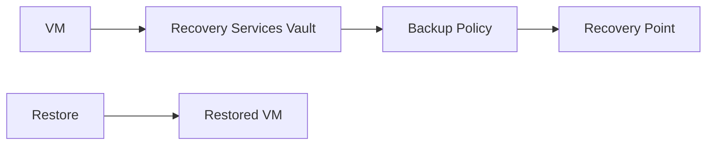

# Lab: Backup a VM + Restore Test (Recovery Services Vault)

## Objective
Create a VM, create a Recovery Services Vault, enable VM backup using a policy, then perform a restore test (restore to a new VM is recommended).

## What you will build


## Estimated time
75–120 minutes

## Cost + safety
- All resources are created in a **dedicated Resource Group** for this lab and can be deleted at the end.
- Default region: **australiaeast** (change if needed).

## Prerequisites
- Azure subscription with permission to create resources
- Azure CLI installed and authenticated (`az login`)
- (Optional) Azure Portal access

## Parameters (edit these first)
```bash
# LOCATION="australiaeast"
# PREFIX="az104"
# LAB="m05-backup"
# RG_NAME="${PREFIX}-${LAB}-rg"
```
> **Tip:** Commands below are intentionally **commented out**. Copy to a shell script, review, then **uncomment** to run.

## Portal solution (high-level)
- Portal → Create a small VM.
- Portal → Recovery Services vaults → Create vault.
- Vault → Backup → Azure → Virtual machine → Select VM → Enable backup (choose default policy).
- Wait for first backup (or trigger) then test Restore (restore to a new VM).
- Validate restored VM exists (then delete it during cleanup).

## Azure CLI solution (fully parameterised)
### 1) Create Resource Group
```bash
# Create the resource group in the specified location
az group create --name "$RG_NAME" --location "$LOCATION"
echo "RG_NAME=$RG_NAME"
```

### 2) Deploy resources
```bash
# Define VM name and admin username
VM_NAME="${PREFIX}-${LAB}-vm"
ADMIN_USER="azureuser"

# Create a simple VM to be backed up
VM_ID="$(az vm create \
  --resource-group "$RG_NAME" \
  --name "$VM_NAME" \
  --image UbuntuLTS \
  --size Standard_B1s \
  --admin-username "$ADMIN_USER" \
  --generate-ssh-keys \
  --query id -o tsv)"
echo "VM_ID=$VM_ID"

# Define Recovery Services Vault name
VAULT_NAME="${PREFIX}-${LAB}-rsv"
echo "VAULT_NAME=$VAULT_NAME"

# Create the Recovery Services Vault
VAULT_ID="$(az backup vault create \
  --resource-group "$RG_NAME" \
  --name "$VAULT_NAME" \
  --location "$LOCATION" \
  --query id -o tsv)"
echo "VAULT_ID=$VAULT_ID"

# Configure vault backup storage redundancy for cost-effective lab usage
az backup vault backup-properties set --resource-group "$RG_NAME" --vault-name "$VAULT_NAME" --backup-storage-redundancy LocallyRedundant
echo "Configured vault redundancy (lab)."

# NOTE: Enabling VM backup via CLI can require additional steps and policy identifiers.
# For learning reliability, use Portal to enable backup on the VM, then use CLI to inspect.
echo "RECOMMENDED: Enable backup via Portal (Vault -> Backup) for this lab."

# List backup containers and items after enabling backup via Portal
# az backup container list --resource-group "$RG_NAME" --vault-name "$VAULT_NAME" -o table
# az backup item list --resource-group "$RG_NAME" --vault-name "$VAULT_NAME" -o table
```


### 3) Validate
```bash
# Display Recovery Services Vault details
az backup vault show --resource-group "$RG_NAME" --name "$VAULT_NAME" -o table
echo "Validate: vault exists. After Portal enablement, validate backup item appears in the vault."
```


## ARM template solution (when needed)
This lab includes a minimal ARM template example for enabling a Recovery Services Vault.
> Use ARM here to show how admins often codify vault creation. Backup enablement is still simpler via Portal/CLI for learning.

```json
{
  "$schema": "https://schema.management.azure.com/schemas/2019-04-01/deploymentTemplate.json#",
  "contentVersion": "1.0.0.0",
  "parameters": {
    "vaultName": { "type": "string" },
    "location": { "type": "string" }
  },
  "resources": [
    {
      "type": "Microsoft.RecoveryServices/vaults",
      "apiVersion": "2023-04-01",
      "name": "[parameters('vaultName')]",
      "location": "[parameters('location')]",
      "properties": {}
    }
  ]
}
```

Deploy it (commented):
```bash
# Define vault name for ARM template deployment
VAULT_NAME="${PREFIX}-${LAB}-rsv"
echo "VAULT_NAME=$VAULT_NAME"

# Deploy the ARM template to create the Recovery Services Vault
az deployment group create \
  --resource-group "$RG_NAME" \
  --template-file vault.json \
  --parameters vaultName="$VAULT_NAME" location="$LOCATION"
```


## Cleanup (required)
```bash
# Delete the resource group and all its resources asynchronously
az group delete --name "$RG_NAME" --yes --no-wait
echo "Deleted RG: $RG_NAME (async)"
```

## Notes
- Every CLI command that returns an ID/URL is captured into a **variable** and echoed.
- If a command returns JSON, use `--query ... -o tsv` for clean variable assignment.
