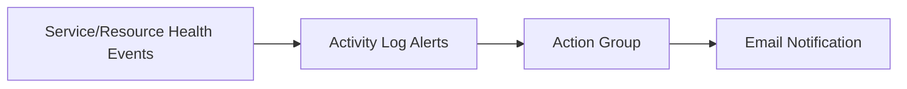

# Lab: Service Health + Resource Health Alerts
> Variant: CLI + ARM lab track (Portal walkthrough omitted).

## Objective
Create an action group and configure Activity Log alerts for Service Health and Resource Health events at subscription scope.

## What you will build


## Estimated time
25-40 minutes

## Cost + safety
- This lab creates monitoring configuration only (low cost).
- Use a dedicated resource group for easy cleanup.

## Prerequisites
- Azure subscription with permission to create monitor resources
- Azure CLI installed and authenticated (az login)

## Setup: Create environment file
```bash
cat > .env << 'EOF'
LOCATION="australiaeast"
PREFIX="az104"
LAB="m05-health-alerts"
RG_NAME="${PREFIX}-${LAB}-rg"
EOF

source .env
echo "Environment loaded: RG_NAME=$RG_NAME"
```

## Azure CLI solution (fully parameterised)
### 1) Create Resource Group
```bash
az group create --name "$RG_NAME" --location "$LOCATION"
echo "RG_NAME=$RG_NAME"
```

### 2) Deploy resources
```bash
# Subscription scope for activity log alerts
SUB_ID="$(az account show --query id -o tsv)"
SUB_SCOPE="/subscriptions/${SUB_ID}"
echo "SUB_SCOPE=$SUB_SCOPE"

# Action group (replace email before running)
AG_NAME="${PREFIX}-${LAB}-ag"
EMAIL="you@example.com"

AG_ID="$(az monitor action-group create \
  --resource-group "$RG_NAME" \
  --name "$AG_NAME" \
  --short-name "az104h" \
  --action email ops "$EMAIL" \
  --query id -o tsv)"
echo "AG_ID=$AG_ID"

# Service Health alert
SERVICE_ALERT_NAME="${PREFIX}-${LAB}-service-health"
SERVICE_ALERT_ID="$(az monitor activity-log alert create \
  --name "$SERVICE_ALERT_NAME" \
  --resource-group "$RG_NAME" \
  --scopes "$SUB_SCOPE" \
  --condition category=ServiceHealth \
  --action-group "$AG_ID" \
  --query id -o tsv)"
echo "SERVICE_ALERT_ID=$SERVICE_ALERT_ID"

# Resource Health alert
RESOURCE_ALERT_NAME="${PREFIX}-${LAB}-resource-health"
RESOURCE_ALERT_ID="$(az monitor activity-log alert create \
  --name "$RESOURCE_ALERT_NAME" \
  --resource-group "$RG_NAME" \
  --scopes "$SUB_SCOPE" \
  --condition category=ResourceHealth \
  --action-group "$AG_ID" \
  --query id -o tsv)"
echo "RESOURCE_ALERT_ID=$RESOURCE_ALERT_ID"
```

### 3) Validate
```bash
# List activity log alerts in the lab RG
az monitor activity-log alert list --resource-group "$RG_NAME" -o table

# Show action group details
az monitor action-group show --resource-group "$RG_NAME" --name "$AG_NAME" -o table

echo "Validated Service Health and Resource Health alerts."
```

## ARM template solution (when needed)
Not required for this lab.

## Cleanup (required)
```bash
az group delete --name "$RG_NAME" --yes --no-wait
rm -f .env
echo "Cleanup started: monitoring resources removed."
```

## Notes
- Use a real monitored email address before creating the action group.
- Activity Log alert signal arrival depends on platform events.
