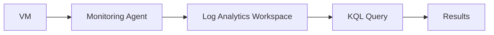

# Lab: Enable VM Insights + Query Logs (Minimal)

## Objective
Create a VM and a Log Analytics workspace, enable VM Insights/monitoring, and run a basic query. Capture workspace ID and VM ID.

## What you will build


## Estimated time
60–75 minutes

## Cost + safety
- All resources are created in a **dedicated Resource Group** for this lab and can be deleted at the end.
- Default region: **australiaeast** (change if needed).

## Prerequisites
- Azure subscription with permission to create resources
- Azure CLI installed and authenticated (`az login`)
- (Optional) Azure Portal access

## Parameters (edit these first)
```bash
LOCATION="australiaeast"
PREFIX="az104"
LAB="m05-vminsights"
RG_NAME="${PREFIX}-${LAB}-rg"
```
> **Tip:** Commands below are intentionally **commented out**. Copy to a shell script, review, then **uncomment** to run.

## Portal solution (high-level)
- Portal → Create Log Analytics workspace.
- Portal → Create a small VM.
- Portal → VM → Insights → Enable.
- Portal → Logs (workspace) → run a Heartbeat query.

## Azure CLI solution (fully parameterised)
### 1) Create Resource Group
```bash
# Create the resource group in the specified location
az group create --name "$RG_NAME" --location "$LOCATION"
echo "RG_NAME=$RG_NAME"
```

### 2) Deploy resources
```bash
# Define Log Analytics workspace name
LAW_NAME="${PREFIX}-${LAB}-law"
echo "LAW_NAME=$LAW_NAME"

# Create the Log Analytics workspace for monitoring data
LAW_ID="$(az monitor log-analytics workspace create \
  --resource-group "$RG_NAME" \
  --workspace-name "$LAW_NAME" \
  --location "$LOCATION" \
  --query id -o tsv)"
echo "LAW_ID=$LAW_ID"

# Define VM name and admin username
VM_NAME="${PREFIX}-${LAB}-vm"
ADMIN_USER="azureuser"
echo "VM_NAME=$VM_NAME"

# Create a small VM for monitoring
VM_ID="$(az vm create \
  --resource-group "$RG_NAME" \
  --name "$VM_NAME" \
  --image UbuntuLTS \
  --size Standard_B1s \
  --admin-username "$ADMIN_USER" \
  --generate-ssh-keys \
  --query id -o tsv)"
echo "VM_ID=$VM_ID"

# NOTE: Enabling VM insights and monitoring agents varies by region and Azure Monitor Agent updates
# This lab demonstrates infrastructure setup; use Portal VM → Insights for the most reliable agent enablement path
echo "NOTE: Agent enablement can vary; use Portal VM → Insights for the most reliable path."
```


### 3) Validate
```bash
# Example KQL query to run in Portal Logs after agent is installed:
# Heartbeat | take 10
echo "Validate: Heartbeat entries appear for the VM after a few minutes."
```


## ARM template solution (when needed)
Optional: AMA/DCR deployments are often IaC-managed, but kept out of this minimal lab to reduce complexity.

## Cleanup (required)
```bash
# Delete the resource group and all its resources asynchronously
az group delete --name "$RG_NAME" --yes --no-wait
echo "Deleted RG: $RG_NAME (async)"
```

## Notes
- Every CLI command that returns an ID/URL is captured into a **variable** and echoed.
- If a command returns JSON, use `--query ... -o tsv` for clean variable assignment.
