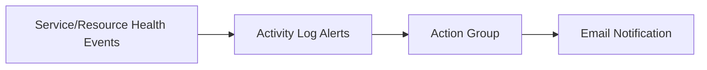

# Lab: Service Health + Resource Health Alerts
> Variant: Portal lab track (CLI/ARM walkthrough omitted).

## Objective
Create an action group and configure Activity Log alerts for Service Health and Resource Health events at subscription scope.

## What you will build


## Estimated time
25-40 minutes

## Cost + safety
- This lab creates monitoring configuration only (low cost).
- Use a dedicated resource group for easy cleanup.

## Prerequisites
- Azure subscription with permission to create monitor resources
- Azure Portal access

## Setup: Create environment file
```bash
cat > .env << 'EOF'
LOCATION="australiaeast"
PREFIX="az104"
LAB="m05-health-alerts"
RG_NAME="${PREFIX}-${LAB}-rg"
EOF

source .env
echo "Environment loaded: RG_NAME=$RG_NAME"
```

## Portal solution (high-level)
- Portal -> Monitor -> Alerts -> Action groups -> Create an action group with an email receiver.
- Portal -> Monitor -> Alerts -> Create -> Alert rule.
- Scope: Subscription.
- Signal type: Activity Log.
- Create one alert for Service Health category.
- Create another alert for Resource Health category.
- Attach the same action group to both alerts.
- Validate both rules are enabled.

## Cleanup (required)
```bash
az group delete --name "$RG_NAME" --yes --no-wait
rm -f .env
echo "Cleanup started."
```

## Notes
- Use a real monitored email address before creating the action group.
- Activity Log alert signal arrival depends on platform events.
