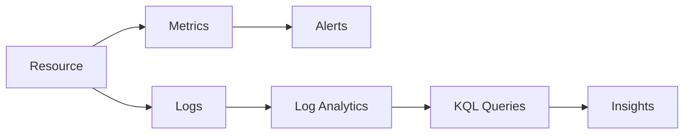

# Azure Monitor Basics (Metrics, Logs, Insights)

## What you will learn
- Difference between metrics and logs
- Where to configure diagnostics
- How to think about signals during incidents

## Concept flow architecture


## Key concepts (AZ-104 focus)
- Metrics are time-series, fast, and great for thresholds.
- Logs are rich, searchable, and best for investigations and auditing.
- Diagnostics settings route logs/metrics to Log Analytics, Storage, or Event Hub.

## Admin mindset
- Use a minimum alert set: availability, high CPU, failures, and budget alerts.
- Centralise logs in Log Analytics for querying and correlation.
- During incidents, correlate Activity Log + resource logs + metrics.

## Common pitfalls / exam traps
- Assuming logs are collected by default (diagnostics often required).
- Creating too many alerts causing noise.
- Using metrics where logs are needed (and vice versa).

## Quick CLI signals (read-only examples)
> These are **signals** you look for as an administrator. They are not a full lab.
```bash
# az <service> <command> ... 
```
