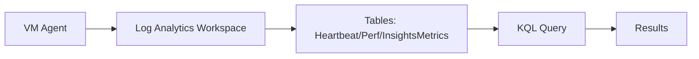

# Log Analytics + KQL (Operational Queries)

## What you will learn
- How Log Analytics workspace stores data
- Basic KQL structure
- Common tables for VM monitoring

## Concept flow architecture


## Key concepts (AZ-104 focus)
- Workspaces store logs in tables; KQL filters, projects, and aggregates.
- Common patterns: `where`, `summarize`, `project`, `order by`.
- AZ-104 expects you to configure workspaces and understand how to query basic information.

## Admin mindset
- Use Heartbeat to confirm agents are sending data.
- Use Perf for CPU/memory counters when enabled.
- Keep queries saved for repeatability.

## Common pitfalls / exam traps
- Querying the wrong workspace.
- Expecting data immediately after enabling monitoring (ingestion delay).
- Not understanding time range filters (last 24h vs last 30m).

## Quick CLI signals (read-only examples)
> These are **signals** you look for as an administrator. They are not a full lab.
```bash
# az <service> <command> ... 
```
