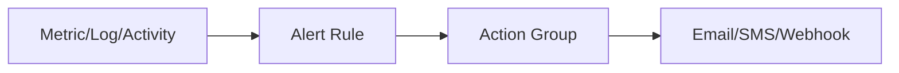

# Alerts + Action Groups (Notify and Automate)

## What you will learn
- Alert rules types (metric/log/activity)
- Action groups for notifications
- Avoiding alert noise

## Concept flow architecture


## Key concepts (AZ-104 focus)
- Metric alerts: threshold-based on metrics.
- Log alerts: KQL-based conditions from Log Analytics.
- Activity log alerts: subscription-level events (e.g., delete operations).

## Admin mindset
- Start with business-critical alerts then iterate.
- Use action groups to centralise recipients and integrations.
- Set severity and suppression windows to reduce noise.

## Common pitfalls / exam traps
- Using alerts without action groups (no one gets notified).
- Too sensitive thresholds causing alert storms.
- Not scoping alerts to correct resources.

## Quick CLI signals (read-only examples)
> These are **signals** you look for as an administrator. They are not a full lab.
```bash
# az <service> <command> ... 
```
