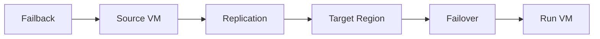

# Azure Site Recovery (ASR) (Concept Overview)

## What you will learn
- What ASR is used for
- Replication and failover concepts
- AZ-104 level expectations

## Concept flow architecture


## Key concepts (AZ-104 focus)
- ASR replicates workloads to enable disaster recovery and migration scenarios.
- Core steps: set up vault, enable replication, test failover, planned/unplanned failover.
- AZ-104 typically expects conceptual understanding and awareness of key components.

## Admin mindset
- Use ASR when RTO/RPO requirements justify it and budgets allow.
- Run test failovers in isolated networks to avoid production impact.
- Document failover runbooks.

## Common pitfalls / exam traps
- Underestimating complexity and cost of full DR replication.
- Running failover without validation plans.
- Assuming ASR replaces backups (they serve different needs).

## Quick CLI signals (read-only examples)
> These are **signals** you look for as an administrator. They are not a full lab.
```bash
# az <service> <command> ... 
```
